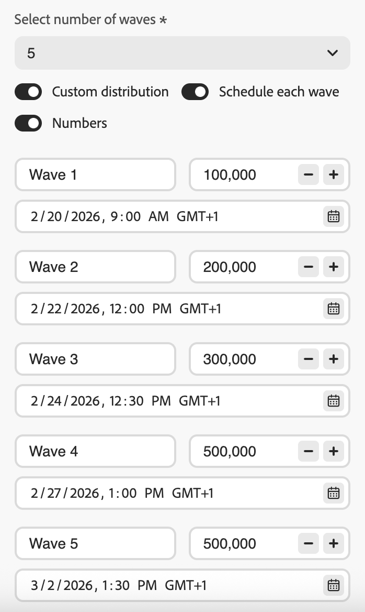

# 在歷程中使用波段傳送 {#send-using-waves-journeys}

>[!BEGINSHADEBOX]

**在此頁面上：**&#x200B;瞭解如何以排程批次（稱為波段）從讀取對象歷程傳送傳出訊息，以平衡負載、保護下游系統以及支援傳遞能力。

>[!ENDSHADEBOX]

您可以在一段時間內以批次（波段）傳送歷程中的傳出訊息，而非一次傳送所有訊息。 Wave傳送有助於平衡負載、避免壓倒性的下游系統（例如呼叫中心或登陸頁面），並支援傳遞能力與傳送者信譽，尤其是對於高流量讀取對象歷程。

<!--
>[!CAUTION]
>
>Wave sending is available for read audience journeys only and applies to **outbound** actions only (Email, SMS, Push, Direct mail).
-->

當您定義對象如何進入以及如何排程動作時，可在歷程層級進行設定。 您可以定義波段數量、波段大小（以對象百分比或絕對數字表示），以及每個波段執行的時機。

## 限制和護欄 {#limitations-guardrails}

* 波次傳送僅適用於具有&#x200B;**[!DNL As soon as possible]**&#x200B;和&#x200B;**[!UICONTROL 一次]**&#x200B;排程器型別的讀取對象歷程。 進一步瞭解[歷程排程](read-audience.md#schedule)。
* 波動傳送不適用於週期性、事件觸發、業務事件、測試模式或模擬執行歷程。
* 您必須定義至少&#x200B;**2個波段**，最多可新增&#x200B;**10個波段**。
* 兩個波段開始的最小間隔為&#x200B;**30分鐘**。
* 波段開始時間不能早於歷程開始時間或過去。
* 將對象分割成波段最多可能需要1小時。 在那之前，設定檔可能不會進入歷程。
* 在單一歷程版本中，兩個波段絕不會同時執行。 下一個波段只在上一個波段完成後開始。 例如，如果波段間隔1小時排程，但第一個波段執行2小時，則第二個波段會在第一個波段結束時開始，而不是在其排程時間開始。
* 當平台套用配額限制或系統容量負載較重時，波次啟動可能會延遲。

## 設定歷程中的波段傳送 {#configure-wave-sending}

1. 以[讀取對象](read-audience.md)活動開始您的歷程。

1. 連按兩下&#x200B;**[!UICONTROL 讀取對象]**&#x200B;活動以開啟其屬性，並選取&#x200B;**[!UICONTROL 以波形傳送歷程動作]**&#x200B;選項。

   {width="100%"}

1. 設定&#x200B;**波段數** （例如4）。

   {width="80%"}

   >[!NOTE]
   >
   >您至少必須定義2個波段，最多可新增10個波段。

1. 選擇如何定義波段大小和時間，如下所述。

### 等波 {#equal-waves}

依預設，對象會分割成大小相等的波段。 設定每個波段開始之間的固定間隔（例如2小時）。

{width="70%"}

>[!NOTE]
>
>兩個波段開始的最小間隔為&#x200B;**30分鐘**。

系統接著會自動排程後續波段（例如，第一個波段在早上9:00，第二個波段在晚上11:00，第三個波段在晚上1:00，第四個波段在晚上3:00）。

### 自訂分佈 {#custom-distribution}

選取&#x200B;**[!UICONTROL 自訂分佈]**&#x200B;選項，將每個波段的大小定義為總受眾的百分比（例如15%、20%、25%、40%）。

{width="70%"}

選取&#x200B;**[!UICONTROL 數字]**&#x200B;將每個波段的大小定義為設定檔的絕對數（例如10,000； 50,000）。

{width="70%"}

>[!NOTE]
>* 使用百分比時，所有波段總計必須為100%。 如果不是這種情況，則會顯示警告。
>* 使用數字時，系統不會驗證涵蓋範圍 — 確保您的波段大小涵蓋預期的對象。 [了解更多](#faq)

### 自訂排程 {#custom-schedule}

選取&#x200B;**[!UICONTROL 排程每個波段]**&#x200B;以定義每個波段的特定開始日期和時間。 波段不需要平均間距（例如，上午9:00、上午11:00、下午5:00、下午8:30）。

{width="70%"}

>[!NOTE]
>
>兩個波段開始的最小間隔為&#x200B;**30分鐘**。

## 使用案例 {#use-cases}

Wave傳送可協助您控制傳送訊息的時間和數量，以改善傳遞能力、保護寄件者信譽，並使傳送訊息符合您的營運容量。 考慮在以下情況下使用波段：

* **客服中心或回應管理：**&#x200B;限制每天或每小時傳出的訊息數目，以便下游團隊（例如客戶服務）可以處理回應。 例如，每天傳送20則訊息以符合客服中心容量。

  {width="55%"}

* **高容量與傳遞能力：**&#x200B;請避免一次傳送非常大的歷程。 隨時間分散傳遞，以協助維持寄件者的信譽並降低被標籤為垃圾郵件的風險。

  {width="55%"}

* **提升：**&#x200B;使用新平台或IP時，逐步增加音量（例如，第一波增加10%，然後增加15%、20%等）以逐步建立聲譽。

  {width="55%"}

## 常見問題 {#faq}

+++ 如果波段大小的總和不等於您的總受眾，會發生什麼情況？

* 如果您的波段大小總和&#x200B;**超過**&#x200B;個對象（例如，您排程在第一個波段中為100,000個對象設定100,000），則第一個波段將傳送給整個對象，而其餘波段將沒有剩餘的人員可傳送，這些波段將不會執行。
* 如果&#x200B;**的總和小於受眾**（例如，您為總共100,000個受眾定義了四個波段，總共40,000個設定檔），則只有這些波段中包含的設定檔會收到訊息。 其餘對象將不會收到通訊，且不會在後續批次中重試。

+++

+++ 我可以指派不同的區段或條件給個別波段嗎？

您只能定義波段的大小和時間。 相同的對象會流經歷程；您無法將不同的區段或條件指派給個別波段。

+++

## 另請參閱 {#see-also}

* [在歷程中使用對象](read-audience.md) — 設定「讀取對象」活動。

+++ AI知識參考

本節包含結構化知識，用於支援與本主題相關的解譯、擷取和問答。

如需完整瞭解，此資訊應結合本頁的檔案。 兩者皆非獨立來源；頁面說明功能，本節提供額外內容，以協助去除術語、意圖、適用性和限制條件的歧義。

* **TL；DR：**&#x200B;此頁面說明如何在Adobe Journey Optimizer讀取對象歷程中設定波動傳送，以控管批次隨時間傳遞傳出訊息，改善傳遞能力並保護寄件者信譽。

**意圖：**
* 在讀取對象歷程中啟用波段傳送，以批次傳送訊息
* 設定每個波段之間間隔固定的相等波段
* 將自訂波段大小定義為百分比或絕對設定檔計數
* 使用自訂排程以特定開始日期和時間排程每個波段
* 控制傳遞量，以保護寄件者的信譽或與營運容量一致

**字彙表：**
* **波段傳送**：一種傳送模式，可將讀取對象分割成批次（波段），並按排定的間隔傳送訊息給每個批次，而非一次傳送所有訊息&#x200B;*（產品特定）*
* **相等波段**：波段設定，將對象分割成大小相等的部分，波段開始&#x200B;*（產品特定）*&#x200B;之間有固定的間隔
* **自訂分佈**：手動定義每個波段大小為設定檔百分比或絕對數的波段設定&#x200B;*（產品特定）*
* **自訂排程**：每個波動都有特定開始日期和時間，允許不一致的間距&#x200B;*（產品特定）*&#x200B;的波動組態

**護欄：**
* 波次傳送僅適用於具有「儘快」和「一次」排程器型別的讀取對象歷程；不適用於循環、事件觸發、業務事件、測試模式或模擬執行歷程。
* 必須定義至少2個波段，最多10個波段。
* 兩個連續波段開始的最小間隔為30分鐘。
* 波段開始時間不能早於歷程開始或過去。
* 將受眾分成波段最多可能需要1小時；在那之前，設定檔可能無法輸入。
* 在單一歷程版本中，兩個波段絕不會同時執行；下一個波段只會在上一個波段完成後開始。
* 波次啟動可能會因平台配額限制或系統負載過重而延遲。
* 使用以百分比為基礎的自訂分佈時，所有波段總計必須為100%。
* 使用以數字為基礎的自訂分佈時，系統不會驗證總涵蓋範圍；使用者必須確保波次大小涵蓋預期的受眾。
* 如果波段大小超過受眾，第一個波段會傳送給完整受眾，而其餘波段則不會執行。
* 如果波段大小總計小於對象，則只有已定義波段中的設定檔會收到訊息；其餘的不會重試。

**術語：**
* 正式名稱：波次傳送 — 首字母縮寫：none — 變體：批次傳送、波次傳送、分階段傳送
* 同義字： &quot;waves&quot; = &quot;batches&quot; = &quot;delivery phases&quot;
* 請勿混淆：「波次傳送」≠「週期性歷程」（波次傳送會分割讀取到定時批次的單一對象；週期性歷程會依排程重新讀取對象）

**常見問題集：**
* **問：波動傳送是否可用於週期性歷程？**  — 否；波次傳送僅適用於具有「儘快」或「一次」排程器型別的讀取對象歷程。
* **問：兩個波段之間的最小時間是多少？**  — 兩個連續波段開始之間的30分鐘。
* **問：如果我的波段大小總計超過對象，會發生什麼情況？**  — 第一個波段傳送給完整對象，後續波段沒有剩餘的設定檔可傳送；它們不執行。
* **問：我可以指派不同的內容或區段給個別波段嗎？**  — 否；所有波段都使用相同的對象和歷程內容。 每個波段只能自訂大小和時間。
* **問：我可以設定多少波段？**  — 每個歷程2至10個波段。
* **問：何時應該使用波動傳送？**  — 使用它來保護高容量傳送的寄件者信譽、使傳送與下游團隊容量（例如呼叫中心）保持一致，或逐漸增加新IP或平台的容量。

+++
