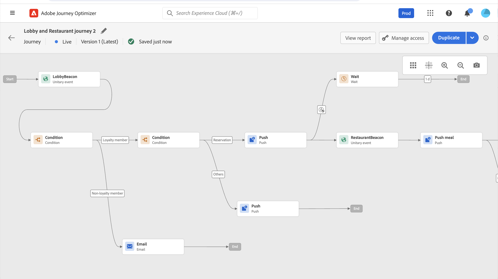
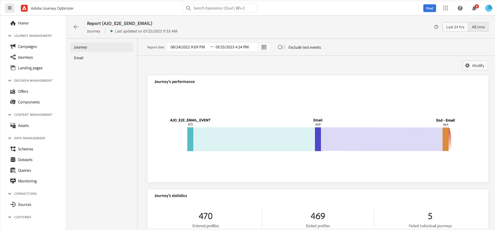

# 行程執行 {#message-execution}

## 測試您的歷程

您可以使用test配置檔案test您的旅程。 建議此步驟驗證您的設定和消息。

瞭解更多資訊 [節](testing-the-journey.md)。

## 激活您的行程

您必須發佈您的行程以激活它。

瞭解更多資訊 [節](publishing-the-journey.md)。

發佈後，您可以使用專用報告工具監控您的行程，以衡量您的行程的有效性。

[瞭解有關報告的詳細資訊](../reports/live-report.md)

## 傳送訊息 {#send-messages}

當您的郵件定義了內容時，即可通過 [旅程](journey.md)。

一旦發送消息，您就可以通過多個指示器監視其執行。 [瞭解有關報告的更多資訊](../global-report.md)。

## 計畫消息 {#schedule-messages}

可以通過 **[!UICONTROL Read Segment]** 活動 [旅程](journey.md)。 您可以指定段將在何時輸入行程。 [瞭解有關「讀取段」活動的詳細資訊](read-segment.md)。

請依照下列步驟執行此操作：

1. 編輯行程，拖放 **[!UICONTROL Read Segment]** 開始配置。 [瞭解有關配置「讀取段」活動的詳細資訊](read-segment.md#configuring-segment-trigger-activity)。

1. 按一下 **[!UICONTROL Edit journey schedule]** 連結以訪問旅程的屬性。

   

1. 配置 **[!UICONTROL Scheduler type]** 欄位：從清單中選擇所需值，使段按特定日期/時間或循環基準輸入行程。

   >[!NOTE]
   >
   >的 **[!UICONTROL Schedule]** 只有在 **[!UICONTROL Read Segment]** 活動已放入畫布。

   

1. 如果選擇 **[!UICONTROL Once]**，定義段將輸入行程的特定日期和時間。

   

1. 如果選擇循環方法，請編輯開始日期和時間。 您還可以定義可選的結束日期和時間。

   

   >[!NOTE]
   >
   >預設情況下，段輸入行程 **[!UICONTROL As soon as possible]**，意思是在旅程發表1小時後。

1. 按一下 **[!UICONTROL OK]** 的子菜單。

<!--Unitary messages that are triggered by an event within a journey cannot be scheduled.-->
