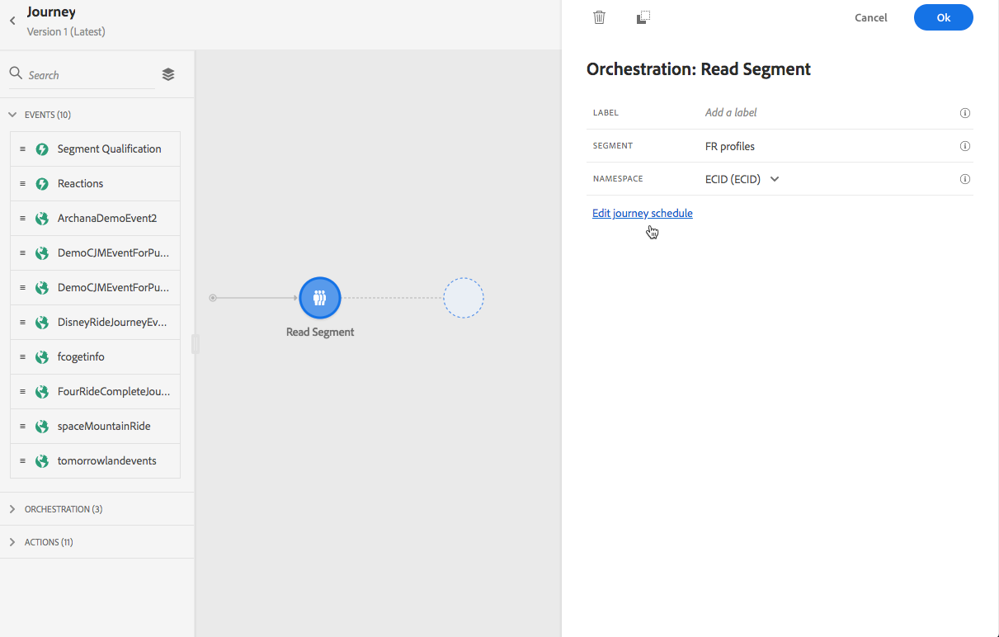

# 歷程執行{#message-execution}

## 測試您的旅程

您可以使用測試描述檔來測試您的旅程。 建議此步驟用於驗證您的設定和訊息。

請參閱[一節](testing-the-journey.md)瞭解更多資訊。

## 啟動您的歷程

您必須發佈您的歷程以啟動它。

請參閱[一節](publishing-the-journey.md)瞭解更多資訊。

發佈後，您可以使用專屬的報告工具來監控您的旅程，以評估您的旅程成效。

[進一步瞭解報表](../reports/live-report.md)

## 傳送訊息 {#send-messages}

當您的訊息已定義並發佈內容時，即可透過[journey](journey.md)傳送。

>[!NOTE]
>
>您可以將仍處於草稿模式的訊息新增至歷程，但是請務必先發佈訊息，再發佈歷程。

一旦傳送訊息，您就可以透過多個指標來監控其執行。 [進一步瞭解監控消息執行](../message-monitoring.md)。

## 計畫消息{#schedule-messages}

可以通過[journey](journey.md)中的&#x200B;**[!UICONTROL Read segment]**&#x200B;活動來安排消息。 您可以指定區段何時進入歷程。 [進一步瞭解「讀取」區段活動](read-segment.md)。

若要這麼做，請依照下列步驟進行：

1. 編輯歷程，拖放&#x200B;**[!UICONTROL Read segment]**&#x200B;活動並開始設定。 [進一步瞭解設定「讀取」區段活動](read-segment.md#configuring-segment-trigger-activity)。

1. 按一下&#x200B;**[!UICONTROL Edit journey schedule]**&#x200B;連結以存取歷程的屬性。

   

1. 設定&#x200B;**[!UICONTROL Scheduler type]**&#x200B;欄位：從清單中選取所需值，讓區段以特定日期／時間或循環性輸入歷程。

   >[!NOTE]
   >
   >**[!UICONTROL Schedule]**&#x200B;區段僅在&#x200B;**[!UICONTROL Read Segment]**&#x200B;活動已拖放至畫布時可用。

   

1. 如果您選取&#x200B;**[!UICONTROL Once]**，請定義區段將進入歷程的特定日期和時間。

   

1. 如果您選取循環方法，請編輯開始日期和時間。 您也可以定義選用的結束日期和時間。

   

   >[!NOTE]
   >
   >依預設，區段會輸入歷程&#x200B;**[!UICONTROL As soon as possible]**，這表示歷程發佈後1小時。

1. 按一下&#x200B;**[!UICONTROL OK]**&#x200B;以儲存變更。

<!--Unitary messages that are triggered by an event within a journey cannot be scheduled.-->
