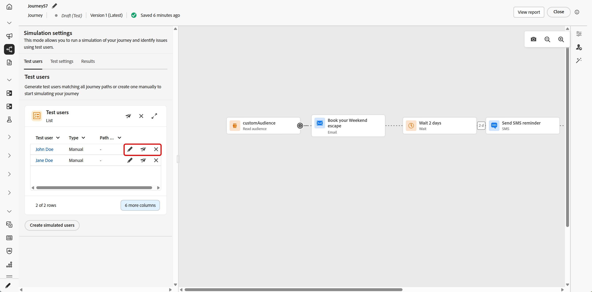
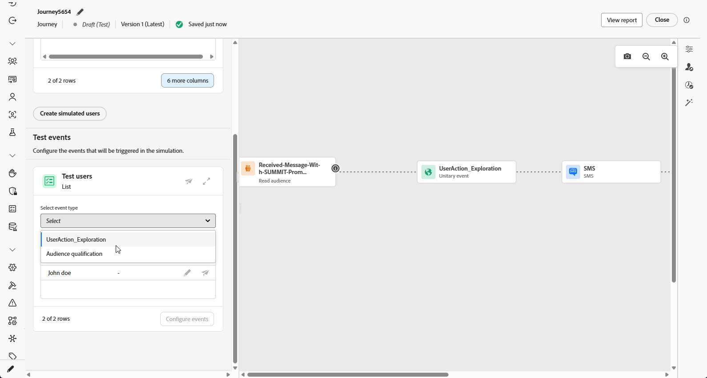
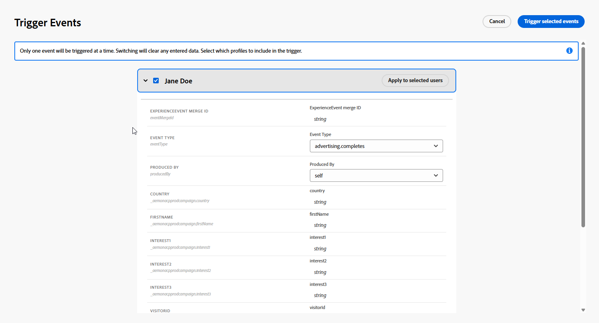

# 模擬您的歷程{#simulate-journey}

>[!IMPORTANT]
>
> 此功能以有限可用性的形式提供給所有客戶，並具備基本功能。

除了&#x200B;**草稿**、**測試模式**&#x200B;和&#x200B;**即時**&#x200B;之外，您還可以將歷程設定為&#x200B;**[!UICONTROL 模擬]**。 在模擬中，您使用&#x200B;**個模擬的使用者進行測試**：您新增的臨時設定檔樣實體，而不使用Adobe Experience Platform中的持續測試設定檔。

Adobe Journey Optimizer提供兩種方式來測試和驗證您的歷程：

* **[模擬](#test-users)**：使用&#x200B;**[!UICONTROL 模擬]**&#x200B;歷程功能，並模擬使用者在Adobe Experience Platform中快速執行，但不預先建立設定檔。

* **[測試模式](testing-the-journey.md)**：使用在Adobe Experience Platform中標示為測試設定檔的持續設定檔，可跨工作階段重複使用。 當您需要一致、預先定義的資料時，請選擇此方法。 [瞭解如何建立測試設定檔](../audience/creating-test-profiles.md)。

請注意，歷程模擬處於&#x200B;**有限可用性**&#x200B;中。 若要分享意見並協助我們改善體驗，請從頂端列開啟&#x200B;**[!UICONTROL 意見反應]**。

## 建立和管理模擬使用者 {#test-users}

>[!IMPORTANT]
>
>您至少需要下列其中一個許可權才能存取&#x200B;**[!UICONTROL 模擬]**&#x200B;功能： **模擬歷程**、**發佈歷程**&#x200B;或&#x200B;**核准並發佈歷程**。 [了解更多](../administration/permissions.md)

模擬使用者是您在&#x200B;**[!UICONTROL 模擬設定]**&#x200B;中定義的臨時設定檔實體。 本節涵蓋如何從UI或JSON檔案建立檔案、儲存檔案以供重複使用、從清單中調整或移除檔案，以及將其傳送至歷程中。

### 建立模擬使用者

下列步驟說明如何從UI或匯入JSON檔案來建立模擬使用者。

1. 從您的歷程中，開啟&#x200B;**[!UICONTROL Simulate]**&#x200B;並選擇&#x200B;**[!UICONTROL Simulation]**。

   歷程介面中的

1. 按一下&#x200B;**[!UICONTROL 建立模擬使用者]**&#x200B;以建立新使用者，並選取是要從UI建立使用者，還是從JSON匯入使用者。

   若要改為重複使用模擬使用者，請按一下[選取模擬使用者]&#x200B;**&#x200B;**，然後選擇您先前儲存的專案。

   

1. 如果您從JSON建立模擬使用者，請以模擬使用者資料更新對應欄位。

1. 如果您從UI建立模擬使用者，請輸入&#x200B;**[!UICONTROL 顯示名稱]**&#x200B;和&#x200B;**[!UICONTROL 描述]**&#x200B;以識別此模擬使用者。 然後，從聯合綱要中選取要為此使用者填入的屬性。

   從聯合結構描述中選取

1. 按一下新增&#x200B;**[!UICONTROL 對象會籍]**&#x200B;以模擬區段會籍。

1. 按一下&#x200B;**[!UICONTROL 新增設定檔]**，在單一工作階段中建立多個模擬使用者。

1. 對於您在此工作階段中新增的每個模擬使用者，您都可以使用以下動作：

   * **[!UICONTROL 重複]**：新增一個模擬使用者，該使用者會複製現有專案的完整組態，然後您可以視需要編輯重複。
   * **[!UICONTROL 套用至全部]**：將屬性值或設定從一個模擬使用者傳播到清單中其他每個模擬使用者。
   * **[!UICONTROL 刪除]**：從清單中移除選取的模擬使用者。

1. 按一下[儲存]儲存一或多個模擬使用者，以供日後使用。**&#x200B;**

1. 儲存後，您建立的模擬使用者會出現在&#x200B;**[!UICONTROL 測試使用者]**&#x200B;清單中。 針對每個專案，開啟選項功能表並選取下列其中一項：

   * ：更新模擬使用者的詳細資料。
   * ：僅針對這個模擬的使用者執行模擬。
   * ：從此清單移除使用者。 系統不會刪除模擬使用者，而會保留在「模擬使用者」選項中。

   

1. 如果您的歷程包含&#x200B;**[!UICONTROL 等待]**&#x200B;活動，請開啟&#x200B;**[!UICONTROL 測試設定]**&#x200B;索引標籤以微調模擬期間等待的時間長度。

1. 按一下&#x200B;**[!UICONTROL 全部傳送]**，將清單中的每個模擬使用者傳送至歷程。 當模擬的使用者成功進入歷程時，會出現`Simulated users have been sent successfully.`確認訊息。

   

1. 存取&#x200B;**[!UICONTROL 結果]**&#x200B;標籤以開啟執行記錄檔並檢閱每個步驟的執行方式。 如需詳細資訊，請參閱[檢視結果](#viewing-results)。

在&#x200B;**[!UICONTROL 模擬]**&#x200B;中驗證歷程後，請檢閱&#x200B;**[!UICONTROL 結果]**&#x200B;記錄。 如果發生錯誤，請保留&#x200B;**[!UICONTROL 模擬]**，將必要的變更套用至歷程，然後再次執行&#x200B;**[!UICONTROL 模擬]**，直到執行看起來正確為止。 接著，您就可以發佈歷程。 檢視[發佈您的歷程](../building-journeys/publish-journey.md)。

### 選取模擬使用者

您手動建立的模擬使用者會儲存起來，而且可在其他歷程中啟用模擬時，從此清單中選取這些使用者。

1. 將歷程設定為&#x200B;**[!UICONTROL 模擬]**。 開啟&#x200B;**[!UICONTROL Simulate]**&#x200B;進入點並選擇&#x200B;**[!UICONTROL Simulation]**，讓歷程使用模擬功能，例如搭配Test模式或Live （視您的工作區而定）。

   歷程介面中的

1. 在&#x200B;**[!UICONTROL 模擬設定]**&#x200B;面板中，您可以按一下&#x200B;**[!UICONTROL 選取模擬使用者]**，選取先前建立的模擬使用者。

   

1. 從先前建立和儲存的模擬使用者清單中選取。

1. 選取模擬使用者後，這些使用者現在可在&#x200B;**[!UICONTROL 測試使用者]**&#x200B;清單中使用。 從選項功能表中，選擇下列選項：

   * 以編輯使用者並變更其詳細資料。
   * 以僅傳送模擬給一個模擬使用者。
   * 以從清單中清除模擬的使用者。 請注意，清除它並不會刪除它，您仍可從「模擬使用者」清單中選取它。

   

1. 按一下&#x200B;**[!UICONTROL 全部傳送]**，將清單中的每個模擬使用者傳送至歷程。 當模擬的使用者成功進入歷程時，會出現`Simulated users entered the journey successfully.`確認訊息。

   

1. 存取&#x200B;**[!UICONTROL 結果]**&#x200B;標籤以開啟執行記錄檔並檢閱每個步驟的執行方式。 如需詳細資訊，請參閱[檢視結果](#viewing-results)。

在&#x200B;**[!UICONTROL 模擬]**&#x200B;中驗證歷程後，請檢閱&#x200B;**[!UICONTROL 結果]**&#x200B;記錄。 如果發生錯誤，請保留&#x200B;**[!UICONTROL 模擬]**，將必要的變更套用至歷程，然後再次執行&#x200B;**[!UICONTROL 模擬]**，直到執行看起來正確為止。 接著，您就可以發佈歷程。 檢視[發佈您的歷程](../building-journeys/publish-journey.md)。

## 觸發您的事件 {#firing_events}

如果您的歷程包含一或多個事件，您可以在模擬作用中時觸發這些事件。

1. 在&#x200B;**[!UICONTROL 選取事件型別]**&#x200B;中，選取要為此模擬引發的事件。

   

1. 按一下&#x200B;**[!UICONTROL 設定事件]**&#x200B;以開啟編輯器，並視需要調整事件。 若要只變更特定模擬使用者的裝載，請按一下該使用者旁邊的。

   

1. 在&#x200B;**[!UICONTROL 觸發事件]**&#x200B;檢視中，指定要包含在執行中的模擬使用者。 事件設定會一次套用至單一事件。 修改選取的事件或包含的使用者集合會重設先前輸入的欄位值。 請先完成目前的設定，再變更任一選取專案。

   

1. 按一下「**[!UICONTROL 完成]**」。

1. 然後，在&#x200B;**[!UICONTROL 測試事件]**&#x200B;中，選取&#x200B;**[!UICONTROL 全部傳送]**，將列在&#x200B;**[!UICONTROL 測試使用者]**&#x200B;下的每個模擬使用者傳送至歷程，或選取，讓單一使用者只為該使用者執行模擬。

1. 存取&#x200B;**[!UICONTROL 結果]**&#x200B;標籤以開啟執行記錄檔並檢閱每個步驟的執行方式。 如需詳細資訊，請參閱[檢視結果](#viewing-results)。

## 檢視結果 {#viewing-results}

**[!UICONTROL 結果]**&#x200B;索引標籤可讓您檢視測試結果。 在&#x200B;**[!UICONTROL 測試使用者]**&#x200B;下拉式清單中，選取您要檢查其執行的模擬使用者。

<!--
* **All simulated users**: Select **[!UICONTROL All]** to see results aggregated across every simulated user in the run. This view helps you scan the full simulation at a glance, activity, outcomes, and errors, without picking a single simulated user first.
-->

對於每個活動，記錄可以顯示模擬的使用者是否進入或退出步驟，以及在模擬期間發生的錯誤。

測試使用者的

對於&#x200B;**等待**&#x200B;活動，記錄檔包含兩個持續時間相關的值：

* **定義的持續時間**：在已發佈歷程的&#x200B;**等待**&#x200B;活動上指定的持續時間，並在歷程上線後套用。 記錄會記錄模擬是否從測試設定套用覆寫（例如10秒），而非僅依賴歷程上定義的值。
* **實際持續時間**：模擬使用者留在&#x200B;**等待**&#x200B;活動上的經過時間。 此值是從&#x200B;**[!UICONTROL 測試設定]**&#x200B;索引標籤設定的。

當記錄中出現錯誤時，保留&#x200B;**模擬**，將必要的變更套用至歷程，然後再次執行&#x200B;**模擬**。 驗證成功後，發佈歷程。 檢視[發佈您的歷程](../building-journeys/publish-journey.md)。

## 限制 {#limitations}

在這個版本中，**[!UICONTROL 模擬]**&#x200B;可能不支援&#x200B;**[!UICONTROL 測試模式]**&#x200B;或即時歷程支援的所有活動、管道或整合，而且行為可能會隨著功能成熟而改變。 請依照本文所述程式處理支援的工作流程。

請參閱下方的下拉式清單，以進一步瞭解模擬限制。

+++ 節點層級限制

如果歷程包含下列任何節點，則無法在&#x200B;**[!UICONTROL 模擬]**&#x200B;中啟動它。 必須先修改歷程或移除相關節點，才能執行模擬。

| 受限制的節點 | 附註 |
| --- | --- |
| 業務事件 | 以業務事件開始的歷程無法在&#x200B;**[!UICONTROL 模擬]**&#x200B;中執行。 |
| 補充ID （多次重新進入） | 同時重新進入（同一個模擬使用者的幾個作用中執行個體）會導致&#x200B;**[!UICONTROL 模擬]**&#x200B;無法啟動。 |
| 內容決定節點 | 必須先移除或變更此活動，然後才能模擬歷程。 |
| 資料集查詢 | 不支援依索引鍵查詢客戶資料集；包含此活動的歷程無法在&#x200B;**[!UICONTROL 模擬]**&#x200B;中執行。 |
| 路徑實驗（最佳化 — 實驗變體） | **[!UICONTROL 模擬]**&#x200B;中不支援。 您仍然可以將&#x200B;**[!UICONTROL 最佳化]**&#x200B;用於過去在&#x200B;**[!UICONTROL 條件]** （例如，資料來源條件）下存在的流程。 |
| 路徑鎖定目標（最佳化、鎖定目標規則變體） | **[!UICONTROL 模擬]**&#x200B;中不支援。 |
| 外部對象屬性擴充 | 當此驗證作用中時，使用來自外部對象來源的個人化屬性的歷程將不會在&#x200B;**[!UICONTROL 模擬]**&#x200B;中開始。 |

+++

 

+++ 功能限制

**[!UICONTROL 模擬]**&#x200B;不支援下列功能。

| 功能 | 附註 |
| --- | --- |
| 退出條件 | 當您執行&#x200B;**[!UICONTROL 模擬]**&#x200B;時，不會套用退出條件。 |
| 動作內的[!DNL Adobe Journey Optimizer]決策（例如，使用Adobe Journey Optimizer決策的電子郵件內容） | 不產生使用[!DNL Adobe Journey Optimizer]決策之內容的動作校樣。 |
| 模擬自訂動作回應 | [!UICONTROL 自訂動作]預設會執行實際傳出呼叫。 正在模擬回應，因此不支援執行任何外部呼叫。 |
| 同意原則評估 | 無法在模擬使用者層級模擬同意。 |
| 歷程上限和仲裁 | **[!UICONTROL 模擬]**&#x200B;中不支援。 |
| 頻率限定（依頻道或通訊型別） | **[!UICONTROL 模擬]**&#x200B;中不支援。 |
| 選擇退出管理、隱藏和允許清單 | 遵循訊息路由設定的適用位置。 |
| 頻道設定中的動態子網域和動態屬性 | 遵循訊息路由設定的適用位置。 |
| 傳送時間最佳化(STO) | **[!UICONTROL 模擬]**&#x200B;中不支援。 |
| 沙箱工具（跨沙箱複製模擬使用者） | 不支援。 |
| 在歷程中傳送的波次 | 不支援。 |
| 無訊息時間 | 不支援。 |
| 選擇退出管理、隱藏和允許清單 | 不支援。 |
| 頻道設定中的動態子網域和動態屬性 | 不支援。 |
| Privacy service | 模擬的使用者不是符合GDPR的永久性設定檔。 請勿在模擬的使用者中包含真實的客戶資料。 |

+++

 

+++ 數量護欄 

這些護欄適用於&#x200B;**[!UICONTROL 模擬]**。 數值上限會在歷程介面和執行階段中強制執行。 上限在後續版本中可能會變更；如果您在接近上限的位置執行，請驗證沙箱中的行為。

| 護欄 | 限制 | 附註 |
| --- | --- | --- |
| 可以選取和觸發一個批次的最大模擬使用者數（批次歷程、事件觸發的流程和對象資格流程） | 20 | 每個&#x200B;**[!UICONTROL 傳送全部]**&#x200B;或&#x200B;**[!UICONTROL 觸發選取的事件]**&#x200B;皆計算；不是整個歷程的累積上限。 |
| 在單一模擬回合中測試的不重複模擬使用者上限 | 100 | 在一個執行區塊中聯絡&#x200B;**100**&#x200B;個不重複使用者&#x200B;**[!UICONTROL 為新的模擬使用者選取模擬使用者]**。 如果您位於&#x200B;**90**，在相同區塊之前最多可以新增&#x200B;**10**。 |
| 可以在一個沙箱中同時在&#x200B;**[!UICONTROL 模擬]**&#x200B;中執行的最大歷程數 | 20 | Cap一次由該沙箱中的每個&#x200B;**[!UICONTROL 模擬]**&#x200B;歷程共用。 |
| 一個沙箱中最大活動模擬使用者數 | 2,000 | 一次可存在於沙箱中的最大模擬使用者數。 Adobe可能會根據客戶意見反應調整此限制。 |
| 事件預填（僅限瀏覽器） | — | 您只能在瀏覽器型模擬UI中預先填寫事件裝載欄位。 預先填入的值只會保留在瀏覽器中，不會同步至其他瀏覽器、裝置或工作階段，因此您可能會在每個測試位置看到不同的預先填入資料。 |

+++
