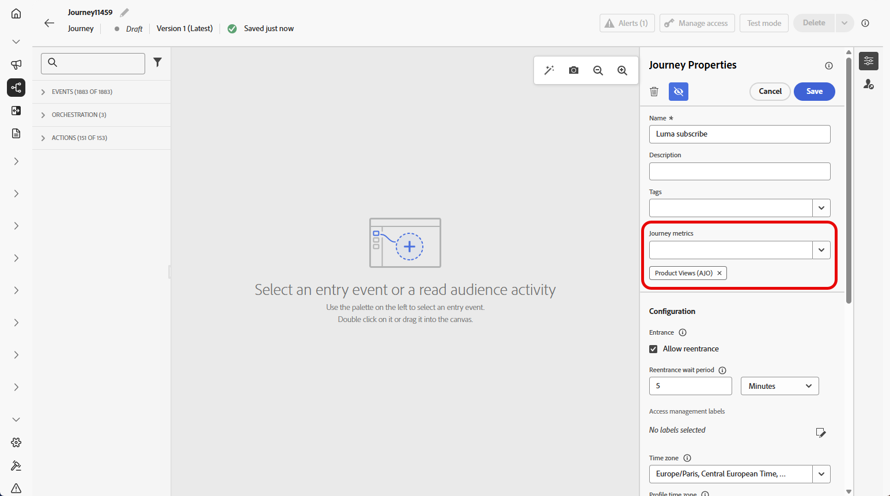
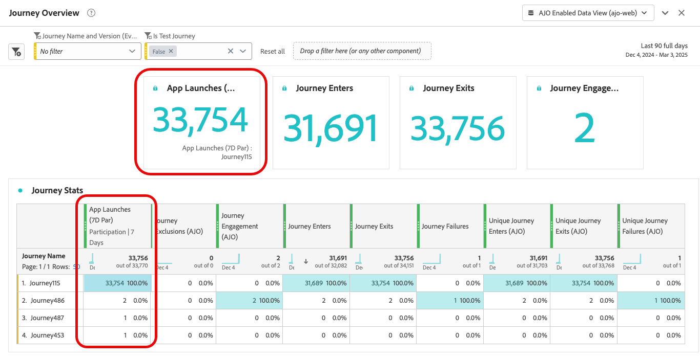

# 設定並追蹤歷程量度 {#success-metrics}

透過歷程量度清楚掌握客戶歷程的成效。 此功能可讓您根據定義的KPI追蹤效能、發掘有效方法的深入分析，以及識別最佳化區域。 透過即時衡量影響，您可以推動持續改善，並以資料為基礎做出提升客戶參與度的決策。

## 先決條件 {#prerequisites}

在使用歷程量度之前，您必須在Adobe Experience Platform中的設定>報告下新增包含`Commerce Details`、`Web`和`Mobile` [欄位群組](https://experienceleague.adobe.com/docs/experience-platform/xdm/tutorials/create-schema-ui.html?lang=zh-Hant#field-group){target="_blank"}的資料集。

這些欄位群組必須從內建選項中選取，而不是從自訂群組中選取。 請參閱[新增資料集](../reports/reporting-configuration.md#add-datasets)區段。

## 可用量度 {#metrics}

量度清單會依資料集所包含的[欄位群組](https://experienceleague.adobe.com/docs/experience-platform/xdm/tutorials/create-schema-ui.html?lang=zh-Hant#field-group){target="_blank"}而有所不同。

如果您的資料集未設定，則只有下列量度可供使用： **[!UICONTROL 點按]**、**[!UICONTROL 不重複點按]**、**[!UICONTROL 點進率]**&#x200B;和&#x200B;**[!UICONTROL 開啟率]**。

請注意，使用Customer Journey Analytics授權可讓您建立自訂成功量度。 [了解更多](https://experienceleague.adobe.com/zh-hant/docs/analytics-platform/using/cja-components/cja-calcmetrics/cm-workflow/participation-metric)

| 量度 | 相關欄位群組 |
|-|-|
| 點按次數 | 不需要欄位群組 |
| 不重複點按 | 不需要欄位群組 |
| 點進率(CTR) | 不需要欄位群組 |
| 點進開啟率(CTOR) | 不需要欄位群組 |
| 頁面檢視 | 網站欄位群組 |
| 應用程式啟動次數 | 行動欄位群組 |
| 首次應用程式啟動次數 | 行動欄位群組 |
| 應用程式安裝次數 | 行動欄位群組 |
| 應用程式升級 | 行動欄位群組 |
| 購買次數 | Commerce詳細資料欄位群組 |
| 結帳次數 | Commerce詳細資料欄位群組 |
| 購物車新增次數 | Commerce詳細資料欄位群組 |
| 購物車開啟次數 | Commerce詳細資料欄位群組 |
| 購物車檢視 | Commerce詳細資料欄位群組 |
| 購物車移除次數 | Commerce詳細資料欄位群組 |
| 產品檢視 | Commerce詳細資料欄位群組 |
| 儲存供日後使用次數 | Commerce詳細資料欄位群組 |

## 歸因 {#attribution}

每個量度都隨附一組歸因，可判斷哪些接觸點或互動對特定結果有貢獻。

* **具有Journey Optimizer授權的量度歸因**：

  僅使用Journey Optimizer授權時，任何選定量度的可用回顧期間上限會設為7天。 對於這些量度，歸因模型預設會設為&#x200B;**上次接觸**，也就是轉換前的最近互動。

  例如，您可以追蹤客戶在過去7天內與您的歷程互動後是否進行了購買。

* **具有Customer Journey Analytics授權的量度歸因**：

  透過Journey Optimizer和Customer Journey Analytics授權，您可以建立具有特定歸因設定的自訂量度，或變更內建量度的歸因。

  深入瞭解[歸因模型](https://experienceleague.adobe.com/zh-hant/docs/analytics-platform/using/cja-dataviews/component-settings/attribution#attribution-models)

## 指派您的歷程量度 {#assign}

>[!IMPORTANT]
>
>每個歷程只允許一個歷程量度。

若要開始追蹤您的歷程量度，請遵循下列步驟：

1. 從您的&#x200B;**[!UICONTROL 歷程]**&#x200B;功能表，按一下&#x200B;**[!UICONTROL 建立歷程]**。

1. 編輯歷程的設定窗格以定義歷程的名稱並設定其屬性。 瞭解如何在[此頁面](../building-journeys/journey-properties.md)上設定您的歷程屬性。

1. 選擇您的&#x200B;**[!UICONTROL 歷程量度]**，用於測量歷程的成效。

   請注意，量度適用於歷程本身，並適用於歷程的所有元素。

   

1. 按一下&#x200B;**[!UICONTROL 儲存]**。

1. 使用必要的&#x200B;**[!UICONTROL 活動]**&#x200B;設計您的歷程。

1. 測試並發佈您的歷程。

1. 開啟您的歷程報告，以追蹤您指派的成功量度的效能。

   您選擇的量度會顯示在報告的KPI和歷程統計資料表中。

   

