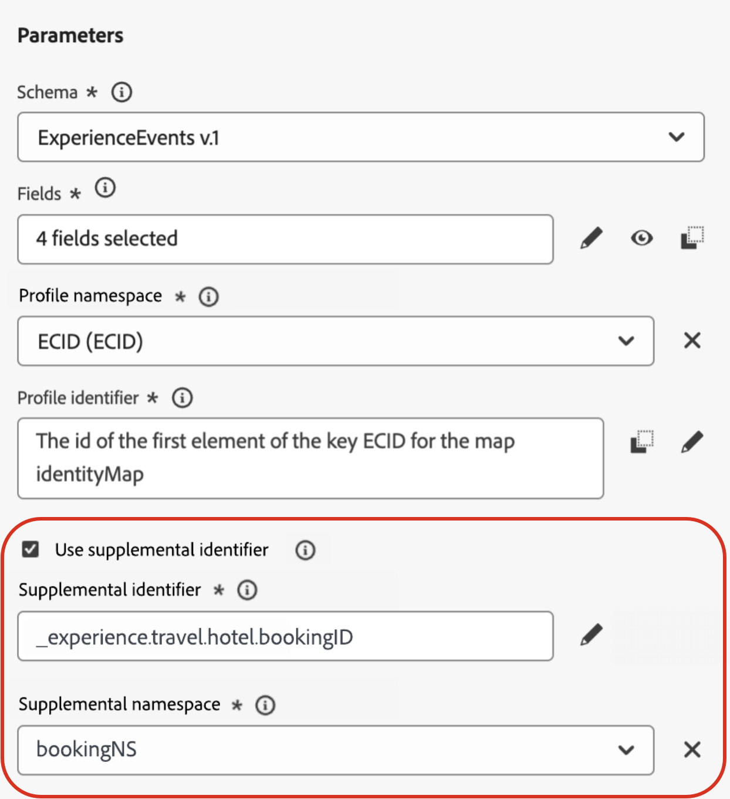
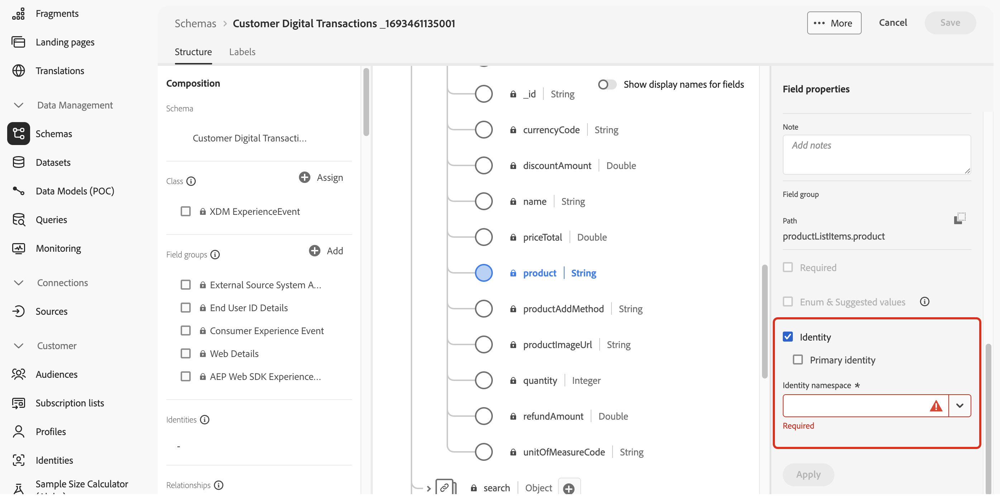
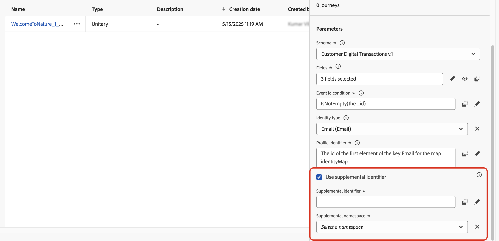
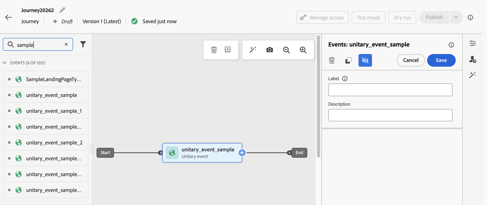
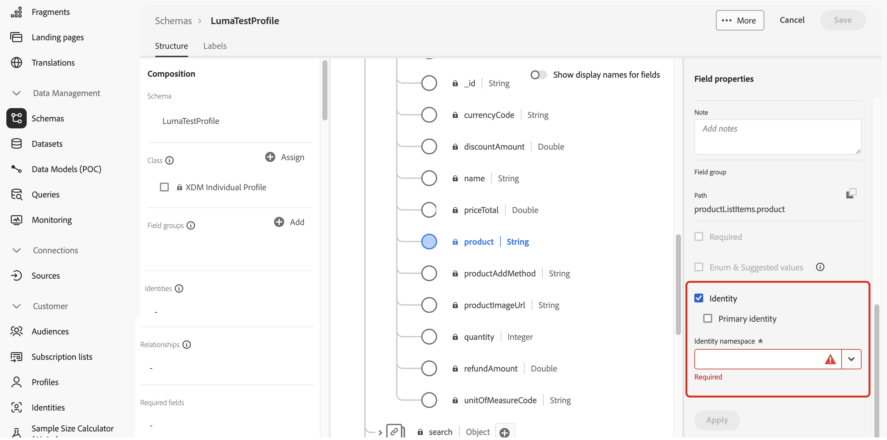
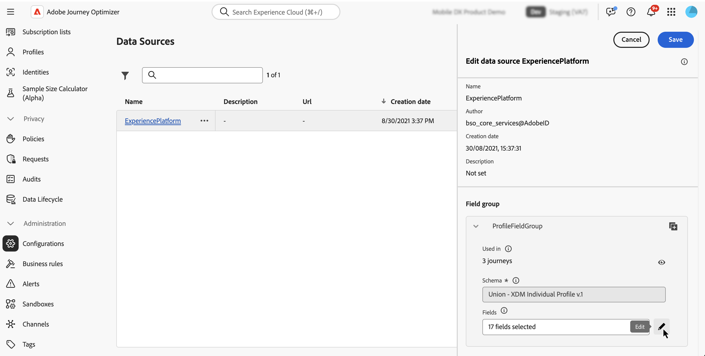
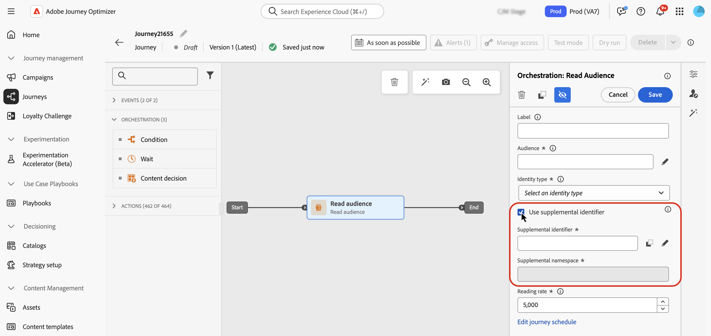
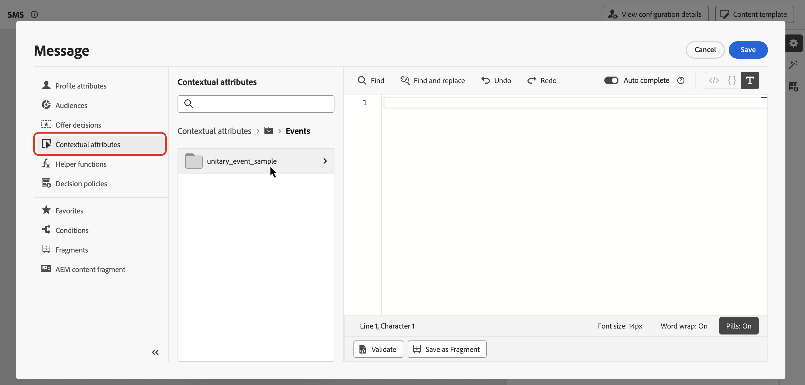

# 在歷程中使用補充識別碼 {#supplemental-id}

>[!CONTEXTUALHELP]
>id="ajo_journey_parameters_supplemental_identifier"
>title="使用補充識別碼"
>abstract="補充識別碼是次要識別碼，提供更多有關歷程執行方式的背景資訊。要定義補充識別碼，請選擇要用作補充識別碼的欄位並選擇與其建立關聯的命名空間。"

<!--
By default, journeys are executed in the context of a **profile ID**. This means that, as long as the profile is active in a given journey, it won't be able to re-enter another journey. To prevent this, [!DNL Journey Optimizer] allows you to capture a **supplemental identifier**, such as an order ID, subscription ID, prescription ID, in addition to the profile ID. 
In this example, we have added a booking ID as a supplemental identifier. 

{width=40% zoomable}

By doing so, journeys are executed in the context of the profile ID associated to the supplemental identifier (here, the booking ID). One instance of the journey is executed for each iteration of the supplemental identifier. This allows multiple entrances of the same profile ID in journeys if they have made different bookings. 

In addition, Journey Optimizer allows you to leverage attributes of the supplemental identifier (e.g., booking number, prescription renewal date, product type) for message customization, ensuring highly relevant communications.-->

<table style="border-collapse: collapse; width: 100%;">
  <tr>
    <td style="vertical-align: top; padding-right: 20px; border: none;">
      <p>依預設，歷程會在<b>設定檔ID</b>的內容中執行。 這表示，只要設定檔在指定歷程中處於作用中狀態，就無法將設定檔重新進入另一個歷程。 為避免此問題，除了設定檔識別碼之外，Journey Optimizer可讓您擷取<b>補充識別碼</b>，例如訂單ID、訂閱ID、處方ID。  
      <p>在此範例中，我們已新增<b>預訂ID</b>作為補充識別碼。</p>
      <p>如此一來，歷程會在與補充識別碼（此處為預訂ID）相關聯的設定檔ID內容中執行。 每個補充識別碼的疊代都會執行一個歷程例項。 如果訪客已進行不同預約，這可在歷程中讓多個入口使用相同的設定檔ID。</p>
      <p>此外，Journey Optimizer可讓您運用補充識別碼的屬性來自訂訊息（例如預訂編號、處方續約日期、產品型別），確保高度相關的通訊。</p>
    </td>
    <td style="vertical-align: top; border: none; text-align: center; width: 40%;">
      
    </td>
  </tr>
</table>

➡️ [在影片中探索此功能](#video)

## 護欄和限制 {#guardrails}

* **支援的歷程**： **事件觸發**&#x200B;和&#x200B;**讀取對象**&#x200B;歷程支援補充識別碼。 對象資格歷程（亦即以對象資格活動開始的歷程）中&#x200B;**不支援**。

* **並行執行個體限制**：設定檔不能有超過10個並行歷程執行個體。

* **頻率規則**：從補充識別碼使用方式建立的每個歷程執行個體都計入頻率上限，即使使用補充識別碼導致多個歷程執行個體亦然。

* **資料型別和結構描述結構**：補充識別項必須是型別`string`。 它可以是獨立的字串屬性，也可以是物件陣列中的字串屬性。 獨立的字串屬性會產生單一歷程例項，而物件陣列中的字串屬性則會導致物件陣列的每個疊代產生唯一的歷程例項。 不支援字串陣列和地圖。

* **歷程重新進入**

  具有補充識別碼的歷程重新進入行為遵循現有的重新進入原則：

   * 如果歷程不可重新進入，則相同的設定檔ID +補充ID組合無法重新進入歷程。
   * 如果歷程透過時間視窗重新進入，則相同的設定檔ID +補充ID組合可在定義的時間視窗後重新進入。

* **資料使用標籤與實作(DULE)** — 未對補充ID執行DULE驗證檢查。 這表示當歷程尋找資料治理原則違規時，不會考慮此屬性。

* **下游事件設定**

  如果您在歷程下游使用另一個事件，該事件必須使用相同的補充ID並具有相同的ID名稱空間。

* **讀取對象歷程**

   * 如果您使用業務事件，補充ID會停用。
   * 補充ID必須是設定檔中的欄位（即不是事件/內容欄位）。
   * 對於使用補充ID的讀取受眾歷程，每個歷程例項的讀取受眾活動讀取率限製為每秒500個設定檔上限。

## 具有補充ID的退出條件行為 {#exit-criteria}

先決條件：為補充ID啟用歷程（透過單一事件或讀取對象活動）

下表說明設定退出條件時，設定檔在啟用ID的補充歷程中的行為：

| 退出條件設定 | 符合退出准則時的行為 |
| ---------------------------- | ---------------------------------- |
| 根據非補充ID事件 | 將會退出該歷程中對應設定檔的所有執行個體。 |
| 根據補充ID事件&#x200B;<br/>*注意：補充ID名稱空間必須符合初始節點的名稱空間。* | 僅會退出相符的設定檔+補充ID例項。 |
| 根據對象 | 將會退出該歷程中對應設定檔的所有執行個體。 |

## 新增補充識別碼並在歷程中運用 {#add}

>[!BEGINTABS]

>[!TAB 事件觸發的歷程]

若要在事件觸發的歷程中使用補充識別碼，請遵循下列步驟：

1. **在事件結構描述中將屬性標示為識別碼**

   1. 存取事件結構描述，並找出您要當作補充識別碼使用的屬性（例如，預訂ID、訂閱ID），然後將其標示為ID。 [瞭解如何使用結構描述](../data/get-started-schemas.md)

   1. 將識別碼標示為&#x200B;**[!UICONTROL 身分]**。

      

      >[!IMPORTANT]
      >
      >請勿將屬性標示為&#x200B;**主要身分**。

   1. 選取要與補充ID關聯的名稱空間。 這必須是非人員識別碼名稱空間。

      將非人員身分名稱空間套用至結構描述後，您必須建立新事件才能使用補充識別碼。 無法重新整理現有實體以識別新識別碼。

1. **將補充ID新增至事件**

   1. 建立或編輯所需的事件。 [瞭解如何設定單一事件](../event/about-creating.md)

   1. 在事件組態畫面中，勾選&#x200B;**[!UICONTROL 使用補充識別碼]**&#x200B;選項。

      

   1. 使用運算式編輯器來選取您標示為補充ID的屬性。

      >[!NOTE]
      >
      >請確定您在&#x200B;**[!UICONTROL 進階模式]**&#x200B;中使用運算式編輯器來選取屬性。

   1. 選取補充ID後，關聯的名稱空間在事件設定畫面中會顯示為唯讀。

1. **將事件新增至歷程**

   將已設定的事件拖曳至歷程畫布。 它會根據設定檔ID和補充ID來觸發歷程專案。

   

>[!TAB 讀取對象歷程]

若要在讀取對象歷程中使用補充識別碼，請遵循下列步驟：

1. **在聯合/設定檔結構描述中將屬性標籤為識別碼**

   1. 存取聯集/設定檔結構，並找出您要當作補充識別碼使用的屬性（例如，預訂ID、訂閱ID），將其標示為ID。 [瞭解如何使用結構描述](../data/get-started-schemas.md)

   1. 將識別碼標示為&#x200B;**[!UICONTROL 身分]**。

      

      >[!IMPORTANT]
      >
      >請勿將屬性標示為&#x200B;**主要身分**。

   1. 選取要與補充ID關聯的名稱空間。 這必須是非人員識別碼名稱空間。

      將非人員身分名稱空間套用至結構描述後，您必須建立新的欄位群組才能使用補充識別碼。 無法重新整理現有實體以識別新識別碼。

<!--1. **Add the supplemental ID field to the data source**

    1. Navigate to the **[!UICONTROL Configuration]** / **[!UICONTROL Data Sources]** menu, then locate the "ExperiencePlatformDataSource" data source.

        

    1. Open the field selector then select the attribute you want to use as a supplemental identifier (e.g., booking ID, subscription ID).-->

1. **在歷程中新增並設定讀取對象活動**

   1. 在您的歷程中拖曳&#x200B;**[!UICONTROL 讀取對象]**&#x200B;活動。

   1. 在活動屬性窗格中，開啟&#x200B;**[!UICONTROL 使用補充識別碼]**&#x200B;選項。

      

   1. 在&#x200B;**[!UICONTROL 增補識別碼]**&#x200B;欄位中，使用運算式編輯器來選取您標示為增補ID的屬性。

      >[!NOTE]
      >
      >請確定您在&#x200B;**[!UICONTROL 進階模式]**&#x200B;中使用運算式編輯器來選取屬性。

   1. 選取增補ID後，關聯的名稱空間會在&#x200B;**[!UICONTROL 增補名稱空間]**&#x200B;欄位中顯示為唯讀。

>[!ENDTABS]

## 善用補充ID屬性

使用運算式編輯器和個人化編輯器來參照個人化或條件邏輯的補充識別碼屬性。 可從&#x200B;**[!UICONTROL 內容屬性]**&#x200B;功能表存取屬性。



針對事件觸發的歷程，如果您使用陣列（例如，多個處方或原則），請使用公式來擷取特定元素。

+++ 檢視範例

在補充ID為`bookingNum`且屬性位於相同層級`bookingCountry`的物件陣列中，歷程將根據bookingNum逐一檢視陣列物件，並為每個物件建立歷程執行個體。

* 條件活動中的下列運算式將逐一檢視物件陣列，並檢查`bookingCountry`的值是否等於「FR」：

  ```
  @event{<event_name>.<object_path>.<object_array_name>.all(currentEventField.<attribute_path>.bookingNum==${supplementalId}).at(0).<attribute_path>.bookingCountry}=="FR"
  ```

* 電子郵件個人化編輯器中的下列運算式將會逐一檢視物件陣列、提取適用於目前歷程執行個體的`bookingCountry`，並在內容中顯示它：

  ```
  {{#each context.journey.events.<event_ID>.<object_path>.<object_array_name> as |l|}} 
  
   {{l.<attribute_path>.bookingCountry}}  
  
  {{/each}}
  ```

* 用來觸發歷程的事件範例：

  ```
  "bookingList": [
        {
            "bookingInfo": {
                "bookingNum": "x1",
                      "bookingCountry": "US"
            }
        },
        {
            "bookingInfo": {
                "bookingNum": "x2",
                "bookingCountry": "FR"
            }
        }
    ]
  ```

+++

## 範例使用案例

### **原則更新通知**

* **案例**：保險公司針對客戶持有的每個有效保單傳送續約提醒。
* **執行**：
   * 設定檔： &quot;John&quot;。
   * 補充ID： `"AutoPolicy123", "HomePolicy456"`。
   * 歷程會針對每個原則個別執行，並提供個人化的續約日期、涵蓋範圍詳細資料和進階資訊。

### **訂閱管理**

* **案例**：當訂閱觸發事件時，訂閱服務會針對每個訂閱傳送量身打造的訊息。
* **執行**：
   * 設定檔： 「Jane」。
   * 補充ID： `"Luma Yoga Program ", "Luma Fitness Program"`。
   * 每個事件都包含訂閱ID和該訂閱的詳細資訊。 歷程會針對每個事件/訂閱個別執行，允許每個訂閱提供個人化的續約優惠。

### **產品推薦**

* **案例**：電子商務平台會根據客戶購買的特定產品傳送建議。
* **執行**：
   * 設定檔： 「Alex」。
   * 補充ID： `"productID1234", "productID5678"`。
   * 歷程會針對每個產品個別執行，並提供個人化的追加銷售機會。

## 作法影片 {#video}

瞭解如何在[!DNL Adobe Journey Optimizer]中啟用並套用補充識別碼。

>[!VIDEO](https://video.tv.adobe.com/v/3464803?quality=12&captions=chi_hant)
