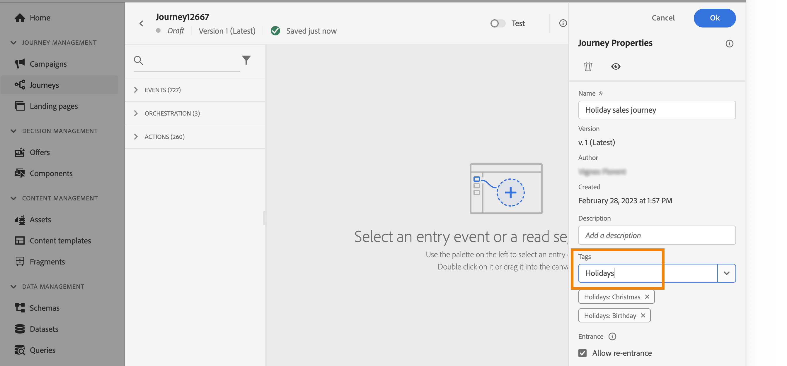
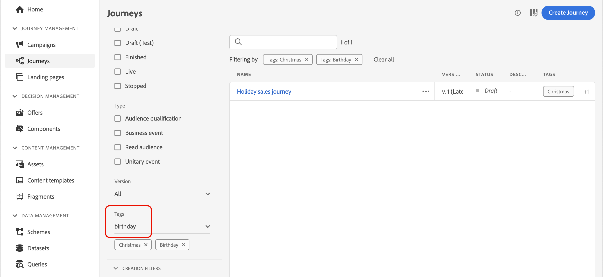
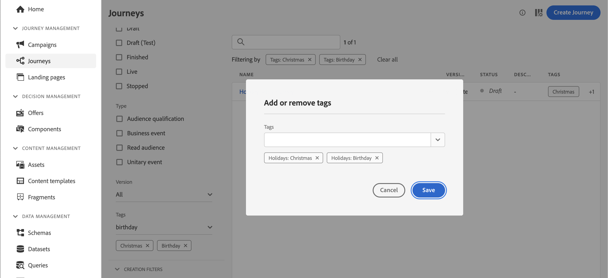

# 管理歷程中的標籤 {#journey_tags}

作為Journey Optimizer的從業人員，您可以使用標籤來組織您的歷程。 標籤是分類物件以改善搜尋的快速輕鬆方法。

## 將標籤新增至歷程

歷程屬性中的&#x200B;**標籤**&#x200B;欄位可讓您定義歷程的標籤。 您可選取現有標籤或建立新標籤。開始輸入所需標籤的名稱，然後從清單選取該名稱。 如果無法使用，請按一下&#x200B;**建立**&#x200B;以建立新的歷程並將其新增至您的歷程。 您可視需要定義任意數量的標籤。

歷程屬性中的

定義的標籤清單會顯示在&#x200B;**標籤**&#x200B;欄位下方。

>[!NOTE]
>
> 標籤不區分大小寫
> 
> 如果您複製或建立新版本的歷程，則會保留標籤。

## 依標籤篩選

歷程清單會顯示專用欄，讓您輕鬆地將您的標籤視覺化。

篩選器也可用於僅顯示具有特定標籤的歷程。

您可以從任何型別的歷程（即時、草稿等）新增或移除標籤。 按一下歷程旁的&#x200B;**更多動作**&#x200B;圖示，然後選取&#x200B;**編輯標籤**。

## 管理標籤

管理員可利用&#x200B;**管理**&#x200B;下方的&#x200B;**標籤**&#x200B;選單來刪除標籤，並依類別進行管理。請參閱此[檔案](https://experienceleague.adobe.com/docs/experience-platform/administrative-tags/overview.html?lang=zh-Hant)。

>[!NOTE]
>
> 歷程中定義的標籤會新增至內建的「未分類」類別。
