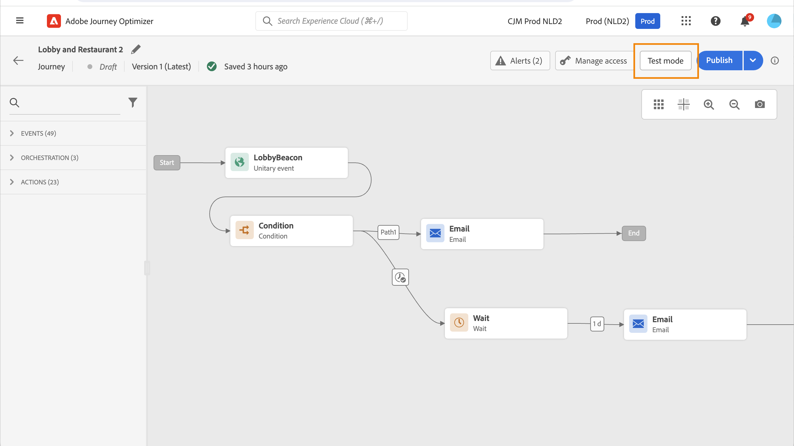
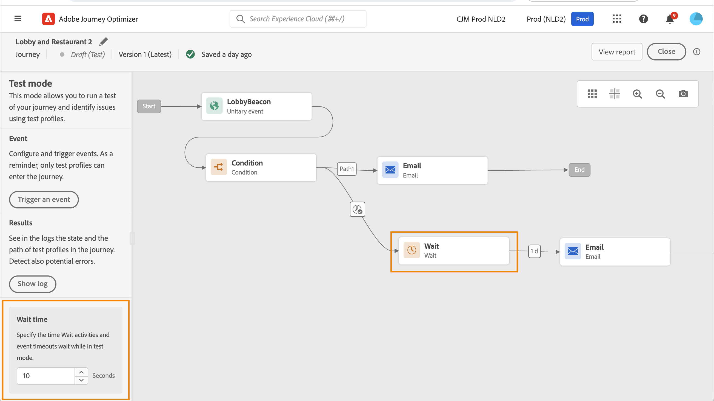
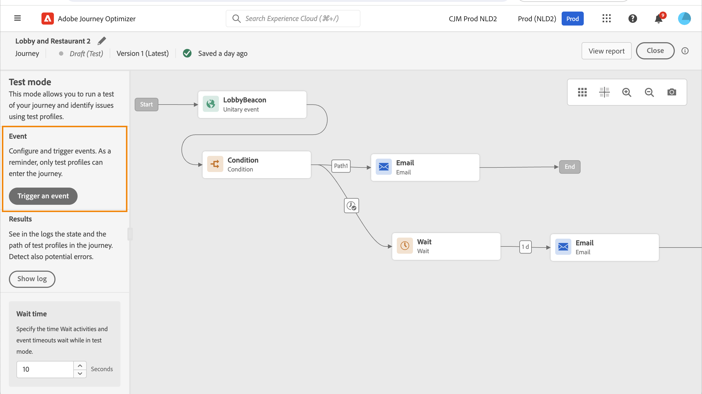
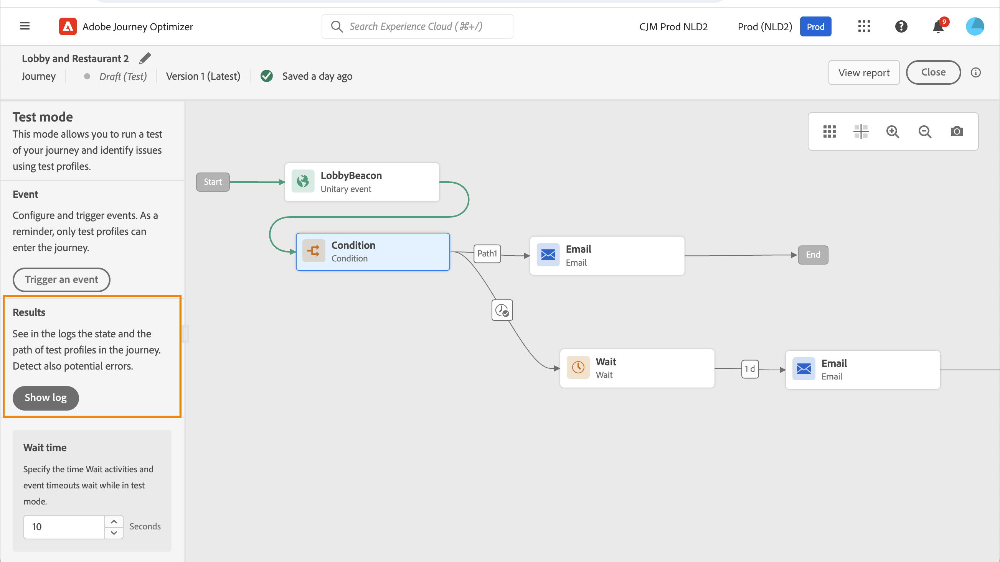
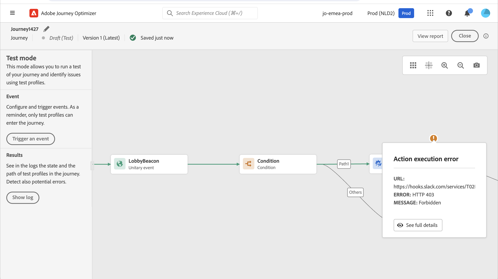
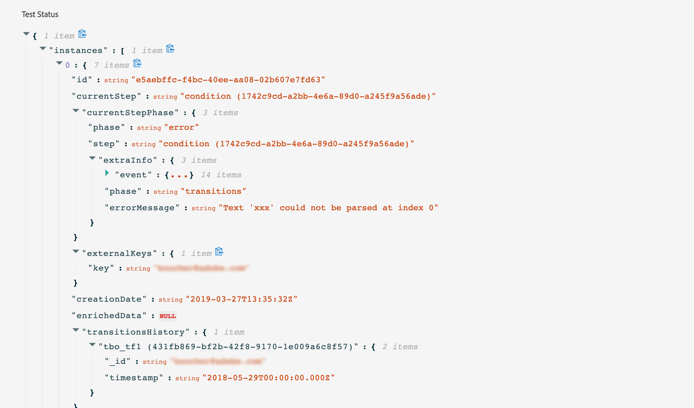

# 測試您的歷程{#testing_the_journey}

>[!CONTEXTUALHELP]
>id="ajo_journey_test"
>title="測試您的歷程"
>abstract="在發佈您的歷程之前使用測試設定檔進行測試。這可讓您分析個人在歷程中的流動方式並在發佈前進行疑難排解。"

一旦您建立了您的歷程，您就可以在發佈之前先測試它。 Journey Optimizer提供「測試模式」，以便在測試設定檔歷程中移動時檢視測試設定檔，並在啟用之前偵測潛在錯誤。 執行快速測試可讓您檢查歷程是否正確運作，以便您能夠放心發佈。

只有測試設定檔才能進入歷程測試模式。 您可以建立新的測試設定檔，或將現有的設定檔轉換為測試設定檔。 在[本節](../audience/creating-test-profiles.md)中進一步瞭解測試設定檔。

>[!NOTE]
>
>在測試您的歷程之前，您必須解決所有錯誤（如果有的話）。 在[本節](../building-journeys/troubleshooting.md)中測試之前，請先瞭解如何檢查錯誤。

## 重要備註 {#important_notes}

### 一般限制

* **僅測試設定檔** — 只有即時客戶設定檔服務中標示為「測試設定檔」的個人才能進入測試模式下的歷程。 [瞭解如何建立測試設定檔](../audience/creating-test-profiles.md)。
* **名稱空間需求** — 測試模式僅適用於使用名稱空間的草稿歷程。 測試模式需要檢查進入歷程的人員是否為測試設定檔，因此必須能夠存取Adobe Experience Platform。
* **設定檔限制** — 在單一測試工作階段中，最多可以有100個測試設定檔進入歷程。
* **事件觸發** — 事件只能從介面觸發。 無法使用API從外部系統引發事件。
* **自訂上傳對象** — 歷程測試模式不支援[自訂上傳對象](../audience/custom-upload.md)屬性擴充。

### 測試期間和測試後的行為

* **停用測試模式** — 當您停用測試模式時，目前或先前在歷程中輸入的所有設定檔都會被移除，且報告會被清除。
* **重新啟用彈性** — 您可以視需要多次啟用和停用測試模式。
* **自動停用** — 在測試模式中停用&#x200B;**一週**&#x200B;的歷程會自動恢復為草稿狀態，以最佳化效能並防止過時資源的使用。
* **編輯與發佈** — 測試模式作用中時，您無法修改歷程。 不過，您可以直接發佈歷程，之前不需要停用測試模式。

### 執行

* **分割行為** — 當歷程達到分割時，一律會選取頂端分支。 如果您想要測試不同的路徑，請重新排序分支。
* **事件計時** — 如果歷程包含*多個事件，則按順序觸發每個事件。過早傳送事件（第一個等待節點完成之前）或太晚傳送事件（在設定的逾時之後）將會捨棄該事件，並將設定檔傳送至逾時路徑。 一律透過在定義的視窗中傳送裝載，確認對事件裝載欄位的任何參考保持有效
* **作用中的日期視窗** — 確定歷程設定的選擇[開始和結束日期/時間](journey-properties.md#dates)視窗包括起始測試模式時的目前時間。 否則，觸發的測試事件會以無訊息方式捨棄。
* **回應事件** — 對於逾時的回應事件，最小和預設等待時間為40秒。
* **測試資料集** — 在測試模式中觸發的事件會儲存在專用的資料集中，標示如下： `JOtestmode - <schema of your event>`

<!--
* Fields from related entities are hidden from the test mode.
-->

## 啟動測試模式

若要使用測試模式，請遵循下列步驟：

1. 若要啟動測試模式，請按一下右上角的&#x200B;**[!UICONTROL 測試模式]**&#x200B;按鈕。

   歷程介面中的

1. 如果歷程至少有一個&#x200B;**等待**&#x200B;活動，請設定&#x200B;**[!UICONTROL 等待時間]**&#x200B;引數，以定義每個等待活動和事件逾時在測試模式中的持續時間。 等待和事件逾時的預設時間為10秒。 這將確保您能快速獲得測試結果。

   

   >[!NOTE]
   >
   >當歷程中使用具有逾時的回應事件時，等待時間的預設值及最小值為40秒。 請參閱[本節](../building-journeys/reaction-events.md)。

1. 使用&#x200B;**[!UICONTROL 觸發事件]**&#x200B;按鈕來設定事件並傳送給歷程。

   

1. 設定所需的不同欄位。 在&#x200B;**設定檔識別碼**&#x200B;欄位中，輸入用來識別測試設定檔的欄位值。 例如，可以是電子郵件地址。 請務必傳送與測試設定檔相關的事件。 請參閱[本節](#firing_events)。

   

1. 收到事件後，按一下&#x200B;**[!UICONTROL 顯示記錄]**&#x200B;按鈕以檢視測試結果並加以驗證。 請參閱[本節](#viewing_logs)。

   

1. 如果發生任何錯誤，請停用測試模式、修改您的歷程並再次測試。完成測試後，您就可以發佈歷程。 請參閱[此頁面](../building-journeys/publish-journey.md)。

## 觸發您的事件 {#firing_events}

>[!CONTEXTUALHELP]
>id="ajo_journey_test_configuration"
>title="設定測試模式"
>abstract="如果您的歷程包含多個事件，請使用下拉選單選取一個事件。然後，對於每個事件，設定傳遞的欄位和事件傳送的執行。"

使用&#x200B;**[!UICONTROL 觸發事件]**&#x200B;按鈕來設定讓人員進入歷程的事件。

### 先決條件 {#trigger-events-prerequisites}

您必須先瞭解哪些設定檔在Adobe Experience Platform中標示為測試設定檔。 事實上，測試模式僅允許在歷程中這些設定檔。

事件必須包含ID。 預期的ID取決於事件設定。 例如，可以是ECID或電子郵件地址。 需要將此金鑰的值新增到&#x200B;**設定檔識別碼**&#x200B;欄位中。

如果您的歷程無法啟用測試模式，錯誤為`ERR_MODEL_RULES_16`，請確定使用的事件包含使用通道動作時的[身分名稱空間](../audience/get-started-identity.md)。

身分名稱空間會用於唯一識別測試設定檔。 例如，如果使用電子郵件來識別測試設定檔，則應選取身分名稱空間&#x200B;**電子郵件**。 如果唯一識別碼是電話號碼，則應該選取識別名稱空間&#x200B;**電話**。

>[!NOTE]
>
>* 當您在測試模式中觸發事件時，會產生實際事件，這表示它也會點選聆聽此事件的其他歷程。
>
>* 確保測試模式中的每個事件都按正確順序在設定的等待期間內觸發。 例如，如果等候60秒，則必須在60秒等待過後、逾時限制過期之前觸發第二個事件。
>

### 事件設定 {#trigger-events-configuration}

如果您的歷程包含多個事件，請使用下拉選單選取一個事件。然後，針對每個事件，設定所傳遞的欄位以及傳送事件的執行。 介面可協助您在事件裝載中傳遞正確的資訊，並確保資訊型別正確無誤。 測試模式會儲存最後用於測試工作階段的引數以供稍後使用。

介面可讓您傳遞簡單事件引數。 如果您想要在事件中傳遞集合或其他進階物件，可以選取&#x200B;**[!UICONTROL 程式碼檢視]**&#x200B;來檢視裝載的整個程式碼並加以修改。 例如，您可以複製並貼上技術使用者準備的事件資訊。

技術使用者也可以使用此介面來撰寫事件裝載和觸發事件，而不必使用協力廠商工具。

按一下&#x200B;**[!UICONTROL 傳送]**&#x200B;按鈕時，測試開始。 歷程中個人的進度以視覺流程表示。 當個人在歷程中移動時，路徑會逐步變成綠色。 如果發生錯誤，會在對應的步驟上顯示警告符號。 您可以將游標放在錯誤上以顯示有關錯誤的更多資訊，並存取完整的詳細資訊（如果有的話）。

當您在事件設定畫面中選取不同的測試設定檔，然後再次執行測試時，視覺流程會清除並顯示新個人的路徑。

在測試中開啟歷程時，顯示的路徑對應於上次執行的測試。

## 規則型歷程的測試模式 {#test-rule-based}

測試模式也可用於使用規則型事件的歷程。 如需規則型事件的詳細資訊，請參閱[此頁面](../event/about-events.md)。

觸發事件時，**事件組態**&#x200B;畫面可讓您定義要在測試中傳遞的事件引數。 您可以按一下右上角的工具提示圖示來檢視事件ID條件。 規則評估的每個欄位旁也提供工具提示。

## 業務事件的測試模式 {#test-business}

使用[商業事件](../event/about-events.md)時，請使用測試模式在歷程中觸發單一測試設定檔入口、模擬事件並傳遞正確的設定檔ID。 您必須傳遞事件引數，以及將進入測試中歷程之測試設定檔的識別碼。 在測試模式中，根據業務事件的歷程沒有「程式碼檢視」模式可用。

請注意，當您首次觸發業務事件時，無法變更相同測試工作階段中的業務事件定義。 您只能讓相同或不同的個人透過相同或其他識別碼進入歷程。 若要變更業務事件引數，您必須停止再啟動測試模式。

## 檢視記錄 {#viewing_logs}

>[!CONTEXTUALHELP]
>id="ajo_journey_test_logs"
>title="測試模式記錄"
>abstract="「**顯示記錄**」按鈕以 JSON 格式顯示測試結果。這些結果會顯示歷程中個人的數目及其狀態。"

**[!UICONTROL 顯示記錄]**&#x200B;按鈕可讓您檢視測試結果。 此頁面以JSON格式顯示歷程的目前資訊。 按鈕可讓您複製整個節點。 您需要手動重新整理頁面以更新歷程的測試結果。

>[!NOTE]
>
>在測試記錄中，如果在呼叫協力廠商系統（資料來源或動作）時發生錯誤，則會顯示錯誤代碼和錯誤回應。

目前顯示在歷程中的個人（技術上稱為執行個體）數量。 以下是為個別使用者顯示的實用資訊：

* _Id_：歷程中的個人內部ID。 這可用於偵錯。
* _currentstep_：個人在歷程中的步驟。 建議您為活動新增標籤，以便更輕鬆識別。
* _currentstep_ >階段：個人歷程的狀態（執行中、已完成、錯誤或逾時）。 如需詳細資訊，請參閱下文。
* _currentstep_ > _extraInfo_：錯誤描述與其他內容資訊。
* _currentstep_ > _fetchErrors_：此步驟中發生擷取資料錯誤的資訊。
* _externalKeys_：事件中定義的索引鍵公式值。
* _extrendedData_：歷程使用資料來源時，歷程已擷取的資料。
* _transitionHistory_：個人遵循的步驟清單。 對於事件，會顯示裝載。
* _actionExecutionErrors_ ：發生錯誤的相關資訊。

以下是個人歷程的不同狀態：

* _執行中_：個人目前正在歷程中。
* _已完成_：個人位於歷程的結尾。
* _錯誤_：個人已在歷程中因錯誤而停止。
* _已逾時_：個人已在歷程中停止，因為步驟耗費太多時間。

使用測試模式觸發事件時，會自動以來源名稱產生資料集。

測試模式會自動建立體驗事件並將其傳送至Adobe Experience Platform。 此體驗事件的來源名稱為「Journey Orchestration測試事件」。

