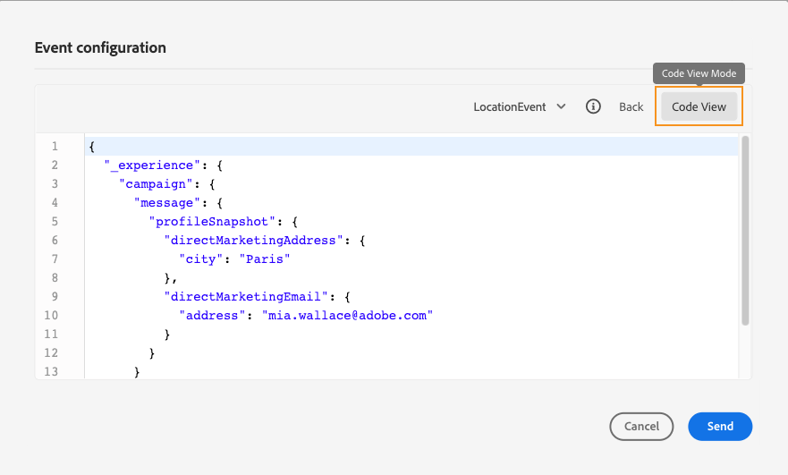

# 測試您的歷程{#testing_the_journey}

>[!CONTEXTUALHELP]
>id="ajo_journey_test"
>title="測試您的歷程"
>abstract="發佈前，請使用測試設定檔來測試您的歷程。 這可讓您分析個人在歷程中的流程，並在發佈前進行疑難排解。"

發佈前，請使用測試設定檔來測試您的歷程。 此模式可讓您執行歷程測試，並使用測試設定檔來識別問題。

只有測試設定檔才能在測試模式中進入歷程。 您可以建立新的測試設定檔，或將現有設定檔轉換為測試設定檔。 進一步了解測試設定檔，位於 [本節](../segment/creating-test-profiles.md).

>[!NOTE]
>
>在測試歷程之前，您必須先解決所有錯誤（如果有的話）。 了解如何先檢查錯誤，再於 [本節](../building-journeys/troubleshooting.md#checking-for-errors-before-testing).

若要使用測試模式，請遵循下列步驟：

1. 若要啟動測試模式，請啟動 **[!UICONTROL 測試]** 切換，位於右上角。

   

1. 如果歷程至少有一個 **等待** 活動，請設定 **[!UICONTROL 等待時間]** 參數，定義每個等待活動和事件逾時在測試模式中的持續時間。 等待和事件逾時的預設時間為10秒。 這可確保您快速取得測試結果。

   

   >[!NOTE]
   >
   >在歷程中使用具有逾時的反應事件時，預設等候時間和最小值為40秒。 請參閱[本節](../building-journeys/reaction-events.md)。

1. 使用 **[!UICONTROL 觸發事件]** 按鈕來設定事件並將事件傳送至歷程。

   

1. 設定預期的不同欄位。 在 **設定檔識別碼** 欄位中，輸入用於識別測試設定檔的欄位值。 例如，可以是電子郵件地址。 請務必傳送與測試設定檔相關的事件。 請參閱[本節](#firing_events)。

   

1. 收到事件後，按一下 **[!UICONTROL 顯示日誌]** 按鈕，查看測試結果並驗證結果。 請參閱[本節](#viewing_logs)。

   

1. 如果發生任何錯誤，請停用測試模式、修改您的歷程並再次測試。測試完成後，您就可以發佈歷程。 請參閱[此頁面](../building-journeys/publishing-the-journey.md)。

## 重要備註 {#important_notes}

* 提供介面以引發事件至測試的歷程，但事件也可由協力廠商系統(例如Postman)傳送。
* 只有在即時客戶個人檔案服務中標示為「測試個人檔案」的個人，才能進入測試的歷程。 請參閱 [節](../segment/creating-test-profiles.md).
* 測試模式僅適用於使用命名空間的草稿歷程。 測試模式需要檢查進入歷程的人員是否為測試設定檔，因此必須能夠存取Adobe Experience Platform。
* 在測試工作階段期間，測試設定檔數量上限為100。
* 當您停用測試模式時，它會從過去或目前進入該模式的所有使用者處搶佔歷程。 也會清除報表。
* 您可以視需要多次啟用/停用測試模式。
* 啟動測試模式時，您無法修改您的歷程。 在測試模式中時，您可以直接發佈歷程，不需要先停用測試模式。
* 到達分割時，一律會選取頂端分支。 如果希望測試選擇不同的路徑，則可以重新組織拆分分支的位置。
* 為了最佳化效能並防止使用過時的資源，在測試模式中，所有一週未觸發的歷程，都會切換回 **草稿** 狀態。

## 觸發事件 {#firing_events}

>[!CONTEXTUALHELP]
>id="ajo_journey_test_configuration"
>title="配置測試模式"
>abstract="如果您的歷程包含數個事件，請使用下拉式清單來選取事件。 然後，針對每個事件，設定傳遞的欄位以及事件傳送的執行。"

使用 **[!UICONTROL 觸發事件]** 按鈕來設定將讓人員進入歷程的事件。

>[!NOTE]
>
>當您在測試模式中觸發事件時，會產生一個實際事件，這表示它也會點擊聆聽此事件的其他歷程。

您必須知道哪些設定檔在Adobe Experience Platform中會標籤為測試設定檔。 事實上，測試模式只允許歷程中的這些設定檔，而事件必須包含ID。 預期的ID取決於事件設定。 例如，它可以是ECID或電子郵件地址。 此索引鍵的值需要新增至 **設定檔識別碼** 欄位。

如果您的歷程包含數個事件，請使用下拉式清單來選取事件。 然後，針對每個事件，設定傳遞的欄位以及事件傳送的執行。 介面可協助您在事件裝載中傳遞正確的資訊，並確定資訊類型正確無誤。 測試模式會儲存測試工作階段中使用的最後一個參數，以供稍後使用。

介面可讓您傳遞簡單事件參數。 如果要在事件中傳遞集合或其他高級對象，可以按一下 **[!UICONTROL 程式碼檢視]** 來查看裝載的整個程式碼，並加以修改。 例如，您可以複製並貼上技術使用者準備的事件資訊。

技術使用者也可以使用此介面來撰寫事件裝載和觸發事件，而不需使用協力廠商工具。

按一下 **[!UICONTROL 傳送]** 按鈕，測試開始。 歷程中的個人進度會以視覺流程表示。 當個人在歷程中移動時，路徑會逐漸變成綠色。 如果發生錯誤，則在對應的步驟上會顯示警告符號。 您可以將游標置於其上以顯示有關錯誤的更多資訊，並訪問完整詳細資訊（如果可用）。

當您在事件設定畫面中選取不同的測試設定檔並再次執行測試時，會清除視覺流程並顯示新個人的路徑。

在測試中開啟歷程時，顯示的路徑對應於上次執行的測試。

不論事件是透過介面還是從外部觸發(例如使用Postman)，視覺流程皆有效。

## 規則型歷程的測試模式 {#test-rule-based}

測試模式也適用於使用規則型事件的歷程。 如需規則型事件的詳細資訊，請參閱 [本頁](../event/about-events.md).

觸發事件時， **事件設定** 畫面可讓您定義要傳遞至測試的事件參數。 您可以按一下右上角的工具提示圖示，以檢視事件ID條件。 規則評估的每個欄位旁也會提供工具提示。

## 業務事件的測試模式 {#test-business}

使用 [業務事件](../event/about-events.md)，使用測試模式來觸發歷程中的單一測試設定檔入口、模擬事件，並傳遞正確的設定檔ID。 您必須傳遞事件參數以及將在測試中輸入歷程之測試設定檔的識別碼。 您無法使用 **[!UICONTROL 一次最多100個設定檔]** 其他以區段為基礎的歷程存在的選項。 在測試模式中，沒有「程式碼檢視」模式可供根據業務事件進行的歷程使用。

請注意，當您首次觸發業務事件時，無法變更相同測試工作階段中的業務事件定義。 您只能讓相同或不同的個人進入傳遞相同或其他識別碼的歷程。 如果要更改業務事件參數，必須停止並重新啟動測試模式。

## 檢視記錄 {#viewing_logs}

>[!CONTEXTUALHELP]
>id="ajo_journey_test_logs"
>title="測試模式日誌"
>abstract="顯示日誌按鈕以JSON格式顯示測試結果。 這些結果會顯示歷程中的個人人數及其狀態。"

此 **[!UICONTROL 顯示日誌]** 按鈕可讓您檢視測試結果。 本頁面以JSON格式顯示歷程的目前資訊。 按鈕可讓您複製整個節點。 您需要手動重新整理頁面，以更新歷程的測試結果。

>[!NOTE]
>
>在測試記錄中，如果在呼叫協力廠商系統（資料來源或動作）時發生錯誤，則會顯示錯誤碼和錯誤回應。

歷程中目前會顯示個人（技術上稱為例項）的人數。 以下是針對每個個人顯示的實用資訊：

* _Id_:歷程中的個人內部ID。 這可用於偵錯用途。
* _currentstep_:個人在歷程中的步驟。 建議您在活動中新增標籤，以便更輕鬆地加以識別。
* _currentstep_ >階段：個人歷程的狀態（執行中、完成、錯誤或逾時）。 請參閱下方以了解更多資訊。
* _currentstep_ > _extraInfo_:錯誤的說明和其他內容資訊。
* _currentstep_ > _fetchErrors_:有關此步驟期間發生的擷取資料錯誤的資訊。
* _externalKeys_:在事件中定義的鍵公式值。
* _chenchedData_:歷程使用資料來源時，歷程已擷取的資料。
* _transitionHistory_:個人遵循的步驟清單。 對於事件，會顯示裝載。
* _actionExecutionErrors_ :發生錯誤的相關資訊。

以下是個人歷程的不同狀態：

* _執行中_:個人目前在歷程中。
* _已完成_:個人位於歷程結束。
* _錯誤_:由於錯誤，個人會在歷程中停止。
* _超時_:由於步驟耗費太多時間，個人會在歷程中停止。

使用測試模式觸發事件時，資料集會以來源名稱自動產生。

測試模式會自動建立體驗事件，並將其傳送至Adobe Experience Platform。 此體驗事件的來源名稱為「Journey Orchestration測試事件」。

