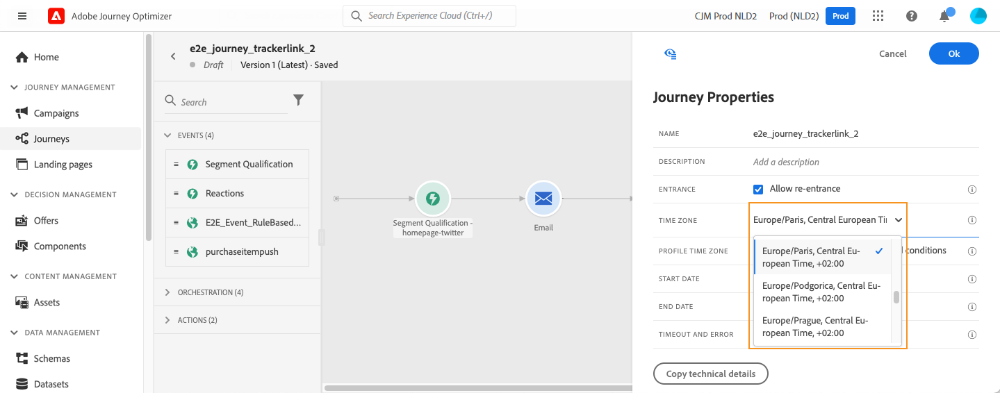

# 時區管理 {#timezone_management}

>[!CONTEXTUALHELP]
>id="ajo_journey_properties_time_zone"
>title="歷程時區"
>abstract="選取歷程的時區。 當使用固定時區時，對於所有進入歷程的個人來說都是相同的。"

您可以在歷程的[屬性](../building-journeys/journey-properties.md#timezone)中定義時區。

若要存取歷程屬性，請選取畫面右上角的鉛筆圖示。

此時區將用於包含時間元素的歷程的每個活動，例如：

* [時間條件](../building-journeys/conditions.md#time_condition)
* [日期條件](../building-journeys/conditions.md#date_condition)
* [自訂等待](../building-journeys/wait-activity.md#custom)

<!--
* [Fixed date wait](../building-journeys/wait-activity.md#fixed_date)
-->

您可以選取[固定時區](#fixed-timezone)，或選擇使用使用者設定檔](#timezone-from-profiles)中定義的時區[。

## 定義固定時區 {#fixed-timezone}

時區可以固定。 清除預先定義的時區，並從下拉式清單中選取一個時區。 如果您使用固定時區，則所有進入歷程的個人都將使用相同的時區。

若要這麼做，請在&#x200B;**[!UICONTROL 歷程屬性]**&#x200B;窗格中選取時區。

## 使用輪廓時區 {#timezone-from-profiles}

>[!CONTEXTUALHELP]
>id="ajo_journey_properties_profile_time_zone"
>title="使用輪廓時區"
>abstract="勾選此選項，即可在&#x200B;**「等待」**&#x200B;及&#x200B;**「條件」**&#x200B;活動中使用即時輪廓時區。 如果已經定義輪廓的時區，系統便會取得該時區並在歷程中使用。 若未設定，將使用上面時區欄位中定義的時區。"

如果歷程的進入事件具有名稱空間，這表示歷程可以存取[!DNL Adobe Experience Platform]的即時客戶設定檔服務，您可能會想要使用設定檔層級定義的時區。 若要這麼做，請在&#x200B;**屬性**&#x200B;中勾選&#x200B;**在等待和條件中使用設定檔時區**。 預設不會勾選此選項。

如果為設定檔定義了時區，則會擷取該時區並由歷程使用。 如果沒有，則使用的時區是時區欄位中定義的時區。

>[!NOTE]
>
>設定檔時區與&#x200B;**偏好設定詳細資料**&#x200B;欄位群組中現有的&#x200B;**時區**&#x200B;欄位搭配使用。

## 在運算式中使用時區 {#timezone-in-expressions}

歷程的開始和結束日期無法連結至特定時區。 它們會自動關聯至執行個體的時區。
