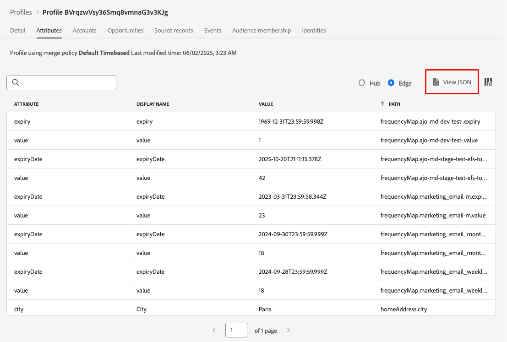

# 將歷程中的傳入動作進行疑難排解 {#troubleshooting-inbound-actions}

傳入動作（例如應用程式內、Web和程式碼型體驗）是[!DNL Journey Optimizer]的重要元件，因為這些動作會在使用者歷程期間與其啟用個人化參與。 但可能會發生非預期的行為，例如遺失傳入內容，或設定檔退出歷程後繼續傳送。

本指南逐步說明如何偵錯歷程中入站動作的相關問題，協助您在聯絡支援人員之前獨立識別並解決問題。

<!--This guide addresses the two most common scenarios with inbound actions in a journey. They are as follows:

* A profile enters the inbound step, but the user does not receive the expected inbound content.
* A user continues to receive inbound content even after the profile exits the journey.
-->

## 先決條件 {#prerequisites}

開始疑難排解之前，請先確定下列事項：

1. 設定&#x200B;**Assurance**&#x200B;工作階段。 在[Adobe Experience Platform Assurance檔案](https://experienceleague.adobe.com/en/docs/experience-platform/assurance/tutorials/using-assurance){target="_blank"}中進一步瞭解。

1. 導覽至包含傳入動作的歷程，以擷取歷程名稱和版本ID。

   >[!NOTE]
   >
   >您可以在&#39;journey/&#39;之後的URL中找到歷程版本ID (例如： *86232fb1-2932-4036-8198-55dfec606fd7*)。

   

1. 按一下傳入動作以檢視其詳細資訊。 擷取傳入動作標籤和ID。

   

1. 取得設定檔名稱空間和ID，以識別設定檔遇到的問題。 根據您的設定，例如名稱空間可以是ECID、電子郵件或客戶ID。 在[Experience Platform檔案](https://experienceleague.adobe.com/en/docs/experience-platform/profile/ui/user-guide#browse-identity){target="_blank"}中瞭解如何查詢設定檔。

## 案例1：使用者尚未收到傳入內容 {#scenario-1}

在此案例中，設定檔已在歷程中輸入入站動作，但即使在30分鐘後，對應的入站內容也不會在設定觸發步驟顯示在裝置/使用者端中。

### 預先檢查 {#pre-checks}

1. **已針對設定檔擷取啟用歷程傳入資料集**

   傳入動作在執行期間使用&#x200B;**歷程傳入**&#x200B;資料集進行設定檔更新。 確保目前沙箱中的設定檔已啟用此資料集。 [進一步瞭解資料集](../data/get-started-datasets.md)

2. 已在平台身分中定義&#x200B;**&#39;joai&#39;身分**

   傳入動作使用設定檔&#x200B;**中的** joai`segmentMembership`名稱空間來啟動傳入步驟的設定檔。 確定已在沙箱的Platform身分中定義它。 深入瞭解[Experience Platform Identity服務](https://experienceleague.adobe.com/en/docs/experience-platform/identity/home){target="_blank"}

### 偵錯步驟 {#debugging-steps}

下圖顯示您可以遵循的偵錯步驟順序：

{width="70%" align="center"}

### 步驟1：檢查裝置/使用者端是否從Edge Network接收內容 {#step-1}

首先，檢查裝置/使用者端是否取得預期的內容。

>[!BEGINTABS]

>[!TAB 應用程式內頻道]

1. 前往[Assurance](https://experienceleague.adobe.com/en/docs/experience-platform/assurance/tutorials/using-assurance){target="_blank"}工作階段，然後從左側面板選取&#x200B;**[!UICONTROL 應用程式內傳訊]**&#x200B;區段。

1. 在&#x200B;**[!UICONTROL 裝置]**&#x200B;上的訊息，按一下&#x200B;**[!UICONTROL 訊息]**&#x200B;下拉式清單。

   {width="80%"}

1. 尋找歷程名稱后接「 — 應用程式內訊息」的訊息。 如果存在，表示裝置/使用者端上存在應用程式內訊息，而問題可能和應用程式內觸發器有關。

1. 如果找不到訊息，裝置/使用者端就不會收到應用程式內訊息。<!--Go to the [next step](#step-2) for further debugging.-->

>[!TAB 網路頻道]

造訪頁面並檢查網路標籤，或在&#x200B;**[!UICONTROL Edge]**&#x200B;工作階段的[Edge Delivery](https://experienceleague.adobe.com/en/docs/experience-platform/assurance/tutorials/using-assurance){target="_blank"}區段中檢查Assurance回應裝載。

>[!TAB 程式碼型體驗管道]

使用[Adobe的API](https://developer.adobe.com/data-collection-apis/docs/api/)執行curl要求，並在&#x200B;**[!UICONTROL Edge]**&#x200B;工作階段的[Edge Delivery](https://experienceleague.adobe.com/en/docs/experience-platform/assurance/tutorials/using-assurance){target="_blank"}區段中檢查Assurance回應裝載。

>[!ENDTABS]

### 步驟2：檢查Edge Network是否傳回內容 {#step-2}

此步驟旨在確保Edge Network傳回預期要在裝置/使用者端上轉譯的輸入內容。

當設定檔進入歷程中的傳入動作時，會自動符合傳入動作對應的特殊受眾區段（在&#x200B;**joai**&#x200B;名稱空間中）。

當使用者端向Edge Network提出特定設定檔和介面的要求時，該設定檔符合接收針對該介面的傳入歷程動作內容的資格，前提是該設定檔目前是相對應&#x200B;**joai**&#x200B;區段的成員。

若要針對Edge Network行為除錯，請遵循下列步驟。

1. 在Assurance工作階段中開啟&#x200B;**[!UICONTROL Edge Delivery]**&#x200B;檢視。 此檢視提供在Edge Network伺服器上執行輸入動作的相關資訊。 進一步瞭解 [Experience Platform 文件](https://experienceleague.adobe.com/zh-hant/docs/experience-platform/assurance/view/edge-delivery){target="_blank"}。

1. 驗證與輸入動作相對應的Edge活動是否已列在&#x200B;**[!UICONTROL 合格活動]**&#x200B;或&#x200B;**[!UICONTROL 不合格活動]**&#x200B;區段中。

   

   * 如果在&#x200B;**合格活動**&#x200B;區段中，設定檔符合傳入歷程動作的資格，則應傳回內容。
   * 如果在&#x200B;**不合格活動**&#x200B;區段中，設定檔不符合傳入歷程動作的資格。 如需詳細資訊，請參閱排除原因。
   * 如果在&#x200B;**兩個區段**&#x200B;中都沒有發生，可能是將傳入歷程動作發佈到Edge Network時發生問題，或是要求的表面URI不符合傳入動作的管道組態設定。

   >[!NOTE]
   >
   >若要在&#x200B;**Assurance**&#x200B;工作階段中尋找Edge活動，請尋找&#x200B;**[!UICONTROL audienceNamespace]**&#x200B;為&#x200B;**joai**，**[!UICONTROL audienceSegmentId]**&#x200B;為&lt;*JourneyVersionID*>_&lt;*JourneyActionID*>的活動(例如： *86232fb1-2932-4036-8198-55dfec606fd7_708f718d-8503-4427-ad8d-8e28979b554c*)。

   {width="70%"}

1. 如果您的活動在&#x200B;**[!UICONTROL 不合格活動]**&#x200B;區段中，且排除原因為&#x200B;*&#39;區段非作用中&#39;*，表示Edge Network傳遞伺服器認為設定檔不屬於相關&#x200B;**joai**&#x200B;對象區段。

   您可以開啟「設定檔」區段的&#x200B;**segmentsMap**&#x200B;元素，並尋找&#x200B;**joai**&#x200B;區段ID是否存在，來仔細檢查&#x200B;**joai**&#x200B;區段是否存在於設定檔的Edge Network傳遞伺服器檢視中。

1. 如果Edge Network傳遞伺服器未檢視設定檔為位於相關的&#x200B;**joai**&#x200B;區段中，請移至下一個步驟。<!--use the Platform Profile viewer UI to check if the expected **joai** segment is in a realized state in the Edge profile. Learn more in the [Experience Platform Profile UI documentation](https://experienceleague.adobe.com/en/docs/experience-platform/profile/ui/user-guide){target="_blank"}-->

### 步驟3：檢查「joai」對象會籍是否已傳播至Edge Network {#step-3}

此步驟是驗證當設定檔進入傳入歷程動作，且該設定檔符合對應&#x200B;**joai**&#x200B;區段的資格時，Edge設定檔是否已正確更新。

當設定檔符合&#x200B;**joai**&#x200B;區段的資格時，設定檔會先在中心更新，然後區段會投射到Edge設定檔中，以供Edge Network傳送伺服器使用。

>[!NOTE]
>
>從集線器更新設定檔起，傳輸到Edge最多可能需要15到30分鐘。

若要檢查Edge設定檔的&#x200B;**屬性中是否存在** joai`segmentMembership`區段，請遵循下列步驟。

1. 導覽至&#x200B;**[!UICONTROL 左側導覽窗格中的]**&#x200B;客戶&#x200B;**[!UICONTROL >]**&#x200B;設定檔[!DNL Journey Optimizer]功能表，並使用名稱空間和ID瀏覽至設定檔。 深入瞭解[即時客戶設定檔](../audience/get-started-profiles.md)

1. 選取「**[!UICONTROL 屬性]**」標籤，然後選擇「**[!UICONTROL Edge]**」檢視。

1. 按一下&#x200B;**[!UICONTROL 檢視JSON]**&#x200B;以開啟設定檔的JSON檢視。

   {width="80%"}

1. 移至`segmentMembership`屬性並檢查區段識別碼&lt;*JourneyVersionID>*_&lt;*JourneyActionID*>是否出現在&#x200B;**joai**&#x200B;名稱空間中，以及是否在&#x200B;**[!UICONTROL realized]** <!--or existing?-->狀態中。

   {width="90%"}

   * 如果存在，則與傳入歷程動作相對應的&#x200B;**joai**&#x200B;區段已正確傳播至Edge設定檔。

   * 如果未顯示在Edge Network傳送伺服器的設定檔檢視中，則傳送伺服器載入Edge設定檔的方式可能會發生問題。

1. 如果&#x200B;**joai**&#x200B;區段ID不存在或處於&#x200B;**[!UICONTROL 已退出]**&#x200B;狀態，表示它（尚）未傳播至Edge。

   請等待15到30分鐘，讓`segmentMembership`值從中樞傳播至Edge。 如果仍不存在，請前往下一步。

<!--The next step is to check whether the audience segment is present in the profile on the Hub.-->

### 步驟4：檢查集線器上的設定檔中是否存在「joai」對象會籍 {#step-4}

此步驟是驗證當設定檔進入入站歷程動作，且該設定檔符合對應&#x200B;**joai**&#x200B;區段的資格時，中心設定檔是否已正確更新。

>[!NOTE]
>
>將&#x200B;**joai**&#x200B;區段會籍擷取到中心設定檔中，從設定檔進入傳入歷程動作的那一刻起，最多可能需要15至30分鐘的時間。

若要檢查集線器設定檔的&#x200B;**屬性中是否存在** joai`segmentMembership`區段，請遵循下列步驟。

1. 導覽至&#x200B;**[!UICONTROL 左側導覽窗格中的]**&#x200B;客戶&#x200B;**[!UICONTROL >]**&#x200B;設定檔[!DNL Journey Optimizer]功能表，並使用名稱空間和ID瀏覽至設定檔。 深入瞭解[即時客戶設定檔](../audience/get-started-profiles.md)

1. 選取&#x200B;**[!UICONTROL 屬性]**&#x200B;標籤，然後選擇&#x200B;**[!UICONTROL 中心]**&#x200B;檢視。

1. 按一下&#x200B;**[!UICONTROL 檢視JSON]**&#x200B;以開啟設定檔的JSON檢視。

1. 移至&#x200B;**[!UICONTROL segmentMembership]**&#x200B;屬性，並檢查區段識別碼&lt;*JourneyVersionID>*_&lt;*JourneyActionID*>是否在&#x200B;**joai**&#x200B;名稱空間中，以及是否在&#x200B;**[!UICONTROL realized]** <!--or existing?-->狀態中。

   * 如果存在，則與傳入歷程動作相對應的&#x200B;**joai**&#x200B;區段已正確擷取到集線器設定檔中。

   * 若在至少30分鐘後仍無法在Edge設定檔中找到，Edge投影系統可能會發生問題。

1. 如果&#x200B;**joai**&#x200B;區段ID不存在或處於&#x200B;**[!UICONTROL 已退出]**&#x200B;狀態，這表示設定檔在進入對應的傳入歷程動作時（尚）未正確符合特殊&#x200B;**joai**&#x200B;對象區段的資格。

   請等待15到30分鐘，以將`segmentMembership`值擷取到集線器上的設定檔。 如果仍不存在，請前往下一步。

### 步驟5：如果使用者端/裝置仍未取得預期的內容 {#step-5}

如果您已執行上述所有步驟，但在等候區段成員資格傳播至Edge Network 30到60分鐘後仍未看到預期行為，請聯絡Adobe客戶服務或您的Adobe代表。

在偵錯步驟中儘可能加入詳細資訊，例如：

* 看到非預期行為的步驟；
* 歷程版本ID；
* 歷程動作ID；
* 完整的Assurance追蹤；
* Edge設定檔的JSON檢視；
* 中樞設定檔的JSON檢視；
* 等

## 案例2：使用者仍在接收傳入內容 {#scenario-2}

此情境與[情境1](#scenario-1)相反：設定檔已退出歷程，但使用者仍在接收傳入內容。

不過，當設定檔退出歷程時，應該不再符合歷程中傳入動作相對應的&#x200B;**joai**&#x200B;受眾區段。

執行與[案例1](#debugging-steps)相同的偵錯步驟，以檢查Hub設定檔、Edge設定檔及Edge Network傳遞伺服器是否正確反映相關&#x200B;**joai**&#x200B;區段的區段會籍狀態，以及使用者端是否不再接收傳入內容。

<!--

## Reference Section {#reference-section}

- [Assurance Setup Guide](https://experienceleague.adobe.com/en/docs/experience-platform/assurance/tutorials/using-assurance)
- [Adobe Experience Platform Documentation](https://experienceleague.adobe.com/docs/experience-platform/home.html)
- [Streaming Ingestion APIs Troubleshooting](https://experienceleague.adobe.com/docs/experience-platform/ingestion/streaming/troubleshooting.html)

-->
