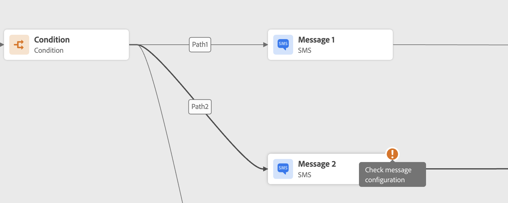
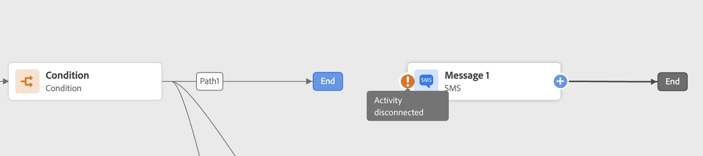
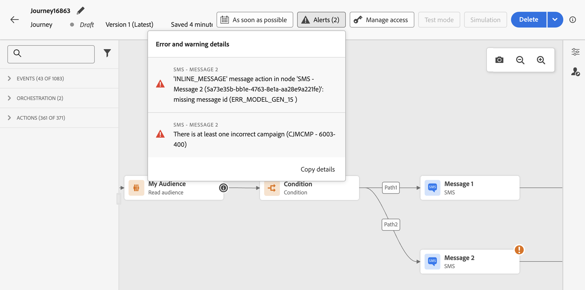

# 在測試您的歷程之前疑難排解錯誤 {#troubleshooting}

在本節中，瞭解如何在測試或發佈之前疑難排解歷程。 下列所有檢查皆可在歷程處於測試模式或歷程為即時狀態時執行。建議您在測試模式中進行下列所有檢查，然後繼續發佈。在[此頁面](../building-journeys/testing-the-journey.md)上進一步瞭解測試模式。

瞭解如何疑難排解歷程事件、檢查設定檔是否進入您的歷程、如何瀏覽歷程，以及是否在此頁面[傳送](troubleshooting-execution.md)訊息。

如果您使用輸入動作，請在此頁面[瞭解如何疑難排解](troubleshooting-inbound.md)。

## 活動中的錯誤 {#activity-errors}

在測試和發佈您的歷程之前，請先確認所有活動皆已正確設定。如果系統仍偵測到錯誤，則無法進行測試或發佈。

發生錯誤，而且畫布上的活動本身會顯示警告符號。將游標放在驚嘆號上，即可顯示錯誤訊息。如果您選取活動，應該會看到錯誤的行並會顯示警告。 例如：

* 如果必填欄位為空，則會顯示錯誤

  

* 在畫布中，當兩個活動中斷連線時，會顯示警告

  

## 歷程中的錯誤 {#canvas-errors}

畫布上方的&#x200B;**[!UICONTROL 警示]**&#x200B;按鈕也會顯示錯誤。 此按鈕可讓您檢視系統偵測到的錯誤，這些錯誤會阻止測試模式啟動或歷程發佈。

系統偵測到兩種問題： **錯誤**&#x200B;和&#x200B;**警告**。 錯誤會封鎖發佈及測試啟動。警告指出未封鎖測試啟動或發佈的潛在問題。您會看到問題的說明，以及類型 ERR_XXX_XXX 的問題日誌 ID。這可協助識別問題。

<!--Most of the time, errors detected by the system are linked to errors visible on the activities but they can also relate to other issues. In all cases, check alerts and resolve the issue using to the error description. If you cannot identify the issue, use the **[!UICONTROL Copy details]** button to store the alerts, and send them to your administrator.-->

與歷程相關的全域錯誤和警告會先出現在清單中。會依活動順序或外觀，由左至右地列出與特定活動相關的錯誤及警告。在警示清單底部，**[!UICONTROL 複製詳細資料]**&#x200B;按鈕可讓您複製有助於疑難排解問題的歷程相關技術資訊。

## 新增替代路徑 {#canvas-add-path}

您可以為下列歷程活動定義發生錯誤時的遞補動作： **[!UICONTROL 最佳化]**&#x200B;和&#x200B;**[!UICONTROL 動作]**。

當動作或條件發生錯誤時，個人的歷程就會停止。唯一能讓它繼續的方法是解決這個問題。 為避免中斷歷程，您還可以核取選項&#x200B;**[!UICONTROL 在逾時或活動屬性中的錯誤]**&#x200B;的情況下新增替代路徑。 請參閱[此章節](../building-journeys/using-the-journey-designer.md#paths)深入瞭解。
