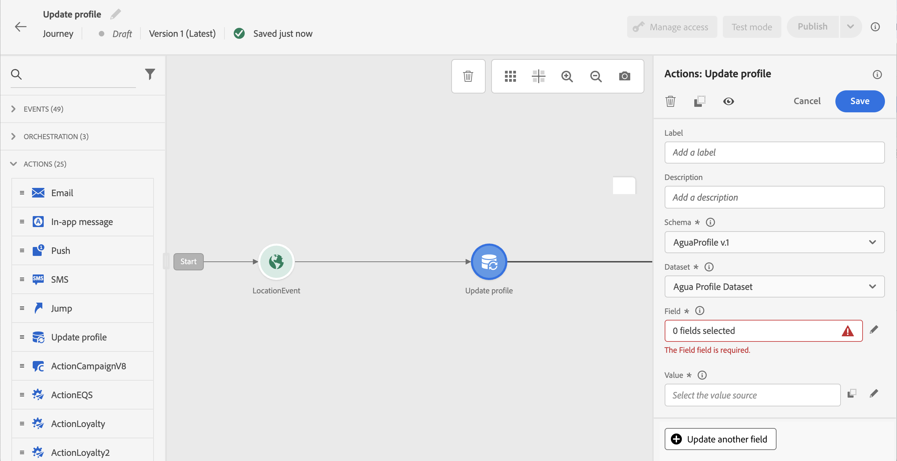
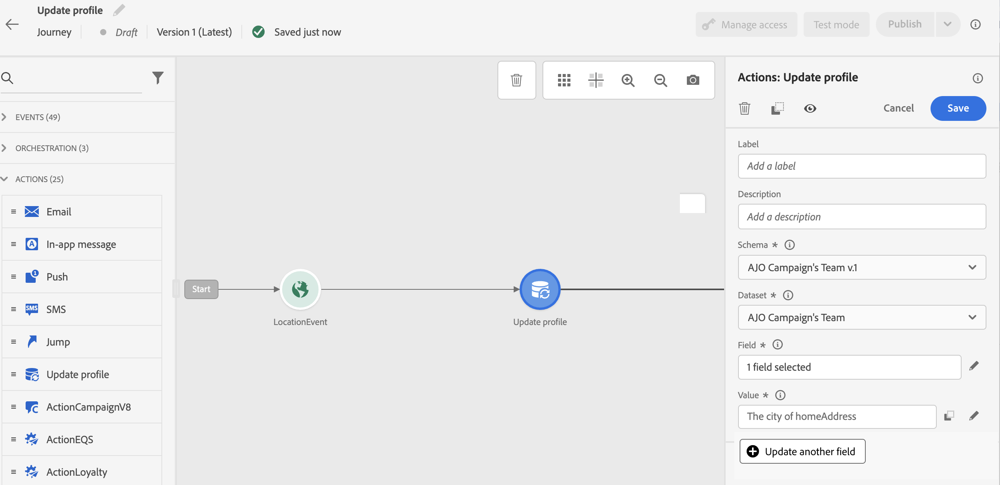

# 更新配置檔案 {#update-profile}

>[!CONTEXTUALHELP]
>id="ajo_journey_update_profiles"
>title="更新配置檔案活動"
>abstract="「更新配置檔案」(Update Profile)操作活動允許您使用來自事件、資料源或使用特定值的資訊更新現有的Adobe Experience Platform配置檔案。"

使用 **[!UICONTROL Update Profile]** 操作活動，用來自事件、資料源或具有特定值的資訊更新現有Adobe Experience Platform配置檔案。

## 建議

* 的 **更新配置檔案** 只能在從具有命名空間的事件開始的行程中使用操作。
* 該操作僅更新現有欄位，不會建立新的配置檔案欄位。
* 不能使用 **更新配置檔案** 操作以生成體驗事件，例如採購。
* 與任何其他操作一樣，在出現錯誤或超時時，可以定義替代路徑，並且不能並行放置兩個操作。
* 發送給Adobe Experience Platform的更新請求是立即/在一秒內。 通常需要幾秒，但有時還需要更多時間，而且無法保證。 因此，例如，如果操作使用由 **更新配置檔案** 操作已定位，您不應期望在操作中更新「欄位1」。
* 的 **更新配置檔案** 活動不支援定義為枚舉的XDM欄位。

## 使用配置檔案更新

1. 從活動開始設計您的旅程。 查看 [節](../building-journeys/journey.md)。

1. 在 **操作** 的下一頁 **更新配置檔案** 的下界。

   

1. 從清單中選擇一個架構。

1. 按一下 **欄位** 的子菜單。 只能選擇一個欄位。

   

1. 從清單中選擇資料集。

   >[!NOTE]
   >
   >的 **更新配置檔案** 操作即時更新配置檔案資料，但不更新資料集。 由於配置檔案是與資料集相關的記錄，所以需要資料集選擇。

1. 按一下 **值** 欄位以定義要使用的值：

   * 使用簡單表達式編輯器，可以從資料源或傳入事件中選擇一個欄位。

      

   * 如果要定義特定值或利用高級功能，請按一下 **高級模式**。

      

的 **更新配置檔案** 已配置。

## 使用test模式 {#using-the-test-mode}

在test模式下，將不模擬配置檔案更新。 將對test配置檔案執行更新。

只有test配置檔案才能以test模式進入行程。 您可以建立新的test配置檔案或將現有配置檔案轉換為test配置檔案。 在Adobe Experience Platform，可以通過csv檔案導入或API調用更新配置檔案屬性。 更簡單的方法是 **更新配置檔案** 操作活動，並將test配置檔案布爾欄位從false更改為true。

有關如何將現有配置檔案轉換為test配置檔案的詳細資訊，請參閱此 [節](../segment/creating-test-profiles.md#create-test-profiles-csv)。
