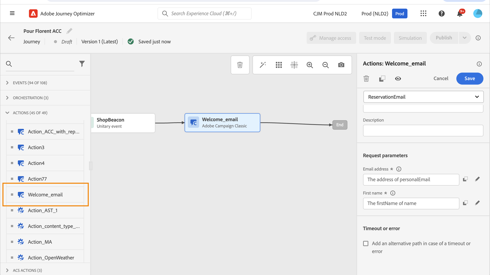

# Adobe Campaign v7/v8 動作 {#using_campaign_classic}

如果您有Adobe Campaignv7或v8，則可進行整合。 它允許您使用Adobe Campaign事務性消息傳遞功能發送電子郵件、推送通知和簡訊。

Journey Optimizer實例和市場活動實例之間的連接是在預配時通過Adobe設定的。 聯繫Adobe。

要使此操作正常運行，您需要配置專用操作。 請參閱此 [節](../action/acc-action.md)。

本中介紹了端到端使用案例 [節](../building-journeys/campaign-classic-use-case.md)。

1. 設計您的旅程，從活動開始。 查看 [節](../building-journeys/journey.md)。
1. 在 **操作** 頁籤，選擇「市場活動」活動並將其添加到您的行程中。
1. 在 **操作參數**，將顯示消息負載中所需的所有欄位。 您需要將每個欄位與要使用的欄位進行映射，無論是從事件還是從資料源。 這類似於自定義操作。 請參閱此 [節](../building-journeys/using-custom-actions.md)。

