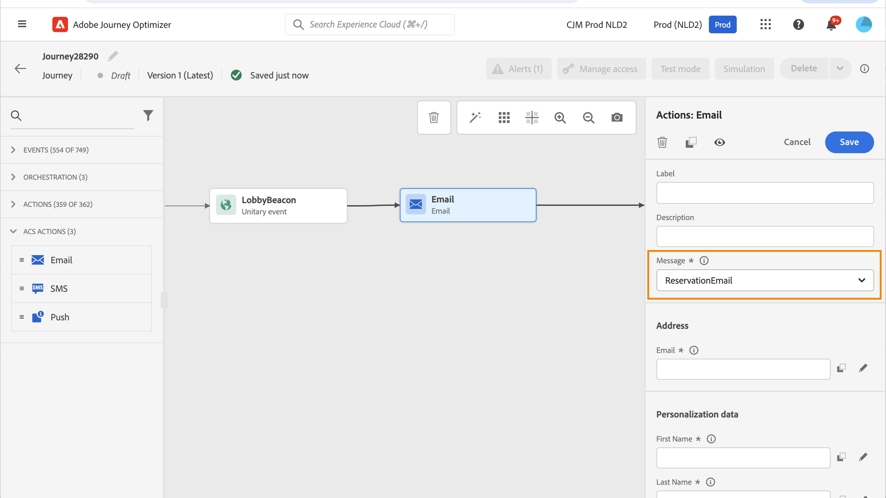
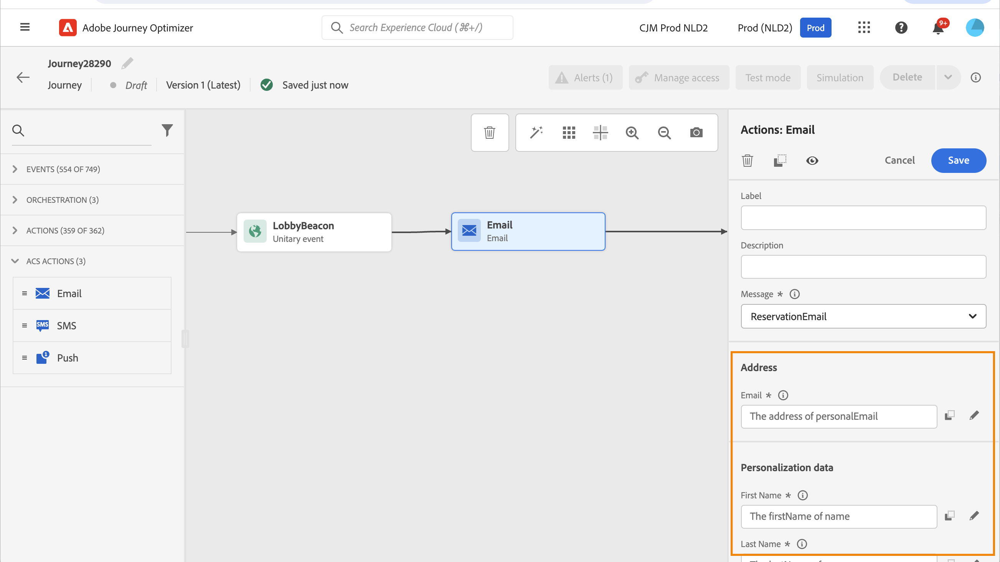
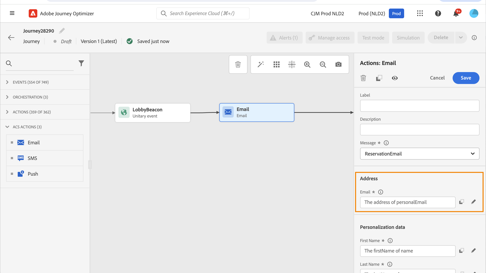
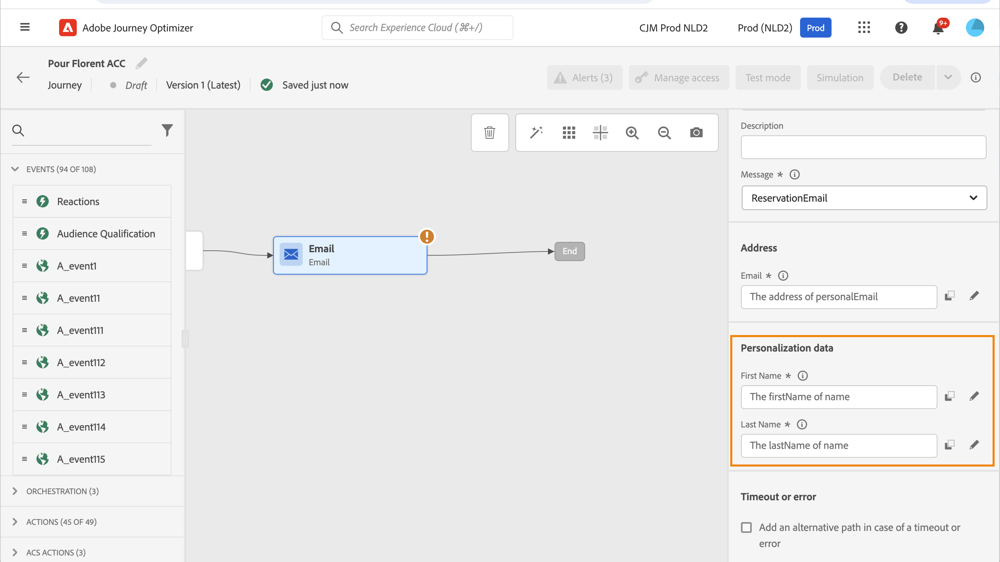
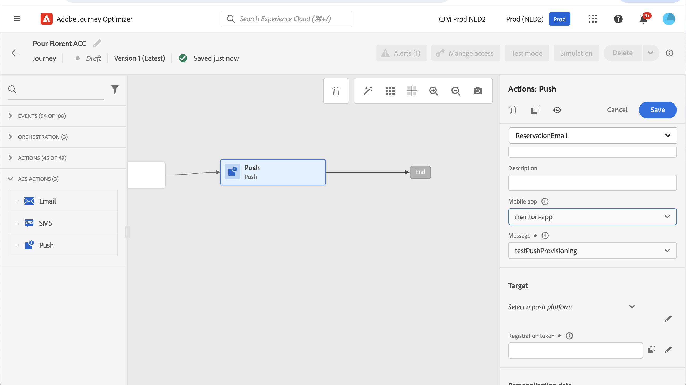

# Adobe Campaign Standard 動作 {#using_campaign_action}

>[!CONTEXTUALHELP]
>id="ajo_journey_action_custom_acs"
>title="自訂動作"
>abstract="如果您有 Adobe Campaign Standard，則可整合。這可讓您使用 Adobe Campaign 交易型訊息功能來傳送電子郵件、推播通知及簡訊。"

如果您有Adobe Campaign Standard，則可使用下列內建動作活動： **[!UICONTROL 電子郵件]**， **[!UICONTROL 推播]** 和 **[!UICONTROL 簡訊]**.

>[!NOTE]
>
>為此，您需要設定內建動作。 請參見[此頁面](../action/acs-action.md)。

您可為這些管道中的每一個選取Adobe Campaign Standard交易式訊息 **範本**. 對於內建電子郵件、簡訊和推播頻道，我們仰賴「交易式傳訊」來執行訊息傳送。 這表示如果您想在歷程中使用特定訊息範本，則必須在Adobe Campaign Standard中發佈。 請參閱 [此頁面](https://experienceleague.adobe.com/docs/campaign-standard/using/communication-channels/transactional-messaging/getting-started-with-transactional-msg.html?lang=zh-Hant) 以瞭解如何使用此功能。

>[!NOTE]
>
>必須發佈Campaign Standard交易式訊息及其相關事件，才能在Journey Optimizer中使用。 如果事件已發佈，但訊息尚未發佈，將無法在Journey Optimizer介面中看見。 如果訊息已發佈，但其關聯事件尚未發佈，則會顯示在Journey Optimizer介面中，但將無法使用。



您可以使用事件（也稱為即時）或設定檔交易式訊息範本。

>[!NOTE]
>
>當我們傳送即時異動訊息(rtEvent)或因自訂動作而透過協力廠商系統路由訊息時，疲勞、封鎖清單或取消訂閱管理需要特定設定。 例如，如果「unsubscribe」屬性儲存在Adobe Experience Platform或協力廠商系統中，則必須在傳送訊息之前新增條件，以檢查此條件。

當您選取範本時，訊息裝載中預期的所有欄位都會顯示在下的活動設定窗格中。 **[!UICONTROL 地址]** 和 **[!UICONTROL 個人化資料]**. 您需要將每個欄位與您要使用的欄位相對應，無論是從事件還是從資料來源進行。 您也可以使用進階運算式編輯器以手動方式傳遞值、對擷取的資訊執行資料操作（例如將字串轉換為大寫）或使用函式，例如「if， then， else」。 請參閱[此頁面](expression/expressionadvanced.md)。



## 電子郵件和簡訊 {#section_asc_51g_nhb}

的 **[!UICONTROL 電子郵件]** 和 **[!UICONTROL 簡訊]**，則引數相同。

>[!NOTE]
>
>針對電子郵件使用設定檔的交易式範本時，Adobe Campaign Standard會自動處理取消訂閱機制。 若要實作，您可以輕鬆加入 **[!UICONTROL 取消訂閱連結]** 內容區塊範圍 [異動電子郵件範本](https://experienceleague.adobe.com/docs/campaign-standard/using/communication-channels/transactional-messaging/getting-started-with-transactional-msg.html?lang=zh-Hant). 不過，如果您使用以事件為基礎的範本(rtEvent)，您必須在訊息中納入連結，將收件者的電子郵件傳遞為URL引數，並將它們導向取消訂閱的登陸頁面。 您必須建立此登入頁面，並確保收件者取消訂閱的決策有效地傳輸至Adobe。

首先，您需要選擇異動訊息範本。

有兩種類別可供使用： **[!UICONTROL 地址]** 和 **[!UICONTROL 個人化資料]**.

您可以輕鬆地定義擷取的位置 **[!UICONTROL 地址]** 或 **[!UICONTROL 個人化資料]** 使用介面。 您可以瀏覽事件和可用資料來源的欄位。 您也可以將進階運算式編輯器用於更進階的使用案例，例如使用需要傳遞引數或執行操作的資料來源。 請參閱[此頁面](expression/expressionadvanced.md)。

**[!UICONTROL 地址]**

>[!NOTE]
>
>此類別只有在您選取「事件」交易式訊息時才會顯示。 對於「設定檔」訊息，請 **[!UICONTROL 地址]** 欄位會由系統自動從Adobe Campaign Standard中擷取。

這些是系統需要知道將訊息傳送到何處的欄位。 如果是電子郵件範本，則為電子郵件地址。 如果是簡訊，則為行動電話號碼。



**[!UICONTROL 個人化資料]**

>[!NOTE]
>
>您無法在個人化資料中傳遞集合。 如果交易式電子郵件或簡訊需要集合，則無法運作。 另請注意，個人化資料採用預期格式（例如：字串、小數等）。 您必須注意遵守這些預期的格式。

這些是Adobe Campaign Standard訊息預期的欄位。 這些欄位可用於個人化訊息、套用條件式格式或挑選特定訊息變體。



## 推播 {#section_im3_hvf_nhb}

在使用推播活動之前，您的行動應用程式需要與Campaign Standard一起設定以傳送推播通知。 使用此 [文章](https://helpx.adobe.com/tw/campaign/kb/integrate-mobile-sdk.html) 對行動裝置採取必要的實作步驟。

首先，您需要從下拉式清單中選擇行動應用程式和交易式訊息。



有兩種類別可供使用： **[!UICONTROL Target]** 和 **[!UICONTROL 個人化資料]**.

**[!UICONTROL Target]**

>[!NOTE]
>
>只有在選取事件訊息時，才會顯示此類別。 對於設定檔訊息，請 **[!UICONTROL Target]** 系統會使用Adobe Campaign Standard執行的調解，自動擷取欄位。

在本節中，您需要定義 **[!UICONTROL 推播平台]**. 下拉式清單可讓您選取 **[!UICONTROL Apple推播通知伺服器]** (iOS)或 **[!UICONTROL Firebase雲端通訊]** (Android)。 或者，您可以從事件或資料來源選取特定欄位，或定義進階運算式。

您也需要定義 **[!UICONTROL 註冊權杖]**. 運算式取決於權杖在事件裝載或其他中的定義方式 [!DNL Journey Optimizer] 資訊。 如果代號是在執行個體的集合中定義，則它可以是簡單欄位或更複雜的運算式：

```
@{Event_push._experience.campaign.message.profileSnapshot.pushNotificationTokens.first().token}
```

**[!UICONTROL 個人化資料]**

>[!NOTE]
>
>您無法在個人化資料中傳遞集合。 如果交易式推播需要集合，則無法運作。 另請注意，個人化資料採用預期格式（例如：字串、小數等）。 您必須注意遵守這些預期的格式。

這些是Adobe Campaign Standard訊息中使用的交易式範本所預期的欄位。 這些欄位可用於個人化您的訊息、套用條件式格式，或挑選特定的訊息變體。
