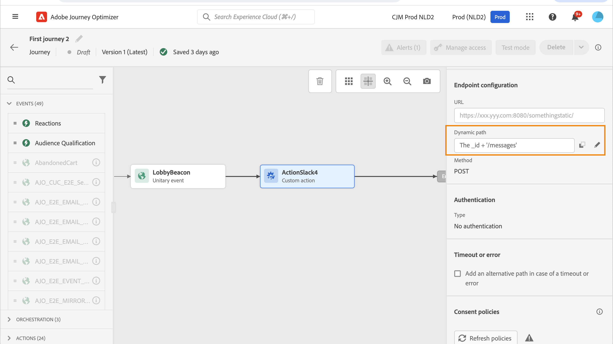
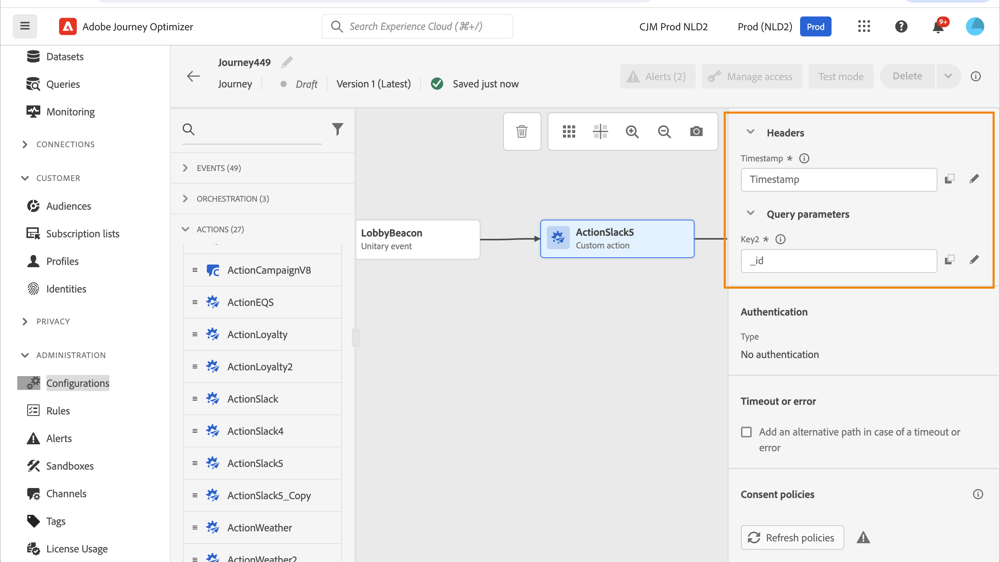

# 使用自訂動作 {#use-custom-actions}

>[!CONTEXTUALHELP]
>id="ajo_journey_action_custom"
>title="自訂動作"
>abstract="自訂動作可讓您設定協力廠商系統的連線，以傳送訊息或 API 呼叫。您可以使用任何提供者提供的任何服務來設定動作，這些服務可透過具有 JSON 格式的裝載，透過 REST API 進行呼叫。"

自訂動作可讓您設定協力廠商系統的連線，以傳送訊息或 API 呼叫。您可以使用任何提供者提供的任何服務來設定動作，這些服務可透過具有 JSON 格式的裝載，透過 REST API 進行呼叫。

## 同意與資料控管 {#privacy}

在Journey Optimizer中，您可以將資料控管和同意原則套用至自訂動作，以防止特定欄位匯出至協力廠商系統，或排除尚未同意接收電子郵件、推播或簡訊通訊的客戶。 如需詳細資訊，請參閱下列頁面：

* [資料控管](../action/action-privacy.md).
* [同意](../action/consent.md).

## URL 組態

的設定窗格 **自訂動作** 活動會顯示針對自訂動作設定的URL設定引數和驗證引數。 您無法在歷程中設定URL的靜態部分，但在自訂動作的全域設定中設定。 [了解更多](../action/about-custom-action-configuration.md)。

### 動態路徑

如果URL包含動態路徑，請在 **[!UICONTROL 路徑]** 欄位。

若要串連欄位和純文字字串，請使用字串函式或進階運算式編輯器中的加號(+)。 以單引號(&#39;)或雙引號(&#39;&#39;)括住純文字字串。 [了解更多](expression/expressionadvanced.md)。

此表格顯示組態範例：

| 欄位 | 值 |
| --- | --- |
| URL | `https://xxx.yyy.com:8080/somethingstatic/` |
| 路徑 | `The id of marketingCampaign + '/messages'` |

串連的URL具有以下形式：

`https://xxx.yyy.com:8080/somethingstatic/`\&lt;campaign id=&quot;&quot;>`/messages`

### 標頭和查詢引數 {#headers}

此 **[!UICONTROL URL設定]** 區段顯示動態標題和查詢引數欄位，但不顯示常數欄位。 動態標題和查詢引數欄位在動作設定畫面中定義為變數。 [了解更多](../action/about-custom-action-configuration.md#url-configuration)

若要指定動態標題和查詢引數欄位的值，請在欄位內或鉛筆圖示上按一下，然後選取所需欄位。

## 動作引數

在 **[!UICONTROL 動作引數]** 區段，您會看到訊息引數定義為 _&quot;變數&quot;_. 對於這些引數，您可以定義從何處取得此資訊（例如：事件、資料來源）、手動傳遞值或使用進階運算式編輯器進行進階使用案例。 進階使用案例可以是資料操控和其他函式用途。 請參閱此 [頁面](expression/expressionadvanced.md).

**相關主題**

[設定動作](../action/about-custom-action-configuration.md)
