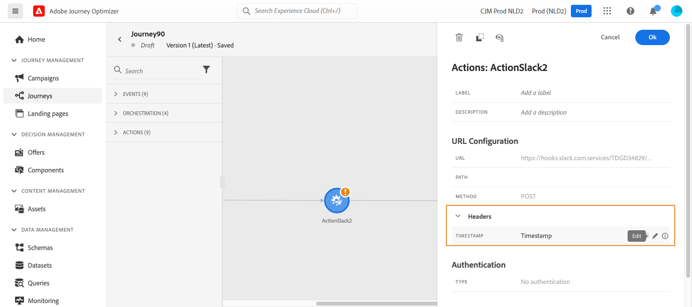

# 使用自訂動作 {#use-custom-actions}

>[!CONTEXTUALHELP]
>id="ajo_journey_action_custom"
>title="自訂動作"
>abstract="自訂動作可讓您設定第三方系統的連線，以傳送訊息或 API 呼叫。 您可以使用任何提供者提供的任何服務來設定動作，這些服務可經由 REST API，搭配 JSON 格式的承載進行呼叫。"

使用自訂動作來啟用與協力廠商系統的連線，以傳送訊息或API呼叫。 您可以使用任何提供者提供的任何服務來設定動作，這些服務可經由 REST API，搭配 JSON 格式的承載進行呼叫。

在[本節](../action/action.md)中進一步瞭解自訂動作。

瞭解如何在[此頁面](../action/about-custom-action-configuration.md)上建立和設定自訂動作。

瞭解如何在[此頁面](../action/action-response.md)上使用自訂動作的API呼叫回應進行個人化。

## 同意與資料控管 {#privacy}

在Journey Optimizer中，您可以將資料控管和同意原則套用至自訂動作，以防止特定欄位匯出至協力廠商系統，或排除尚未同意接收電子郵件、推播或簡訊通訊的客戶。 如需詳細資訊，請參閱下列頁面：

* [資料控管](../action/action-privacy.md)。
* [同意](../action/consent.md)。

## URL 組態

**自訂動作**&#x200B;活動的設定窗格會顯示URL設定引數，以及為自訂動作設定的驗證引數。 您無法在歷程中設定URL的靜態部分，但在自訂動作的全域設定中設定。 [了解更多](../action/about-custom-action-configuration.md)。

### 動態路徑

如果URL包含動態路徑，請在&#x200B;**[!UICONTROL 路徑]**&#x200B;欄位中指定路徑。

若要串連欄位和純文字字串，請使用字串函式或進階運算式編輯器中的加號(+)。 以單引號(&#39;)或雙引號(&#39;&#39;)括住純文字字串。 [了解更多](expression/expressionadvanced.md)。

此表格顯示組態範例：

| 欄位 | 價值 |
| --- | --- |
| URL | `https://xxx.yyy.com:8080/somethingstatic/` |
| 路徑 | `The _id + '/messages'` |

串連的URL具有以下形式：

`https://xxx.yyy.com:8080/somethingstatic/`\&lt;ID>`/messages`

### 標頭和查詢引數 {#headers}

**[!UICONTROL URL組態]**&#x200B;區段會顯示動態標頭和查詢引數欄位，但不會顯示常數欄位。 動態標題和查詢引數欄位在動作設定畫面中定義為變數。 [了解更多](../action/about-custom-action-configuration.md#url-configuration)

若要指定動態標題和查詢引數欄位的值，請在欄位內或鉛筆圖示上按一下，然後選取所需欄位。

自訂動作中的

## 動作引數

在&#x200B;**[!UICONTROL 動作引數]**&#x200B;區段中，您會看到定義為&#x200B;_「變數」_&#x200B;的訊息引數。 對於這些引數，您可以定義從何處取得此資訊（例如：事件、資料來源）、手動傳遞值或使用進階運算式編輯器進行進階使用案例。 進階使用案例可以是資料操控和其他函式用途。 請參見此[頁面](expression/expressionadvanced.md)。

