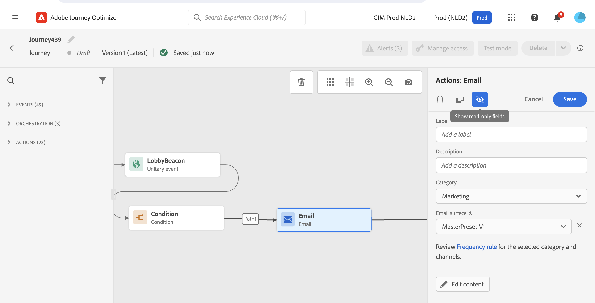

# 設計您的歷程 {#design-your-journey}

>[!CONTEXTUALHELP]
>id="ajo_journey_canvas"
>title="設計您的歷程"
>abstract="通過旅程介面，您可以輕鬆地將活動從調色板拖放到畫布中。 您還可以按兩下某個活動，在下一步可用步驟的畫布中將其添加。"

通過旅程介面，您可以輕鬆地將活動從調色板拖放到畫布中。 您還可以按兩下某個活動，在下一步可用步驟的畫布中將其添加。 每個活動都在流程中具有特定的角色和位置。 活動被排序。 完成活動後，流將繼續並處理下一個活動，依此類推。

## 開始行程設計 {#gs-journey-design}

的 **調色板** 在螢幕的左側。 所有可用活動都分為幾類： **[!UICONTROL Events]**。 **[!UICONTROL Orchestration]** 和 **[!UICONTROL Actions]**。 通過按一下不同類別的名稱，可以展開/折疊它們。 要在旅途中使用活動，請將其從調色板拖放到畫布中。

開始新行程時，無法作為第一步放入畫布中的元素將被隱藏。 這關係到所有動作、狀況活動、等待和反應。

的 **[!UICONTROL Filter items]** 表徵圖在左上角顯示以下濾鏡：

* **僅顯示可用項**:隱藏或顯示調色板中不可用的元素，例如使用與旅途中使用的命名空間不同命名空間的事件。 依預設，系統會隱藏無法使用的項目。如果選擇顯示它們，則它們將顯示為灰色。

* **僅顯示最近的項目**:此篩選器允許您僅顯示使用的前五個事件和操作，而不是現成的事件和操作。 這特定於每位使用者。 預設情況下，所有項目都會顯示。 

您還可以使用 **[!UICONTROL Search]** 的子菜單。 只篩選事件和操作。

的 **畫面** 是旅程設計師的中心地帶。 您可以在此區域中刪除活動並配置它們。 按一下畫布中的活動以配置它。 此操作將開啟右側的活動配置窗格。

的 **活動配置窗格** 在元件面板中按一下活動時顯示。 填寫必填欄位。 按一下 **[!UICONTROL Delete]** 表徵圖以刪除活動。 按一下 **[!UICONTROL Cancel]** 取消修改或 **[!UICONTROL Ok]** 確認。 要刪除活動，還可以選擇一個活動（或多個），然後按回車鍵。 按轉義鍵將關閉活動配置窗格。

預設情況下，只讀欄位是隱藏的。 要顯示只讀欄位，請按一下 **顯示只讀欄位** 表徵圖。 此設定適用於所有行程中的所有活動。

根據行程的狀態，您可以使用右上角的按鈕在行程中執行不同的操作： **[!UICONTROL Publish]**。 **[!UICONTROL Duplicate]**。 **[!UICONTROL Delete]**。 **[!UICONTROL Journey properties]**。 **[!UICONTROL Test]**。 未選擇任何活動時，將顯示這些按鈕。 某些按鈕將按上下文顯示。 激活test模式時，test模式日誌按鈕出現。

## 開始您的旅程 {#start-your-journey}

在設計行程時，首先要問的問題是配置式如何進入行程。 有兩種可能：

**以事件開始**:當一個旅程被設定為傾聽事件時，個人就會進入這個旅程 **整體** 即時。 您的行程中包含的消息將發送給當前流入行程的人員。 [瞭解有關事件的詳細資訊](../event/about-events.md)

**從讀取段開始**:你可以設定你聽Adobe Experience Platform段的旅程。 在這種情況下，屬於指定段的所有個人都會輸入行程。 您行程中包含的消息將發送給屬於該段的個人。 [瞭解有關閱讀段的詳細資訊](read-segment.md)。

## 定義後續步驟{#define-next-steps}

在第一個事件或「讀取段」之後，您可以組合不同的活動來構建多步跨渠道方案。 從調色板中選擇所需的步驟。

**事件**

當您以事件開始行程時，當接收到事件時，將觸發行程。 然後，此人將單獨遵循您旅途中定義的後續步驟。

可以添加 **幾個事件** 在您的旅途中，只要他們使用相同的命名空間。 事件是預先配置的。 [瞭解有關事件的詳細資訊](about-journey-activities.md#event-activities)

也可以添加 **反應** 消息之後的事件，以對與消息相關的跟蹤資料做出響應。 例如，這允許您在個人開啟前一條消息或按一下其內時發送另一條消息。 瞭解更多資訊 [節](reaction-events.md)。

的 **段資格** 活動活動允許您根據Adobe Experience Platform段入口和出口讓個人進入或前進。 您可以讓所有新的銀色客戶輸入行程併發送個性化消息。 瞭解更多資訊 [節](segment-qualification-events.md)。

**業務流程**

在業務流程活動中，您將 **讀取段** 活動，允許您設定收聽Adobe Experience Platform節目的路程。 [瞭解有關「讀取段」活動的詳細資訊](read-segment.md)。

其它活動允許您將條件添加到行程中以定義多條路徑、設定在執行下一活動之前的等待時間或結束行程。 瞭解更多資訊 [節](about-journey-activities.md#orchestration-activities)。

**動作**

您將在此處找到渠道操作活動，該活動允許您在 [!DNL Journey Optimizer]。 [瞭解有關渠道操作活動的詳細資訊](journeys-message.md)

您還將找到配置為通過第三方系統發送消息的自定義操作。 瞭解更多資訊 [節](about-journey-activities.md#action-activities)。

## 添加備用路徑{#paths}

如果出現以下行程活動的錯誤或超時，您可以定義回退操作： **[!UICONTROL Condition]** 和 **[!UICONTROL Action]**。

要為活動添加回退操作，請選擇 **[!UICONTROL Add an alternative path in case of a timeout or an error]** 框中，選擇「 CSV文本」：在活動後添加另一個路徑。 超時持續時間由管理員用戶在 [旅程屬性](../building-journeys/journey-gs.md#change-properties)。 例如，如果電子郵件發送時間過長或出錯，您可以決定發送推送通知。

各種活動（事件、操作、等待）允許您在其後添加多個路徑。 為此，請將游標置於活動上，然後按一下「+」符號。 只能並行設定事件和等待活動。 如果多個事件並行設定，則所選路徑將是第一個事件。

在收聽事件時，我們建議您不要無限期地等待事件。 它不是強制性的，只是最佳做法。 如果只想在某個時間內收聽一個或多個事件，則將並行放置一個或多個事件和等待活動。 請參閱[本節](../building-journeys/general-events.md#events-specific-time)。

要刪除路徑，請將游標置於路徑上，然後按一下 **[!UICONTROL Delete path]** 表徵圖

在畫布中，當兩個活動斷開連接時，將顯示警告。 將游標置於警告表徵圖上以顯示錯誤消息。 要解決此問題，只需移動已斷開的活動並將其連接到上一活動即可。

## 複製和貼上活動 {#copy-paste}

您可以複製一個行程的一個或多個活動，並貼上到同一行程或另一個行程中。 如果要重新使用在上一次行程中已配置的許多活動，這樣您就可以節省時間。

**重要備註**

* 您可以跨不同的頁籤和瀏覽器複製/貼上。 您只能複製/貼上同一實例中的活動。
* 如果目標行程中的事件使用不同的命名空間，則無法複製/貼上事件。
* 貼上的活動可能會引用目標行程中不存在的資料，例如，如果您在不同沙箱之間複製/貼上。 始終檢查錯誤並進行所需的調整。
* 請注意，無法撤消操作。 要刪除貼上的活動，您需要選擇並刪除它們。 因此，請確保在複製活動之前僅選擇所需的活動。
* 您可以從任何行程複製活動，甚至只讀活動。
* 您可以選擇任何活動，即使是未連結的活動。 貼上後連結的活動將保持連結狀態。

以下是複製/貼上活動的步驟：

1. 開路。
1. 通過在按一下時移動滑鼠來選擇要複製的活動。 也可以在按 **Ctrl/命令** 按鈕 使用 **Ctrl/Command + A** 的子菜單。
   
1. 按 **Ctrl/Command + C**。
如果只想複製一個活動，可按一下該活動並使用 **複製** 表徵圖。
   
1. 在任何旅程中，按 **Ctrl/Command + V** 貼上活動，而不將其連結到現有節點。 貼上的活動按同一順序放置。 貼上後，活動將保持選定狀態，以便您可以輕鬆移動活動。 也可以將游標置於空佔位符上並點擊 **Ctrl/Command + V**。 貼上的活動將連結到節點。
   
