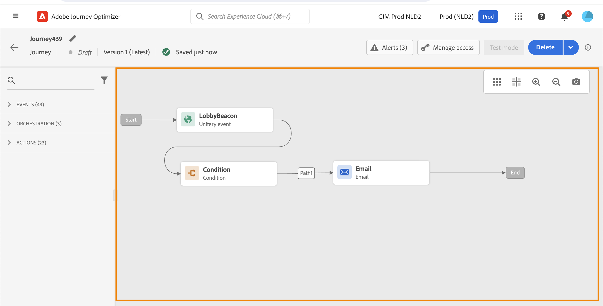
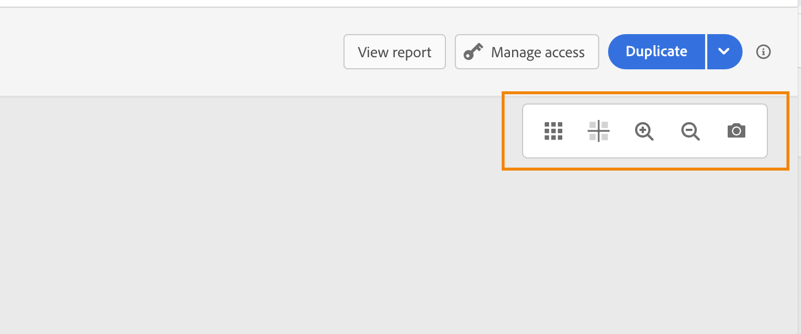
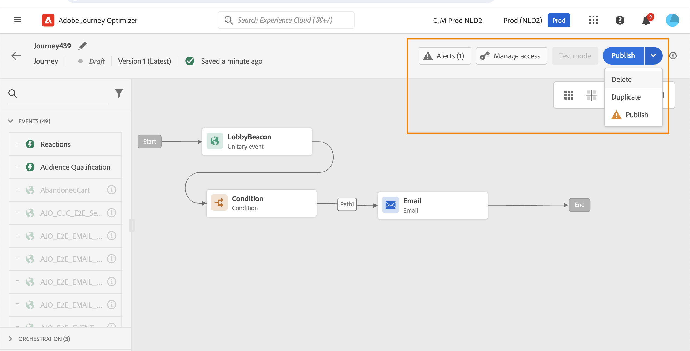
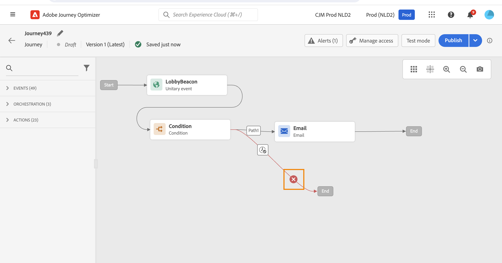
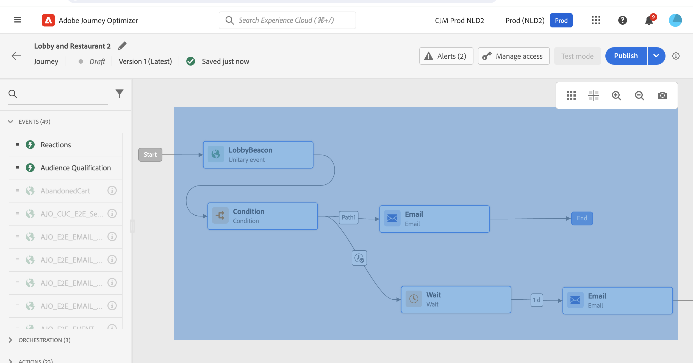
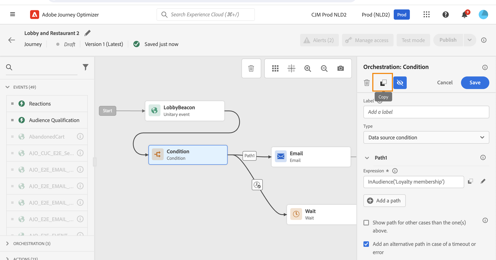
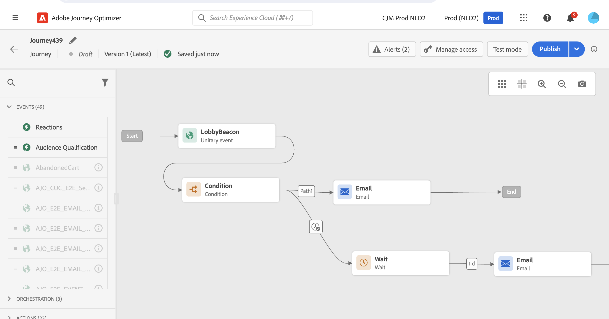

# 設計您的歷程 {#design-your-journey}

>[!CONTEXTUALHELP]
>id="ajo_journey_canvas"
>title="設計您的歷程"
>abstract="歷程介面可讓您輕鬆地將活動從調色盤拖放到畫布中。您還可以按兩下活動以在下一步可用時將其新增到畫布中。"

Adobe Journey Optimizer 包含全頻道協調流程畫布，可讓行銷人員協調行銷外聯活動與一對一客戶參與。 使用者介面可讓您輕鬆將活動從浮動視窗拖放至畫布，以建立您的歷程。 請注意，您也可以在下一個可用步驟中，連按兩下活動以將其新增至畫布中。

事件、協調流程和動作活動在此過程中具有特定角色和位置。 活動會排序：活動完成後，流程會繼續處理下一個活動，以此類推。

## 開始使用歷程設計 {#gs-journey-design}

**浮動視窗**&#x200B;位於熒幕的左側。 所有可用的活動都分為幾個類別： [事件](#jo-event)、[協調流程](#jo-orch)和[動作](#jo-actions)。 您可以按一下不同類別的名稱，以展開/收合不同類別。 若要在歷程中使用活動，請將其從浮動視窗拖放至畫布中。

開始新歷程時，無法在第一步驟放入畫布的元素會隱藏。 這關係到所有動作、狀況活動、等待和反應。

左上角的&#x200B;**[!UICONTROL 篩選專案]**&#x200B;圖示可讓您顯示下列篩選器：

* **僅顯示可用的專案**：隱藏或顯示浮動視窗中無法使用的元素，例如使用與歷程所用名稱空間不同的名稱空間的事件。 依預設，會隱藏無法使用的專案。 如果您選擇顯示，這些區段將會顯示為灰色。

* **僅顯示最近使用的專案**：此篩選器除了現成可用的專案之外，還允許您僅顯示最近使用的五個事件和動作。 這特定於每位使用者。 依預設，會顯示所有專案。

您也可以使用&#x200B;**[!UICONTROL 搜尋]**&#x200B;欄位。 系統只會篩選事件和動作。

**畫布**&#x200B;是歷程設計器中的中央區域。 您可以在此區域中放置並設定活動。 按一下畫布中的活動以進行設定。 這會開啟右側的活動設定窗格。

位於畫布右上角的&#x200B;**工具列**&#x200B;可讓您顯示/隱藏格線、放大/縮小及下載畫布的熒幕擷圖。 請參閱[本章節](../building-journeys/journey-properties.md#timeout_and_error)。

<!--and show/hide timeout and error paths-->

{width="70%" align="left"}

當您按一下浮動視窗中的活動時，**活動設定窗格**&#x200B;就會顯示。 填寫必填欄位。 按一下&#x200B;**[!UICONTROL 刪除]**&#x200B;圖示以刪除活動。 按一下&#x200B;**[!UICONTROL 取消]**&#x200B;取消修改，或按一下&#x200B;**[!UICONTROL 確定]**&#x200B;確認。 若要刪除活動，您也可以選取一個活動（或數個活動）並按退格鍵。 按下ESC鍵將關閉活動設定窗格。

依預設，唯讀欄位會隱藏。 若要顯示唯讀欄位，請按一下活動設定窗格左上方的&#x200B;**顯示唯讀欄位**&#x200B;圖示。 此設定適用於所有歷程中的所有活動。

![具有[顯示唯讀欄位]選項的活動設定窗格](assets/journey59bis.png)

根據歷程的狀態，您可以使用右上角的按鈕對歷程執行不同的動作： **[!UICONTROL 發佈]**、**[!UICONTROL 重複]**、**[!UICONTROL 刪除]**、**[!UICONTROL 測試模式]**、**[!UICONTROL 管理存取]**、**[!UICONTROL 警報]**。 未選取任何活動時，這些按鈕就會顯示。 有些按鈕會根據內容顯示。 測試模式啟動時，測試模式記錄按鈕出現。

## 開始您的歷程 {#start-your-journey}

當您設計歷程時，您想問的第一個問題是設定檔將如何進入歷程。

有兩種可能性：

1. **從事件開始**：當歷程設定為接聽事件時，個人會即時統一進入歷程&#x200B;**&#x200B;**。 您歷程中包含的訊息會傳送給目前流入歷程的人。 [進一步瞭解事件](../event/about-events.md)

1. **從讀取對象開始**：您可以設定您的歷程以聆聽Adobe Experience Platform對象。 在這種情況下，屬於指定受眾的所有個人都會進入歷程。 歷程中包含的訊息會傳送給屬於該對象的個人。 深入瞭解[閱讀對象](read-audience.md)。 如需如何在Journey Optimizer中產生及鎖定對象的詳細資訊，請參閱[本節](../audience/about-audiences.md)。

## 定義後續步驟{#define-next-steps}

在第一個事件或讀取對象後，您可以結合不同的活動以建立您的多步驟跨管道情境。 從浮動視窗中選擇所需的步驟。

### 活動{#jo-event}

事件會觸發個人化歷程，例如線上購買。 當某人進入歷程時，就會以個人身分穿過，而且不會有兩個人以相同速度或沿著相同路徑移動。

當您使用事件開始您的歷程時，歷程會在收到事件時觸發。 接著，歷程中的每個人都個別遵循歷程中定義的後續步驟。

您可以在歷程中新增&#x200B;**數個事件**，只要它們使用相同的名稱空間即可。 事件已預先設定。 [進一步瞭解歷程事件](about-journey-activities.md#event-activities)

您也可以在訊息之後新增&#x200B;**回應**&#x200B;事件，以回應與訊息相關的追蹤資料。 舉例來說，這可讓您在個人開啟先前的訊息或按一下訊息內部時，傳送其他訊息。 [進一步瞭解反應事件](reaction-events.md)。

使用&#x200B;**對象資格**&#x200B;事件活動，讓個人根據Adobe Experience Platform對象進出而在歷程中進入或前進。 您可以讓所有新的銀級客戶進入歷程並傳送個人化訊息。 在此[節](audience-qualification-events.md)中瞭解更多。

### 協調流程{#jo-orch}

協調活動是不同的條件，可協助判斷歷程的下一步。

在協調活動中，使用&#x200B;**讀取對象**&#x200B;活動來設定您聆聽Adobe Experience Platform對象的歷程。 [進一步了解讀取對象活動](read-audience.md)。

其他活動可讓您新增條件至歷程以定義數個路徑、在執行下一個活動之前設定等待時間，或結束歷程。 [進一步瞭解協調活動](about-journey-activities.md#orchestration-activities)。

### 動作{#jo-actions}

動作是您因某種觸發而想要發生的動作，例如傳送訊息。 這是客戶體驗的歷程。 這可以是電子郵件、簡訊或推播訊息，或第三方動作，例如Slack訊息。

頻道動作活動可讓您包含在[!DNL Journey Optimizer]中設計的訊息。 [進一步瞭解頻道動作活動](journeys-message.md)

在動作活動中，使用自訂動作透過協力廠商系統傳送訊息。 [進一步瞭解自訂動作](about-journey-activities.md#action-activities)。

## 新增替代路徑 {#paths}

您可以為下列歷程活動定義在錯誤或逾時時的後援動作： **[!UICONTROL 條件]**&#x200B;和&#x200B;**[!UICONTROL 動作]**。

若要為活動新增遞補動作，請在活動屬性中選取&#x200B;**[!UICONTROL 在逾時或錯誤的情況下新增替代路徑]**&#x200B;方塊：在活動後新增其他路徑。 逾時期間由[歷程屬性](../building-journeys/journey-properties.md)中的管理員使用者定義。 例如，如果電子郵件傳送時間太長或發生錯誤，您可以決定傳送推播通知。

各種活動（事件、動作、等待）可讓您在它們之後新增數個路徑。 若要這麼做，請將游標置於活動上並按一下「+」符號。 只有事件和等待活動可以並行設定。 如果同時設定多個事件，則選擇的路徑將是第一個發生的事件之一。

在聆聽事件時，建議您不要無限期等待該事件。 這並非強制性，只是最佳做法。 如果您只想在特定時間監聽一或多個事件，您可以同時放置一或多個事件和等待活動。 請參閱[本節](../building-journeys/general-events.md#events-specific-time)。

若要刪除路徑，請將游標放在路徑上，然後按一下&#x200B;**[!UICONTROL 刪除路徑]**&#x200B;圖示。

在畫布中，當兩個活動中斷連線時，會顯示警告。 將游標放在警告圖示上以顯示錯誤訊息。 若要修正問題，只需移動已中斷連線的活動，並將其連線至上一個活動即可。

## 複製並貼上活動 {#copy-paste}

您可以複製歷程的一或多個活動，並將其貼到相同歷程或其他歷程中。 如果您想要重複使用先前歷程中已設定的許多活動，這可讓您節省時間。

**重要備註**

* 您可以在不同標籤和瀏覽器之間複製/貼上。 您只能複製/貼上相同執行個體中的活動。
* 如果目的地歷程具有使用不同名稱空間的事件，則您無法複製/貼上事件。
* 貼上的活動可能參考不存在於目的地歷程中的資料，例如，如果您跨不同沙箱複製/貼上。 務必檢查錯誤，並進行必要的調整。
* 請注意，您無法復原動作。 若要刪除貼上的活動，您必須選取並刪除活動。 因此，在複製活動之前，請務必僅選取所需的活動。
* 您可以從任何歷程複製活動，甚至是唯讀的活動。
* 您可以選取任何活動，甚至是未連結的活動。 連結的活動在貼上後將保持連結。

以下是複製/貼上活動的步驟：

1. 開啟歷程。
1. 在按一下滑鼠的同時移動滑鼠，選取您要複製的活動。 您也可以在按下&#x200B;**Ctrl/Command**&#x200B;鍵的同時按一下每個活動。 如果要選取所有活動，請使用&#x200B;**Ctrl/Command + A**。
   
1. 按&#x200B;**Ctrl/Command + C**。
如果您只想複製一個活動，可以按一下該活動，並使用活動設定窗格左上角的&#x200B;**複製**&#x200B;圖示。
   
1. 在任何歷程中，按下&#x200B;**Ctrl/Command + V**&#x200B;貼上活動而不將其連結到現有節點。 貼上的活動會以相同順序放置。 貼上活動後，活動會維持選取狀態，以便您輕鬆移動。 您也可以將游標放在空的預留位置上，然後按一下&#x200B;**Ctrl/Command + V**。 貼上的活動將連結至節點。
   
