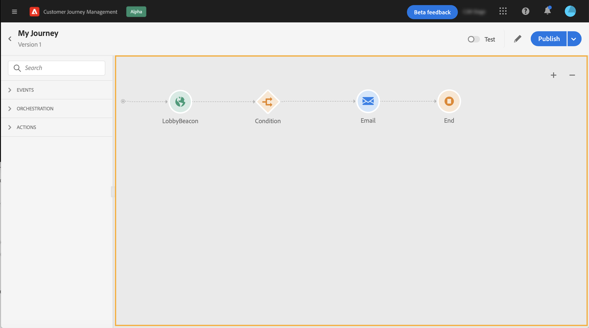
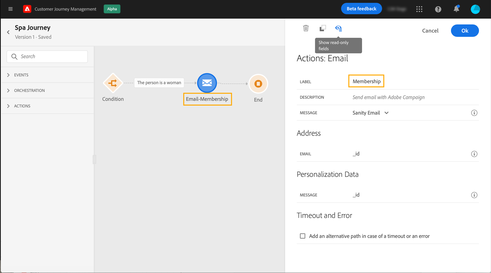

# 設計您的歷程

歷程介面可讓您輕鬆將活動從浮動視窗拖放至畫布中。 您也可以連按兩下某個活動，以在下一個可用步驟將其新增至畫布中。 每個活動在流程中都有特定角色和位置。 活動會排序。 活動完成後，流程會繼續並處理下一個活動，以此類推。

## 開始進行歷程設計

**浮動視窗**&#x200B;位於畫面左側。 所有可用活動皆分為數個類別：**[!UICONTROL Events]**、**[!UICONTROL Orchestration]**&#x200B;和&#x200B;**[!UICONTROL Actions]**。 您可以按一下不同類別的名稱，以展開/收合其他類別。 若要在歷程中使用活動，請將其從浮動視窗拖放至畫布中。

開始新歷程時，無法將第一個步驟放置在畫布中的元素隱藏。 這與所有動作、條件活動、等待和反應有關。

左上角的&#x200B;**[!UICONTROL Filter items]**&#x200B;圖示可讓您顯示下列篩選器：

* **僅顯示可用項目**:隱藏或顯示浮動視窗中無法使用的元素，例如使用與歷程中所用不同命名空間的事件。依預設，系統會隱藏無法使用的項目。如果您選擇顯示，則會顯示為灰色。

* **僅顯示最近的項目**:除了現成可用的事件和動作外，此篩選器還可讓您只顯示最近5個使用的事件和動作。這是每個使用者專屬的。 依預設，會顯示所有項目。

您也可以使用&#x200B;**[!UICONTROL Search]**&#x200B;欄位。 系統只會篩選事件和動作。

**canvas**&#x200B;是歷程設計器中的中央區域。 您可以在此區域中放置活動並加以設定。 按一下畫布中的活動以進行設定。 這會開啟右側的活動設定窗格。

按一下浮動視窗中的活動時，會顯示&#x200B;**活動設定窗格**。 填寫必填欄位。 按一下&#x200B;**[!UICONTROL Delete]**&#x200B;圖示以刪除活動。 按一下&#x200B;**[!UICONTROL Cancel]**&#x200B;取消修改，或按一下&#x200B;**[!UICONTROL Ok]**&#x200B;確認。 若要刪除活動，您也可以選取一個活動（或數個），然後按空格鍵。 按下逸出鍵會關閉活動設定窗格。

預設情況下，只讀欄位是隱藏的。 若要顯示唯讀欄位，請按一下活動配置窗格左上角的&#x200B;**顯示唯讀欄位**&#x200B;圖示。 此設定會套用至所有歷程中的所有活動。

根據歷程的狀態，您可以使用右上角的按鈕，在歷程上執行不同的動作：**[!UICONTROL Publish]**、**[!UICONTROL Duplicate]**、**[!UICONTROL Delete]**、**[!UICONTROL Journey properties]**、**[!UICONTROL Test]**。 未選取任何活動時，這些按鈕就會顯示。 有些按鈕會根據內容顯示。 激活測試模式時，將顯示測試模式日誌按鈕。

## 開始您的歷程

當您設計歷程時，您想要詢問的第一個問題是設定檔將如何進入歷程。 有兩種可能性：

**從事件開始**:當歷程設定為監聽事件時，個人會即時進 **** 入歷程unitaril。您歷程中包含的訊息會傳送給目前流入歷程的人員。 [深入了解事件](../event/about-events.md)

**從讀取區段開始**:您可以設定歷程以監聽Adobe Experience Platform區段。在此情況下，屬於指定區段的所有個人都會進入歷程。 歷程中包含的訊息會傳送給屬於區段的個人。 [深入了解閱讀區段](read-segment.md)。

## 定義後續步驟

在第一個事件或讀取區段之後，您可以結合不同的活動以建立您的多步驟跨通道案例。 從浮動視窗中選擇您需要的步驟。

**事件**

當您從事件開始歷程時，會在收到事件時觸發歷程。 然後，人員會個別遵循您歷程中定義的後續步驟。

只要您的歷程使用相同的命名空間，就可以新增&#x200B;**數個事件**。 事件會預先設定。 [深入了解事件](about-journey-activities.md#event-activities)

您也可以在訊息之後新增&#x200B;**Reaction**&#x200B;事件，以回應與訊息相關的追蹤資料。 舉例來說，當個人開啟前一則訊息或按一下其內部訊息時，這可讓您傳送另一則訊息。 了解更多[小節](reaction-events.md)。

**區段資格**&#x200B;事件活動可讓您根據Adobe Experience Platform區段入口和出口，讓個人進入歷程或前進。 您可以讓所有新的銀級客戶進入歷程並傳送個人化訊息。 了解更多[小節](segment-qualification-events.md)。

**協調**

在協調活動中，您會找到&#x200B;**讀取區段**&#x200B;活動，可讓您設定歷程以監聽Adobe Experience Platform區段。 [深入了解「讀取區段」活動](read-segment.md)。

其他活動可讓您新增條件至歷程，以定義數個路徑、設定在執行下一個活動之前的等待時間，或結束您的歷程。 了解更多[小節](about-journey-activities.md#orchestration-activities)。

**動作**

您會在此找到&#x200B;**Message**&#x200B;活動，該活動可讓您包含[!DNL Journey Optimizer]中設計的訊息。 [深入了解訊息活動](journeys-message.md)

您也會找到您已設定為透過第三方系統傳送訊息的自訂動作。 了解更多[小節](about-journey-activities.md#action-activities)。

## 在畫布中使用路徑 {#paths}

數個活動（**[!UICONTROL Condition]**、**[!UICONTROL Action]**&#x200B;活動）可讓您定義回退動作，以防發生錯誤或逾時。 在活動設定窗格中，核取方塊：**[!UICONTROL Add an alternative path in case of a timeout or an error]**。 活動後會新增另一個路徑。 逾時期間會在歷程的屬性中定義（請參閱管理員使用者[此頁面](../building-journeys/journey-gs.md#change-properties)）。 例如，如果電子郵件太長而無法傳送或發生錯誤，您可以決定傳送簡訊。

各種活動（事件、動作、等待）可讓您在其後新增數個路徑。 要執行此操作，請將游標置於活動上，然後按一下「+」符號。 只能同時設定事件和等待活動。 如果同時設定多個事件，則選擇的路徑將是第一個發生的事件之一。

監聽事件時，建議您不要無限期等待事件。 這不是強制性的，只是最佳做法。 如果您只想在特定時間內監聽一或多個事件，您會同時放置一或多個事件和等待活動。 請參閱[本節](../building-journeys/general-events.md#events-specific-time)。

若要刪除路徑，請將游標置於路徑上，然後按一下&#x200B;**[!UICONTROL Delete path]**&#x200B;圖示。

在畫布中，當兩個活動中斷連線時，會顯示警告。 將游標置於警告表徵圖上以顯示錯誤消息。 若要修正問題，只需移動已中斷連線的活動，並將其連線至上一個活動即可。

## 複製和貼上活動 {#copy-paste}

您可以複製歷程的一或多個活動，並貼到相同歷程或不同歷程中。 如果您想要重複使用先前歷程中已設定的許多活動，這可讓您節省時間。

**重要備註**

* 您可以在不同標籤和瀏覽器之間複製/貼上。 您只能複製/貼上相同例項內的活動。
* 如果目的地歷程的事件使用不同的命名空間，則無法複製/貼上事件。
* 貼上的活動可能會參照目標歷程中不存在的資料，例如當您複製/貼到不同的沙箱時。 始終檢查錯誤並進行必要的調整。
* 請注意，您無法還原動作。 若要刪除貼上的活動，您必須選取並刪除這些活動。 因此，請務必僅在複製活動之前選取您需要的活動。
* 您可以複製任何歷程中的活動，即使是唯讀的活動亦然。
* 您可以選取任何活動，甚至是未連結的活動。 連結的活動在貼上後會保持連結。

以下是複製/貼上活動的步驟：

1. 開啟歷程。
1. 按一下時移動滑鼠，以選取您要複製的活動。 按&#x200B;**Ctrl/Command**&#x200B;鍵時，您也可以按一下每個活動。 如果要選取所有活動，請使用&#x200B;**Ctrl/Command + A**。
   
1. 按&#x200B;**Ctrl/Command + C**鍵。
如果您只想複製一個活動，可以按一下該活動，然後使用活動配置窗格左上角的**Copy**圖示。
   
1. 在任何歷程中，按&#x200B;**Ctrl/Command + V**&#x200B;以貼上活動，而不需將其連結至現有節點。 貼上的活動會以相同順序放置。 貼上後，活動會保持選取狀態，以便您輕鬆移動活動。 您也可以將游標置於空的放置器上，然後按一下&#x200B;**Ctrl/Command + V**。 貼上的活動會連結至節點。
   
