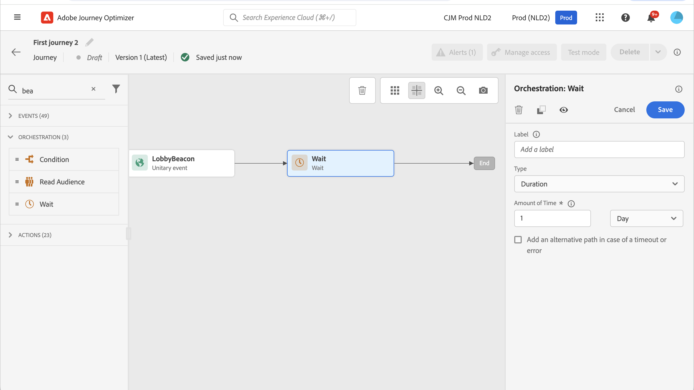
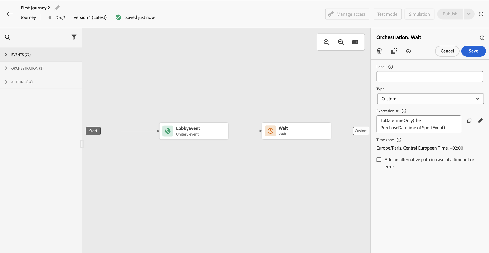

# 等待活動 {#wait-activity}

>[!CONTEXTUALHELP]
>id="ajo_journey_wait"
>title="等待活動"
>abstract="如果您要在執行路徑中的下一個活動之前等待，您可以使用等待活動。這項功能可讓您定義執行下一個活動的時刻。有兩個選項可用：期間和自訂。"

您可以使用&#x200B;**[!UICONTROL 等待]**&#x200B;活動，在執行下一個活動之前定義持續時間。  等待持續時間上限為&#x200B;**90天**。

您可以設定兩種型別的&#x200B;**等待**&#x200B;活動：

* 基於相對持續時間的等待。 [了解更多](#duration)
* 自訂日期，使用函式進行計算。 [了解更多](#custom)

<!--
* [Email send time optimization](#email_send_time_optimization)
* [Fixed date](#fixed_date) 
-->

## 建議 {#wait-recommendations}

### 多個等待活動 {#multiple-wait-activities}

在歷程中使用多個&#x200B;**等待**&#x200B;活動時，請注意，歷程的[全域逾時](journey-properties.md#global_timeout)為91天，這表示設定檔在進入歷程後，一律會退出歷程的最長91天。 請在[此頁面](journey-properties.md#global_timeout)了解更多。

個人只有在歷程中剩餘的時間足以在91天歷程逾時前完成等待期間時，才能進入&#x200B;**等待**&#x200B;活動。

### 等待並重新進入 {#wait-reentrance}

不使用&#x200B;**等待**&#x200B;活動以封鎖重新進入的最佳作法。 請改用歷程屬性層級的&#x200B;**允許重新進入**&#x200B;選項。 請在[此頁面](../building-journeys/journey-properties.md#entrance)了解更多。

### 等待和測試模式 {#wait-test-mode}

在測試模式中，測試&#x200B;**[!UICONTROL 中的]**&#x200B;等待時間引數可讓您定義每個&#x200B;**等待**&#x200B;活動的持續時間。 預設時間為 10 秒。這將確保您能快速獲得測試結果。 請在[此頁面](../building-journeys/testing-the-journey.md)了解更多。

### 等待和行動裝置頻道 {#wait-mobile-channels}

如果您想要在傳送[推播通知](../in-app/create-in-app.md)後立即顯示[應用程式內訊息](../../rp_landing_pages/push-landing-page.md)，請使用&#x200B;**等待**&#x200B;活動來允許應用程式內訊息裝載時間傳播。 通常建議等候5至15分鐘，但確切時間會因裝載複雜性和個人化需求而有所不同。

## 設定 {#wait-configuration}

### 持續時間等待 {#duration}

選取&#x200B;**持續時間**&#x200B;型別，以設定下一個活動執行前等待的相對持續時間。 持續時間上限為&#x200B;**90天**。

<!--
## Fixed date wait{#fixed_date}

Select the date for the execution of the next activity.

-->

### 自訂等待 {#custom}

選取&#x200B;**自訂**&#x200B;型別以定義自訂日期，使用進階運算式，根據來自事件或自訂動作回應的欄位。 您不能直接定義相對持續時間，例如7天，但您可以視需要使用函式來計算相對持續時間（例如：購買後2天）。

編輯器中的運算式應提供`dateTimeOnly`格式。 請參見[此頁面](expression/expressionadvanced.md)。如需dateTimeOnly格式的詳細資訊，請參閱[此頁面](expression/data-types.md)。

最佳實務是使用您的設定檔專屬的自訂日期，並避免對所有人使用相同的日期。 例如，不要定義`toDateTimeOnly('2024-01-01T01:11:00Z')`，而是要定義每個設定檔專屬的`toDateTimeOnly(@event{Event.productDeliveryDate})`。 請注意，使用固定日期可能會導致歷程執行問題。 在[本節](entry-management.md#wait-activities-impact)中進一步瞭解等待活動對歷程處理率的影響。

>[!NOTE]
>
>您可以運用`dateTimeOnly`運算式或使用函式來轉換成`dateTimeOnly`。 例如： `toDateTimeOnly(@event{Event.offerOpened.activity.endTime})`，事件中的欄位格式為2023-08-12T09:46:06Z。
>
>您歷程的屬性中應該有&#x200B;**時區**。 因此，從使用者介面，無法直接指向完整的ISO-8601時間戳記混合時間和時區位移，例如2023-08-12T09:46:06.982-05。 [了解更多](../building-journeys/timezone-management.md)。

若要驗證等待活動是否如預期運作，您可以使用步驟事件。 [了解更多](../reports/query-examples.md#common-queries)。

## 自動等待節點  {#auto-wait-node}

>[!CONTEXTUALHELP]
>id="ajo_journey_auto_wait_node "
>title="關於自動等待節點"
>abstract="系統會在此活動之後自動新增&#x200B;**等待**&#x200B;活動。等待活動的時間設為 3 天。您可以視需求移除或設定等待活動。"

每個傳入體驗活動（應用程式內訊息、程式碼型體驗或卡片）都隨附3天&#x200B;**等待**&#x200B;活動。 由於當設定檔到達歷程終點時，傳入訊息會自動結束，因此我們假設您想要使用者至少在3天內看到它。 您可以移除此&#x200B;**等待**&#x200B;活動，或視需要變更其設定。