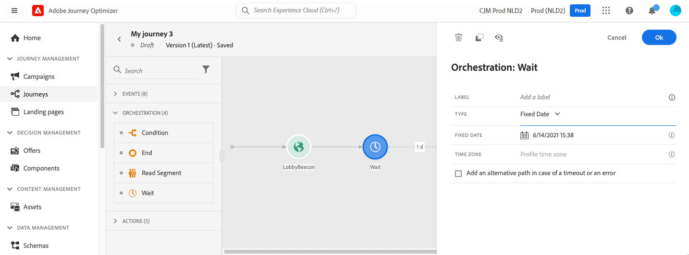

# 等待活動 {#wait-activity}

>[!BEGINSHADEBOX]

**在此頁面上：**&#x200B;瞭解如何設定「等待」活動，讓路徑暫停相對期間或直到自訂計算日期為止，再執行下一個活動。

>[!ENDSHADEBOX]

>[!CONTEXTUALHELP]
>id="ajo_journey_wait"
>title="等待活動"
>abstract="「等待」活動可讓您在執行路徑中的下一個活動之前等待。 這項功能可讓您定義執行下一個活動的時刻。 有兩個選項可用：期間和自訂。"

您可以使用&#x200B;**[!UICONTROL 等待]**&#x200B;活動，在執行下一個活動之前定義持續時間。  等待持續時間上限為&#x200B;**90天**。

您可以設定兩種型別的&#x200B;**等待**&#x200B;活動：

* 基於相對持續時間的等待。 [了解更多](#duration)
* 自訂日期，使用函式進行計算。 [了解更多](#custom)

<!--
* [Email send time optimization](#email_send_time_optimization)
* [Fixed date](#fixed_date) 
-->

## 推薦 {#wait-recommendations}

使用這些建議來確保等待可預測且安全。

### 多個等待活動 {#multiple-wait-activities}

在歷程中使用多個&#x200B;**等待**&#x200B;活動時，請注意，歷程的[全域逾時](journey-properties.md#global_timeout)為91天，這表示設定檔在進入歷程後，一律會退出歷程的最長91天。 請在[此頁面](journey-properties.md#global_timeout)了解更多。

個人只有在歷程中剩餘的時間足以在91天歷程逾時前完成等待期間時，才能進入&#x200B;**等待**&#x200B;活動。

### 等待並重新進入 {#wait-reentrance}

不使用&#x200B;**等待**&#x200B;活動以封鎖重新進入的最佳作法。 請改用歷程屬性層級的&#x200B;**允許重新進入**&#x200B;選項。 請在[此頁面](../building-journeys/journey-properties.md#entrance)了解更多。

### 等待和測試模式 {#wait-test-mode}

在測試模式中，測試&#x200B;**中的**&#x200B;等待時間引數可讓您定義每個&#x200B;**等待**&#x200B;活動的持續時間。 預設時間為 10 秒。 這將確保您能快速獲得測試結果。 請在[此頁面](../building-journeys/testing-the-journey.md)了解更多。

### 等待和行動裝置頻道 {#wait-mobile-channels}

如果您想要在傳送[推播通知](../../rp_landing_pages/push-landing-page.md)後立即顯示[應用程式內訊息](../in-app/create-in-app.md)，請使用&#x200B;**等待**&#x200B;活動來允許應用程式內訊息裝載時間傳播。 通常建議等候5至15分鐘，但確切時間會因裝載複雜性和個人化需求而有所不同。

## 設定 {#wait-configuration}

在此設定等待期間和時間。

### 持續時間等待 {#duration}

選取&#x200B;**持續時間**&#x200B;型別，以設定下一個活動執行前等待的相對持續時間。 持續時間上限為&#x200B;**90天**。

<!--
## Fixed date wait{#fixed_date}

Select the date for the execution of the next activity.

-->

### 自訂等待 {#custom}

選取&#x200B;**自訂**&#x200B;型別以定義自訂日期，使用進階運算式，根據來自事件或自訂動作回應的欄位。 您不能直接定義相對持續時間，例如7天，但您可以視需要使用函式來計算相對持續時間（例如：購買後2天）。

編輯器中的運算式應提供`dateTimeOnly`格式。 請參見[此頁面](expression/expressionadvanced.md)。 如需dateTimeOnly格式的詳細資訊，請參閱[此頁面](expression/data-types.md)。

最佳實務是使用您的設定檔專屬的自訂日期，並避免對所有人使用相同的日期。 例如，不要定義`toDateTimeOnly('2024-01-01T01:11:00Z')`，而是要定義每個設定檔專屬的`toDateTimeOnly(@event{Event.productDeliveryDate})`。 請注意，使用固定日期可能會導致歷程執行問題。 在[本節](entry-management.md#wait-activities-impact)中進一步瞭解等待活動對歷程處理率的影響。

>[!CAUTION]
>
>使用`dateTimeOnly`運算式時，請記住下列事項：
>
>* 您可以直接使用`dateTimeOnly`運算式，或使用函式轉換成它 — 例如： `toDateTimeOnly(@event{Event.offerOpened.activity.endTime})`，其中欄位值是表單`2023-08-12T09:46:06Z`。
>* **時區**&#x200B;已在歷程屬性中定義。 因此，從UI無法指向混合時間和時區位移的完整ISO-8601時間戳記，例如`2023-08-12T09:46:06.982-05`。 [了解更多](../building-journeys/timezone-management.md)
>* 使用`toDateTimeOnly()`建置自訂等待運算式時，請&#x200B;**不**&#x200B;附加`Z`或時區位移（例如`-05:00`）。 運算式必須參考歷程的設定時區，且不含明確時區指示器，否則設定檔可能會卡在等待活動中。
>
>| | 範例 |
>| --- | --- |
>| **正確** | `toDateTimeOnly(concat(toString(toDateOnly(nowWithDelta(2, "days"))),"T10:00:00"))` |
>| **不正確** | `toDateTimeOnly(concat(toString(toDateOnly(nowWithDelta(2, "days"))),"T10:00:00Z"))` ❌ （包含`Z`） |

若要驗證等待活動是否如預期運作，您可以使用步驟事件。 [了解更多](../reports/query-examples.md#common-queries)。

## 等待後重新整理設定檔 {#profile-refresh}

當設定檔停留在以&#x200B;**讀取對象**&#x200B;活動開始的歷程中的&#x200B;**等待**&#x200B;活動時，歷程會自動從整合設定檔服務(UPS)重新整理設定檔的屬性，以擷取最新的可用資料。

* **在歷程專案**：設定檔使用歷程開始時所評估之對象快照中的屬性值。
* **在等待節點之後**：歷程會執行查詢，以從UPS擷取最新的設定檔資料，而非較舊的快照集資料。 這表示自歷程開始以來，設定檔屬性可能已變更。

此行為可確保下游活動在等待期間後使用目前的設定檔資訊。 不過，如果您預期歷程在整個執行期間僅使用原始快照集資料，則可能會產生非預期的結果。

範例：如果設定檔在歷程開始時符合「銀級客戶」對象的資格，但在3天等待期間升級為「金級客戶」，則等待後的活動會看到更新的「金級客戶」狀態。

## 自動等待節點  {#auto-wait-node}

>[!CONTEXTUALHELP]
>id="ajo_journey_auto_wait_node"
>title="關於自動等待節點"
>abstract="「**等待**」節點會自動插入至此傳入動作之後。 其預設為 3 天，確保輪廓在歷程中停留足夠長的時間，以便檢視訊息或體驗。 如果使用案例需要，可以更新等待持續時間或移除該節點。"

每個傳入體驗活動（應用程式內訊息、程式碼型體驗或卡片）都隨附3天&#x200B;**等待**&#x200B;活動。 由於當設定檔到達歷程終點時，傳入訊息會自動結束，因此我們假設您想要使用者至少在3天內看到它。 您可以移除此&#x200B;**等待**&#x200B;活動，或視需要變更其設定。

+++ AI知識參考

本節包含結構化知識，用於支援與本主題相關的解譯、擷取和問答。

如需完整瞭解，此資訊應結合本頁的檔案。 兩者皆非獨立來源；頁面說明功能，本節提供額外內容，以協助去除術語、意圖、適用性和限制條件的歧義。

* **TL；DR：**&#x200B;此頁面說明如何設定歷程中的「等待」活動，以暫停相對持續期間的設定檔進度，或直到自訂計算日期為止，然後再執行下一個步驟。

**意圖：**

* 新增等待活動，以暫停固定相對持續時間的歷程（最長90天）
* 使用進階運算式設定自訂等待，以延遲至設定檔特定的計算日期
* 瞭解等待活動如何與歷程全域逾時（91天）互動
* 使用測試中的等待時間引數來加速測試模式驗證
* 瞭解在讀取對象歷程中的等待節點後如何重新整理設定檔屬性

**字彙表：**

* **等待活動**：在下一個活動執行&#x200B;*（產品專屬）*&#x200B;之前，將設定檔進度暫停一段指定期間或直到計算日期為止的歷程協調活動
* **持續時間等待**：一種等待型別，設定相對暫停時段，最多90天&#x200B;*（產品特定）*
* **自訂等待**：一種等待型別，它使用衍生自設定檔或事件資料的`dateTimeOnly`運算式，以定義復產的特定未來日期/時間&#x200B;*（產品特定）*
* **自動等待節點**：在傳入體驗活動（應用程式內、程式碼型、卡片）之後自動插入3天等待活動，讓設定檔在歷程中維持足夠長的時間，以檢視內容&#x200B;*（產品特定）*
* **測試中的等待時間**：覆寫實際等待時間（預設10秒）的歷程測試模式引數，因此測試結果會快速傳回&#x200B;*（產品特定）*

**護欄：**

* 最長等待時間為90天。
* 在91天（全域逾時）後，無論擱置的等待活動為何，都會從歷程中捨棄設定檔。
* 設定檔只有在歷程中保留足夠時間，讓歷程在91天逾時前完成等待時，才能進入等待活動。
* 請勿使用等待活動來封鎖重新進入；請改用歷程屬性中的允許重新進入選項。
* 自訂等待運算式必須使用`dateTimeOnly`格式，且不得包含`Z`尾碼或明確的時區位移。
* 在自訂等待中使用固定的靜態日期（例如`toDateTimeOnly('2024-01-01T01:11:00Z')`）可能會造成問題；請改用設定檔特定的動態日期。
* 在讀取對象歷程中的等待節點後，會從整合設定檔服務重新整理設定檔屬性，如果預期會出現快照一致性的情況，這可能會產生非預期的結果。

**術語：**

* 正式名稱：等待活動 — 縮寫：無 — 變體：等待節點，等待步驟
* 同義字： &quot;Duration wait&quot; = &quot;relative wait&quot;； &quot;Custom wait&quot; = &quot;expression-based wait&quot;
* 請勿混淆：「期間等待」（相對，例如從現在起的3天）≠「自訂等待」（來自設定檔資料的絕對計算日期）

**常見問題集：**

* **問：等待活動的最長持續期間是多少？**  — 最長等待時間為90天；設定檔也受91天全域歷程逾時的限制。
* **問：測試模式如何處理等待活動？**  — 在測試模式中，「測試等待時間」引數會覆寫實際的等待時間；預設值為10秒，因此測試會快速完成。
* **問：為何要避免將Z附加至自訂等待運算式？**  — 將Z或時區位移新增至`toDateTimeOnly()`運算式可能會導致設定檔卡在等待活動中；運算式必須依賴歷程設定的時區。
* **問：設定檔屬性是否在等待節點之後更新？**  — 是，在以讀取對象開始的歷程中，歷程會在等待後重新整理統一設定檔服務的設定檔屬性，因此下游活動可能會看到更新值，而非原始對象快照資料。
* **問：什麼是自動等待節點？**  — 在傳入體驗活動（應用程式內、程式碼型、卡片）之後自動插入3天等待活動，以確保設定檔保留在歷程中夠長的時間，以檢視訊息；可視需要移除或重新設定。

+++
