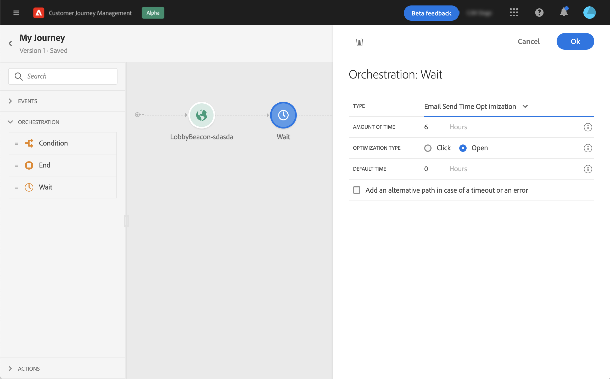

# 等待活動{#wait-activity}

>[!CONTEXTUALHELP]
>id="ajo_journey_wait"
>title="等待活動"
>abstract="如果您要在執行路徑中的下一個活動之前等待，您可以使用等待活動。這項功能可讓您定義執行下一個活動的時刻。有兩個選項可用：期間和自訂。"

如果要在執行路徑中的下一個活動之前等待，可以使用 **[!UICONTROL 等待]** 的子菜單。 這項功能可讓您定義執行下一個活動的時刻。有三種選擇：

* [持續時間](#duration)
* [自訂](#custom)

<!--
* [Email send time optimization](#email_send_time_optimization)
* [Fixed date](#fixed_date) 
-->

## 關於等待活動{#about_wait}

最大等待持續時間為30天。 在test模式下， **[!UICONTROL 等待時間在test]** 參數允許您定義每個等待活動將持續的時間。 預設時間為 10 秒。這將確保您快速獲得test結果。 請參閱 [此頁](../building-journeys/testing-the-journey.md)

當在行程中使用多個等待活動時要小心，因為全局行程超時為30天，這意味著配置檔案在他/她輸入行程後將始終從行程中退出。

## 持續時間等待{#duration}

選擇在執行下一活動之前等待的持續時間。

<!--
## Fixed date wait{#fixed_date}

Select the date for the execution of the next activity.

-->

## 自定義等待{#custom}

此選項允許您使用基於來自事件或資料源的欄位的高級表達式來定義自定義日期，例如2020年7月12日下午5點。 它不允許您定義自定義持續時間，例如7天。 表達式編輯器中的表達式應提供dateTimeOnly格式。 請參閱此 [頁](expression/expressionadvanced.md)。 有關dateTimeOnly格式的詳細資訊，請參閱 [頁](expression/data-types.md)。

>[!NOTE]
>
>可以利用dateTimeOnly表達式或使用函式轉換為dateTimeOnly。 例如：toDateTimeOnly(@{Event.offerOpened.activity.endTime})，事件中的欄位為2016-08-12T09:46:06Z。
>
>的 **時區** 在你旅程的屬性中。 因此，目前無法從介面直接指向完全ISO-8601時間戳混合時間和時區偏移，如2016-08-12T09:46:06.982-05。 請參閱[此頁面](../building-journeys/timezone-management.md)。

要驗證等待活動是否按預期工作，可以使用步驟事件。 請參閱[此頁面](../reports/query-examples.md#common-queries)。

<!--## Email send time optimization{#email_send_time_optimization}

This type of wait uses a score calculated in Adobe Experience Platform. The score calculates the propensity to click or open an email in the future based on past behavior. Note that the algorithm calculating the score needs a certain amount of data to work. As a result, when it does not have enough data, the default wait time will apply. At publication time, you’ll be notified that the default time applies.

>[!NOTE]
>
>The first event of your journey must have a namespace.
>
>This capability is only available after an **[!UICONTROL Email]** activity. You need to have Adobe Campaign Standard.

1. In the **[!UICONTROL Amount of time]** field, define the number of hours to consider to optimize email sending.
1. In the **[!UICONTROL Optimization type]** field, choose if the optimization should increase clicks or opens.
1. In the **[!UICONTROL Default time]** field, define the default time to wait if the predictive send time score is not available.

    >[!NOTE]
    >
    >Note that the send time score can be unavailable because there is not enough data to perform the calculation. In this case, you will be informed, at publication time, that the default time applies.

-->

