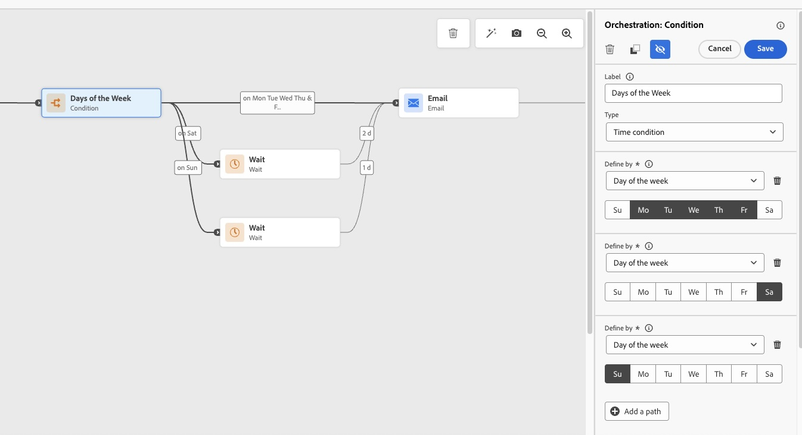
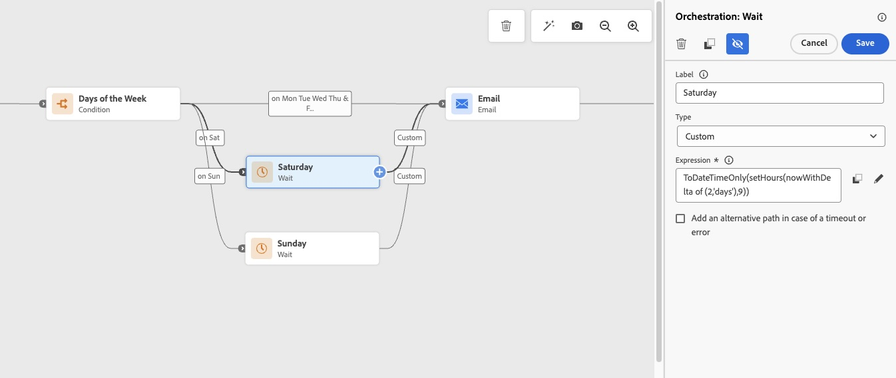

# 只在工作日傳送電子郵件 {#send-emails-only-on-weekdays}

此使用案例會示範如何在Adobe Journey Optimizer中設定只在工作日（星期一到星期五）傳送電子郵件的歷程。 對於在週末（星期六或星期日）進入歷程的設定檔，電子郵件會自動排入佇列，並在星期一的指定時間傳送。 這可透過在工作週期間傳遞訊息來確保最佳參與。

## 使用案例概觀

**挑戰**：確認電子郵件只會在平日傳送，即使設定檔可能會在週末進入歷程。 對於週末的登入點，電子郵件應在星期一的特定時間排入佇列並傳送。

**解決方案**：使用條件活動來識別星期幾。 對於週末專案，使用自訂公式的等待活動會將電子郵件延遲到星期一。 工作日專案會直接繼續進行電子郵件傳送步驟。

此方法可讓您使用條件活動來檢查當天是星期六還是星期日、使用自訂公式來實作等待活動以便週末輸入、將週末電子郵件排入佇列以便星期一在特定小時傳遞，以及立即傳送電子郵件以便平日輸入（星期一至星期五）。

此方法非常適合企業間(B2B)電子郵件行銷活動、專業電子報和通訊、企業相關公告、工作相關產品更新，以及任何不希望週末送貨的行銷活動。

觀看此頁面底部的逐步[教學課程影片](#how-to-video)，瞭解完整實作。

## 先決條件

若要實作此使用案例，您需要具備已設定的[電子郵件頻道介面](../configuration/channel-surfaces.md)、[對象](../audience/about-audiences.md)或[事件](../event/about-events.md)的活動Adobe Journey Optimizer執行個體以觸發歷程，以及對[歷程條件](condition-activity.md)和[運算式](expression/expressionadvanced.md)的基本瞭解。

## 實施步驟

### 步驟1：建立您的歷程

1. 導覽至Adobe Journey Optimizer中的&#x200B;**[!UICONTROL 歷程管理]** > **[!UICONTROL 歷程]**。

1. 按一下&#x200B;**[!UICONTROL 建立歷程]**&#x200B;以建立新歷程。 [進一步瞭解如何建立歷程](journey-gs.md)

1. 設定歷程屬性：
   * **名稱**：平日電子郵件行銷活動
   * **說明**：只會在平日傳送電子郵件（星期一至星期五）
   * 為您的使用案例設定適當的名稱空間

[進一步瞭解歷程屬性](journey-properties.md)

1. 選擇您的歷程進入點：
   * **[讀取對象](read-audience.md)**：針對鎖定特定對象的批次行銷活動
   * **[事件](../event/about-events.md)**：針對根據客戶行為的即時觸發歷程

### 步驟2：新增「條件」活動以檢查一週中的某天

在歷程開始之後，新增&#x200B;**[!UICONTROL 條件]**&#x200B;活動以檢查當天是星期六還是星期日。 這會相應地分支工作流程。

1. 將&#x200B;**[!UICONTROL 條件]**&#x200B;活動拖放到進入點之後的畫布上。 [進一步瞭解條件活動](condition-activity.md)

1. 按一下Condition活動以開啟其設定面板。

1. 在&#x200B;**[!UICONTROL 條件型別]**&#x200B;區段中，選取&#x200B;**[!UICONTROL 資料Source條件]**。 [進一步瞭解條件型別](condition-activity.md#data_source_condition)

   


### 步驟3：設定條件以識別星期六

建立第一個條件路徑以識別星期六專案。

1. 按一下&#x200B;**[!UICONTROL 進階模式]**&#x200B;以開啟運算式編輯器。 [進一步瞭解運算式編輯器](expression/expressionadvanced.md)

1. 輸入下列運算式以檢查當天是否為星期六：

   ```javascript
   dayOfWeek(now()) == 7
   ```

   這會使用`dayOfWeek()`函式搭配`now()`來取得當天。 [進一步瞭解日期函式](functions/date-functions.md)


1. 按一下&#x200B;**[!UICONTROL 確定]**&#x200B;以儲存條件。

1. 將此路徑標示為「星期六」。

### 步驟4：為星期日新增第二個條件路徑

1. 在「條件」活動中，按一下&#x200B;**[!UICONTROL 新增路徑]**&#x200B;以建立第二個條件。

1. 在第二個路徑的運算式編輯器中，輸入：

   ```javascript
   dayOfWeek(now()) == 1
   ```

   這會檢查當天是否為星期日。

1. 將此路徑標示為「星期日」。

1. 檢查&#x200B;**[!UICONTROL 顯示上述案例以外的路徑]**，以建立工作日專案（星期一至星期五）的路徑。


>[!NOTE]
>
>`dayOfWeek()`函式傳回代表一週某天的整數，其中1是星期日，7是星期六。 這遵循ISO-8601的日期編號標準。

### 步驟5：設定週末專案的等待活動

對於在星期六或星期日輸入的設定檔，使用包含自訂公式的等待活動，將電子郵件延遲到星期一您想要的時間。


**對於星期六路徑：**

1. 新增&#x200B;**[!UICONTROL 等待]**&#x200B;活動。 [進一步瞭解等待活動](wait-activity.md)

1. 選取&#x200B;**[!UICONTROL 持續時間]**&#x200B;作為等待型別。

1. 按一下&#x200B;**[!UICONTROL 進階模式]**&#x200B;以輸入自訂公式。

1. 輸入下列公式以等到星期一上午9點：

   ```javascript
   toDuration("PT" + (48 - getHourOfDay(now())) + "H")
   ```

   或者使用此替代公式：

   ```javascript
   setHours(nowWithDelta(2, "days"), 9)
   ```

   

   **解釋**：此公式計算從星期六到星期一上午9點的等待時間。 值X=2代表往前2天（星期六+ 2天=星期一）。 [進一步瞭解日期函式](functions/date-functions.md#nowWithDelta)

星期日路徑為&#x200B;**：**

1. 新增&#x200B;**[!UICONTROL 等待]**&#x200B;活動。

1. 選取&#x200B;**[!UICONTROL 持續時間]**&#x200B;作為等待型別。

1. 按一下&#x200B;**[!UICONTROL 進階模式]**&#x200B;以輸入自訂公式。

1. 輸入下列公式以等到星期一上午9點：

   ```javascript
   setHours(nowWithDelta(1, "days"), 9)
   ```

   **說明**：此公式會等候1天（星期日+ 1天=星期一），並將時間設定為上午9點。 值X=1代表往前1天，而H=9代表上午9點。

>[!TIP]
>
>您可以隨時自訂小時(H)引數，以在星期一傳送電子郵件。 例如，上午10點會變更9至10，下午2點則變更為14。

### 步驟6：設定工作日路徑

針對&#x200B;**工作日路徑** （星期一至星期五）：

1. 直接繼續新增&#x200B;**[!UICONTROL 電子郵件]**&#x200B;動作活動。 工作日專案不需要等待活動。 [進一步瞭解電子郵件動作](journeys-message.md)

1. 設定您的電子郵件訊息：
   * 選取或建立您的[電子郵件內容](../email/get-started-email-design.md)
   * 設定[電子郵件引數](../email/email-settings.md)
   * 視需要設定[個人化](../personalization/personalize.md)

1. 在電子郵件後新增&#x200B;**[!UICONTROL End]**&#x200B;活動。

### 步驟7：合併電子郵件的週末路徑

在星期六和星期日路徑上的等待活動後，將它們合併到相同的電子郵件動作活動：

1. 從星期六等待活動中，新增&#x200B;**[!UICONTROL 電子郵件]**&#x200B;動作。

1. 從星期日等待活動，連線到相同的電子郵件動作。

1. 工作日路徑也應流向此電子郵件動作。

### 步驟8：測試您的歷程

發佈之前，請在Adobe Journey Optimizer的測試模式下徹底測試您的歷程邏輯，以確認一切都如預期般運作：

1. 按一下右上角的&#x200B;**[!UICONTROL 測試]**&#x200B;按鈕。

1. 啟用測試模式。 [瞭解如何測試您的歷程](testing-the-journey.md)

1. 建立在一星期中不同日期具有模擬進入時間的[測試設定檔](../audience/creating-test-profiles.md)：
   * **星期六專案**：驗證設定檔是否遵循星期六路徑、在指定時間等待並接收星期一的電子郵件
   * **星期日專案**：驗證設定檔是否遵循星期日路徑、在指定時間等待並接收星期一的電子郵件
   * **星期一至星期五的專案**：確認電子郵件會立即傳送，無需任何等候

1. 檢閱歷程視覺效果，確保設定檔遵循正確的條件路徑（星期六、星期日或工作日）。

1. 檢查歷程中是否有任何錯誤或警告。 [了解疑難排解歷程](troubleshooting.md)

1. 確認「等待」公式計算所需星期一傳送時間的正確持續時間。

>[!IMPORTANT]
>
>發佈到生產環境之前，請務必徹底測試您的歷程邏輯。 使用測試模式來模擬不同的登入案例，並驗證週末專案是否已正確排入星期一傳送的佇列。 [進一步瞭解歷程測試最佳實務](testing-the-journey.md)

### 步驟9：發佈您的歷程

測試完成後：

1. 按一下右上角的&#x200B;**[!UICONTROL 發佈]**。

1. 確認發佈。 [進一步瞭解發佈歷程](publish-journey.md)

1. 使用[歷程報告](report-journey.md)和[即時報告](../reports/journey-live-report.md)監視歷程績效。

## 最佳實務和考量事項

+++**使用增強式公式最佳化工作流程**

為了增強您的工作流程並處理更複雜的業務需求，您可以將公式擴充至基本工作日檢查以外的假日、時區或特定工作時間。 調整等待公式中的小時引數(H)以符合您的最佳傳送時間，例如，如果上午10點顯示較好的參與率，請將公式變更為使用小時10。 如需多個時區支援，請考慮針對不同地理區域建立個別歷程，以確保星期一在每個收件者的當地時區傳送。

+++

+++**時區管理**

`now()`函式和歷程執行使用在歷程層級設定的時區。 在發佈之前，透過在歷程屬性中設定此專案，確保歷程時區符合您的需求（[進一步瞭解時區管理](timezone-management.md)）。 如果您的對象跨越多個時區，請注意，一週中的某天檢查會在歷程設定的時區中進行，而不是在收件者的當地時區中進行。 對於時區特定的傳送，請為不同區域建立個別歷程，或在讀取對象活動中使用時區設定。

+++

+++**歷程專案與時間**

對於批次歷程，[排程讀取對象](read-audience.md#schedule)以在適合您的對象的時間觸發 — 清晨執行（例如，上午6:00）是商業通訊的常見做法。 對於事件型歷程，收到事件時會立即評估條件，週末輸入的設定檔會自動等到星期一（[深入瞭解事件](../event/about-events.md)）。 請確定您的[歷程逾時設定](journey-properties.md#timeout)符合等候時間上限（從星期六到星期一最多2天）。

+++

+++**測試是必要的**

如實施指南中強調的，請一律測試您的歷程邏輯，以確認一切都如預期般運作。 使用&#x200B;**測試模式**&#x200B;來模擬不同的輸入情境，而不傳送真正的電子郵件。 測試所有三個路徑（星期六專案、星期日專案和工作日專案），驗證等待持續時間計算是否正確，確認星期一在指定時間傳遞，並檢查歷程視覺效果以確保路徑路由正確。

+++

+++**重新輸入與頻率**

對於週期性行銷活動，請適當地設定&#x200B;**[!UICONTROL 重新進入]**&#x200B;設定（[進一步瞭解重新進入設定](entry-management.md)）。 如果設定檔可以重新進入歷程，則每次都將受到星期幾檢查，確保週末專案一律排入星期一的佇列。 請考慮新增[頻率上限規則](../conflict-prioritization/journey-capping.md)，以避免設定檔可以頻繁地重新輸入時過度傳訊。

+++

## 進階變數

+++**特定日目標定位**

若要只在特定日期（例如星期二和星期四）傳送電子郵件，請修改條件：

```javascript
dayOfWeek(now()) == 3 or dayOfWeek(now()) == 5
```

對於所有其他天，新增等待活動，以計算到下週二或星期四的天數。

+++

+++**不同日期的不同傳送時間**

您可以針對不同的週末行為，使用不同的等待公式來建立多個路徑。 例如，星期六到星期三的傳遞使用`nowWithDelta(4, "days")`，星期日到星期二的傳遞使用`nowWithDelta(2, "days")`。 這讓您在傳送排程上有更大的彈性。

+++

+++**營業時間傳遞**

若要確保營業時間內的傳遞，請調整等待公式中的小時引數。 例如，對於在下午2點而非上午9點的傳送：

```javascript
setHours(nowWithDelta(1, "days"), 14)
```

您也可以在「等待」之後新增第二個條件，以檢查目前時間在傳送前的營業小時內嗎。

+++

+++**假日排除**

若要排除假日，請新增其他條件路徑，以檢查特定日期：

```javascript
toDateTimeOnly(now()) == toDateTimeOnly("2024-12-25T00:00:00")
```

如果條件符合假日，請新增「等待」活動以延遲至下一個營業日。 [進一步瞭解日期比較函式](functions/date-functions.md)

+++

## 相關主題

| 主題 | 說明 |
|-------|-------------|
| [關於條件活動](condition-activity.md) | 瞭解如何在您的歷程中建立不同的路徑 |
| [在歷程中使用條件](conditions.md) | 歷程條件的詳細指南 |
| [等待活動](wait-activity.md) | 設定等待期間和公式 |
| [日期函式](functions/date-functions.md) | 日期和時間函式的完整參考 |
| [運算式編輯器](expression/expressionadvanced.md) | 建立複雜運算式 |
| [測試您的歷程](testing-the-journey.md) | 發佈前驗證歷程邏輯 |
| [時區管理](timezone-management.md) | 處理歷程中的不同時區 |
| [歷程最佳實務](journey-gs.md#best-practices) | 歷程設計的建議方法 |

## 作法影片

瞭解如何使用Adobe Journey Optimizer只在工作日傳送電子郵件。 此影片示範條件活動和等待公式的逐步實作，以將週末專案排入佇列，以供星期一傳送。

>[!VIDEO](https://video.tv.adobe.com/v/3469330?quality=12&learn=on)

## 其他資源

| 資源 | 說明 |
|----------|-------------|
| [運算式編輯器檔案](expression/expressionadvanced.md) | 建置及驗證歷程運算式 |
| [歷程設計器指南](using-the-journey-designer.md) | 掌握歷程畫布 |
| [歷程使用案例總覽](jo-use-cases.md) | 探索更多歷程模式和範例 |
| [社群部落格貼文：如何只在工作日傳送電子郵件](https://experienceleaguecommunities.adobe.com/t5/journey-optimizer-blogs/how-to-send-emails-only-on-weekdays-in-adobe-journey-optimizer/ba-p/760400){target="_blank"} | 包含詳細範例的原始部落格 |

