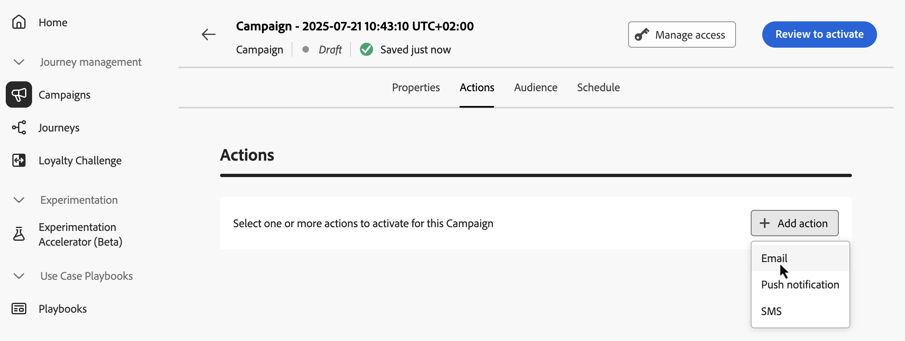

# 設定API觸發的行銷活動動作 {#api-action}

使用&#x200B;**[!UICONTROL 動作]**&#x200B;索引標籤，選取訊息的頻道設定，再設定其他設定，例如追蹤、內容實驗或多語言內容。

1. **選擇頻道**。

   導覽至&#x200B;**[!UICONTROL 動作]**&#x200B;標籤，按一下&#x200B;**[!UICONTROL 新增動作]**&#x200B;按鈕並選取通訊通道。

   

   >[!NOTE]
   >
   >可用的通道因您的授權模式及附加元件而異。
   >
   >針對API觸發的行銷活動，只有電子郵件、簡訊和推播通知通道可用。

1. **選取通道設定**

   會由[系統管理員](../start/path/administrator.md)定義設定。它包含所有用於傳送訊息的技術參數，如標頭參數、子網域、行動應用程式等等。[瞭解如何設定頻道設定](../configuration/channel-surfaces.md)

   

1. **善用最佳化**

   使用&#x200B;**[!UICONTROL 訊息最佳化]**&#x200B;區段來執行內容實驗、運用鎖定目標規則，或使用實驗和鎖定目標的進階組合。 本節中詳細說明這些不同的選項和要遵循的步驟： [行銷活動中的最佳化](campaigns-message-optimization.md)。
<!--
1. **Create a content experiment**

    Use the **[!UICONTROL Content experiment]** section to define multiple delivery treatments in order to measure which one performs best for your target audience. Click the **[!UICONTROL Create experiment]** button then follow the steps detailed in this section: [Create a content experiment](../content-management/content-experiment.md).-->

1. **新增多語言內容**

   使用&#x200B;**[!UICONTROL 語言]**&#x200B;區段，就能在行銷活動中，使用多語言建立內容。 若想這麼做，就請按一下 **[!UICONTROL [新增語言]]** 按鈕，然後選取指定 **[!UICONTROL [語言設定]]**。 本區段有提供如何設定、使用多語言功能的詳細資訊：[開始使用多語言內容](../content-management/multilingual-gs.md)

根據所選的通訊通道，有其他設定可供使用。 請展開下列各節以取得詳細資訊。

+++**套用上限規則** （電子郵件、推播、簡訊）

在&#x200B;**[!UICONTROL 商業規則]**&#x200B;下拉式清單中，選取要套用上限規則至行銷活動的規則集。 運用管道規則集，可讓您根據通訊型別設定頻率上限，以防止訊息相似的客戶超載。 [學習如何使用規則集](../conflict-prioritization/rule-sets.md)

+++

+++**追蹤參與** （電子郵件、簡訊）。

使用&#x200B;**[!UICONTROL 動作追蹤]**&#x200B;區段，追蹤收件者對電子郵件或簡訊傳遞的反應。 一旦執行行銷活動完畢，即可從行銷活動報告，存取追蹤結果。 [深入瞭解行銷活動報告](../reports/campaign-global-report-cja.md)

+++

+++**啟用快速傳遞模式** （推播）。

快速傳送模式是[!DNL Journey Optimizer]附加元件，允許透過行銷活動，迅速傳送大量推播訊息。 當您想要在行動電話上，傳送緊急推播警報時，例如傳送重大新聞給已安裝新聞頻道應用程式的使用者參考，如果對企業來說，延後傳遞訊息很重要，就可能會使用快速傳遞功能。 如需使用快速傳遞模式時的效能詳細資訊，就請參閱 [Adobe Journey Optimizer 產品說明](https://helpx.adobe.com/tw/legal/product-descriptions/adobe-journey-optimizer.html)。

+++

## 後續步驟 {#next}

準備好行銷活動設定和內容後，您就可以設計其內容。 [了解更多](api-triggered-campaign-content.md)
