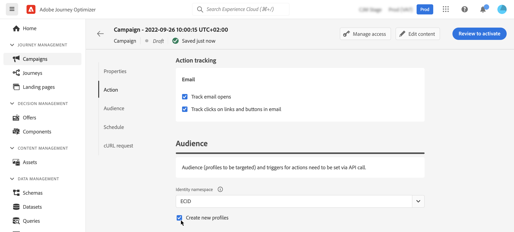

# 定義API觸發的行銷活動對象 {#api-audience}

使用&#x200B;**[!UICONTROL 對象]**&#x200B;標籤來定義行銷活動對象。

## 選取客群

**針對行銷API觸發的行銷活動**，按一下&#x200B;**[!UICONTROL 選取對象]**&#x200B;按鈕以顯示可用Adobe Experience Platform對象清單。 [進一步瞭解對象](../audience/about-audiences.md)。

>[!IMPORTANT]
>
>[對象構成](../audience/get-started-audience-orchestration.md)的對象和屬性目前無法用於Healthcare Shield或Privacy and Security Shield。

**對於異動API觸發的行銷活動**，必須在API呼叫中定義目標設定檔。 單一API呼叫支援最多20個不重複收件者。 每個收件者必須具有唯一的使用者ID，不允許重複的使用者ID。 進一步瞭解[互動式訊息執行API檔案](https://developer.adobe.com/journey-optimizer-apis/references/messaging/#tag/execution/operation/postIMUnitaryMessageExecution){target="_blank"}

## 選取身分識別類型

在&#x200B;**[!UICONTROL 身分型別]**&#x200B;欄位中，選擇用來識別所選對象中個人的金鑰型別。 您可以使用現有的身分型別，或使用Adobe Experience Platform Identity Service建立新的身分型別。 標準身分名稱空間列於[此頁面](https://experienceleague.adobe.com/en/docs/experience-platform/identity/features/namespaces#standard){target="_blank"}。

每個行銷活動只允許一個身分型別。 如果屬於區段的個人在不同身分中沒有選取的身分型別，則無法將該行銷活動設為目標。 在[Adobe Experience Platform檔案](https://experienceleague.adobe.com/docs/experience-platform/identity/home.html?lang=zh-Hant){target="_blank"}中進一步瞭解身分型別和名稱空間。

## 在行銷活動執行時啟用設定檔建立

在某些情況下，您可能需要將交易式訊息傳送至系統中不存在的設定檔。 例如，如果未知的使用者嘗試重設您網站上的密碼。 當資料庫中不存在設定檔時，Journey Optimizer可讓您在執行行銷活動時自動建立該設定檔，以允許傳送訊息至此設定檔。

若要在行銷活動執行時啟用設定檔建立，請將&#x200B;**[!UICONTROL 建立新設定檔]**&#x200B;選項切換為開啟。 如果停用此選項，則會拒絕任何傳送的未知設定檔，且API呼叫將失敗。

>[!IMPORTANT]
>
>在大量交易式傳送使用案例中，提供此選項是為了建立&#x200B;**極小的磁碟區設定檔**，其中大量的設定檔已存在於平台中。
>
>在&#x200B;**AJO互動式訊息設定檔資料集**&#x200B;資料集中，針對每個傳出頻道（電子郵件、簡訊和推播）分別使用三個預設名稱空間（電子郵件、電話和ECID）建立未知的設定檔。 不過，如果您使用自訂名稱空間，則會使用相同的自訂名稱空間建立身分。

## 啟用 Webhook {#webhook}

對於異動API觸發的行銷活動，您可以啟用Webhook以接收對訊息執行狀態的即時回饋。 若要這麼做，請切換&#x200B;**[!UICONTROL 啟用Webhook]**&#x200B;選項，將傳遞狀態事件傳送至已設定的Webhook。

Webhook設定是在&#x200B;**[!UICONTROL 管理]** / **[!UICONTROL 管道]** / **[!UICONTROL 意見Webhook]**&#x200B;功能表中集中管理。 管理員可從該處建立和編輯webhook端點。 [瞭解如何建立意見回饋Webhook](../configuration/feedback-webhooks.md)

## 後續步驟 {#next}

準備好行銷活動設定和內容後，您就可以排程其執行。 [了解更多](api-triggered-campaign-schedule.md)
