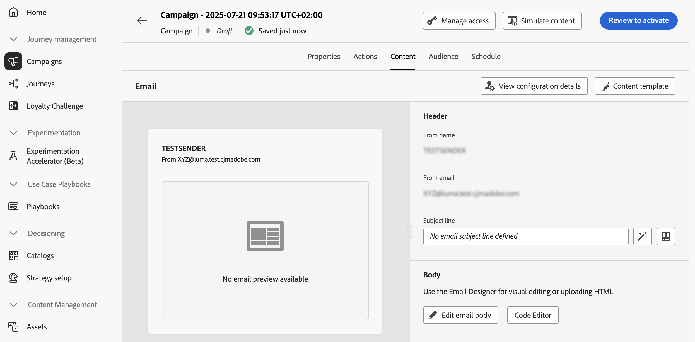
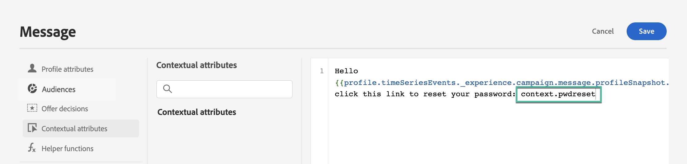
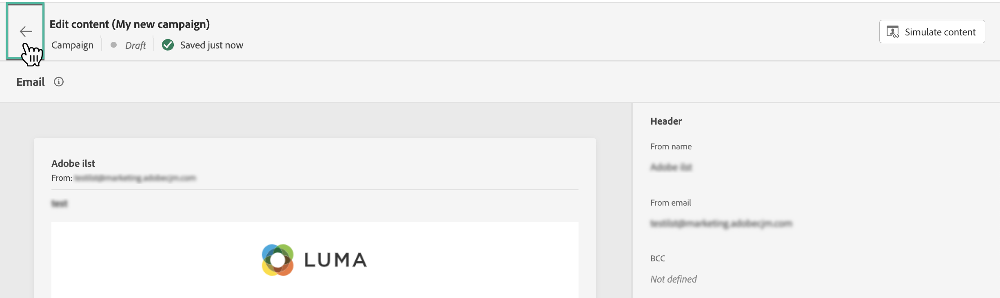

# 編輯API觸發的行銷活動內容 {#api-content}

若要設定訊息內容，請瀏覽至&#x200B;**[!UICONTROL 內容]**&#x200B;索引標籤或按一下&#x200B;**[!UICONTROL 編輯內容]**&#x200B;按鈕。

## 設計內容 {#design}

內容建立程式取決於您選取的管道。 在以下頁面瞭解建立訊息內容的詳細步驟：

<table style="table-layout:fixed"><tr style="border: 0;">
<td>

<a href="../email/create-email.md"><strong>電子郵件</strong></a>
</td>
<td>

<a href="../sms/create-sms.md"><strong>簡訊</strong></a>
</td>
<td>

<a href="../push/create-push.md"><strong>推播通知</strong></a>
</td>
</tr></table>

## 使用內容資料製作個人化內容 {#contextual}

您可以將其他資料傳遞至API裝載，以便用於個人化您的訊息。

讓我們舉個例子，客戶想要重設密碼，而您想要傳送第三方工具產生的密碼重設URL。 透過API觸發的行銷活動，您可以將此產生的URL傳遞至API裝載，並運用至行銷活動以將其新增至訊息。

為此，您需要將它們傳遞到API裝載，並使用個人化編輯器將其新增到您的訊息中。 使用`{{context.<contextualAttribute>}}`語法，其中`<contextualAttribute>`應符合包含您要傳遞之資料的API裝載中的變數名稱。

請注意，目前左側邊欄功能表中沒有可用的內容屬性。 屬性必須直接在個人化運算式中輸入，[!DNL Journey Optimizer]不會執行任何檢查。

**必須讀取**

* 傳入要求的內容屬性不能超過200kb，且一律視為字串型別。
* `context.system`語法限製為僅限Adobe內部使用，且不應用來傳遞內容屬性。
* 與設定檔啟用的事件不同，在REST API中傳遞的內容資料用於一次性通訊，而不是針對設定檔儲存。 設定檔的建立次數上限為名稱空間詳細資訊（如果找不到的話）。
* 在內容中使用大量或繁重的內容相關資料可能會影響效能。

## 測試並檢查您的內容

定義內容後，請使用&#x200B;**[!UICONTROL 模擬內容]**&#x200B;按鈕，以測試設定檔或從CSV / JSON檔案上傳的範例輸入資料來預覽和測試您的內容，或手動新增。 [瞭解如何預覽和測試內容](../content-management/preview-test.md)。 若要瀏覽回到行銷活動建立畫面，請按一下向左箭頭。

## 後續步驟 {#next}

準備好行銷活動設定和內容後，您就可以定義行銷活動對象。 [了解更多](api-triggered-campaign-audience.md)
