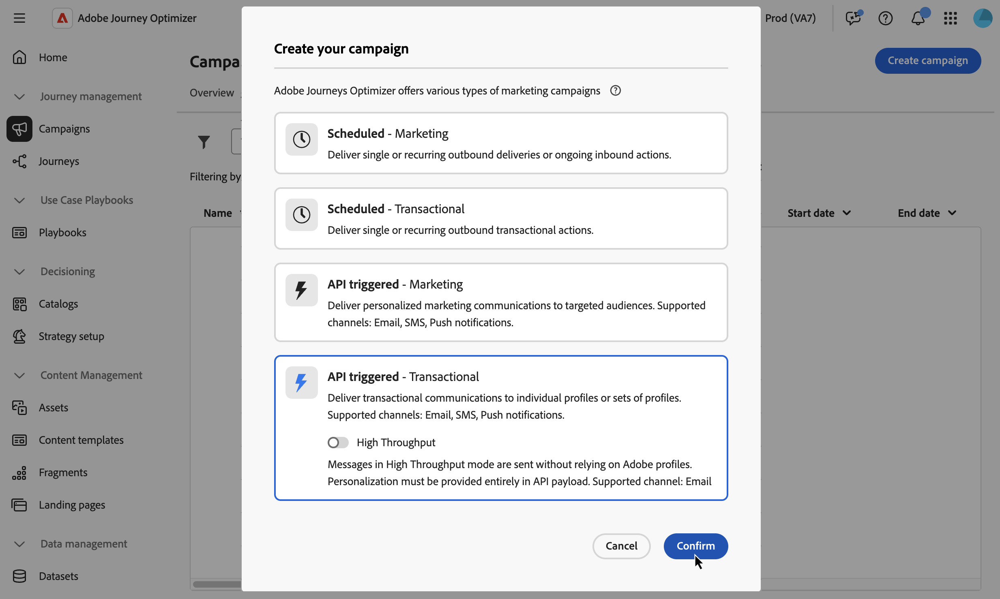

# 定義API觸發的行銷活動屬性 {#api-properties}

若要建立新的API觸發行銷活動，請遵循下列步驟：

1. 瀏覽至&#x200B;**[!UICONTROL 行銷活動]**&#x200B;功能表，並選取&#x200B;**[!UICONTROL 觸發的API]**&#x200B;標籤。

1. 按一下&#x200B;**[!UICONTROL 建立行銷活動]**&#x200B;按鈕並選取行銷活動型別：

   * **[!UICONTROL API觸發 — 行銷]** — 選取此型別的API觸發行銷活動，將個人化行銷通訊傳送給目標對象。

   * **[!UICONTROL 已觸發API — 異動]** — 異動行銷活動的目標是傳送異動訊息，也就是在個人執行動作後傳送的訊息：密碼重設要求、購物車購買等。

     +++高輸送量模式

     對於異動API觸發的行銷活動，您可以啟用&#x200B;**[!UICONTROL 高輸送量]**&#x200B;模式。 此模式專為大規模即時傳訊（每秒最多5000筆交易）而設計，可提供更高的可用性並降低延遲。 [瞭解如何使用Highthrouput模式](../campaigns/api-triggered-high-throughput.md)

     >[!AVAILABILITY]
     >
     >目前，高輸送量模式僅適用於電子郵件頻道和美國地區。
     >
     >此功能僅適用於已購買Adobe **高輸送量異動訊息**&#x200B;附加產品的組織。 請聯絡您的 Adobe 代表以取得更多資訊。

     +++

   

1. 在&#x200B;**[!UICONTROL 屬性]**&#x200B;索引標籤中，輸入行銷活動的名稱和說明。

   

1. 使用&#x200B;**標籤**&#x200B;欄位將Adobe Experience Platform統一標籤指派給您的行銷活動。 這可讓您輕鬆分類，並改進行銷活動清單的搜尋。 [了解如何使用標籤](../start/search-filter-categorize.md#tags)

1. 您可以根據存取標籤限制對此行銷活動的存取。若要新增存取限制，請瀏覽至此頁面最上方的「**[!UICONTROL 管理存取]**」按鈕。請確定只選取您具有許可權的標籤。 [進一步瞭解物件層級存取控制](../administration/object-based-access.md)。

## 後續步驟 {#next}

準備好行銷活動設定和內容後，您就可以設定其動作。 [了解更多](api-triggered-campaign-action.md)
