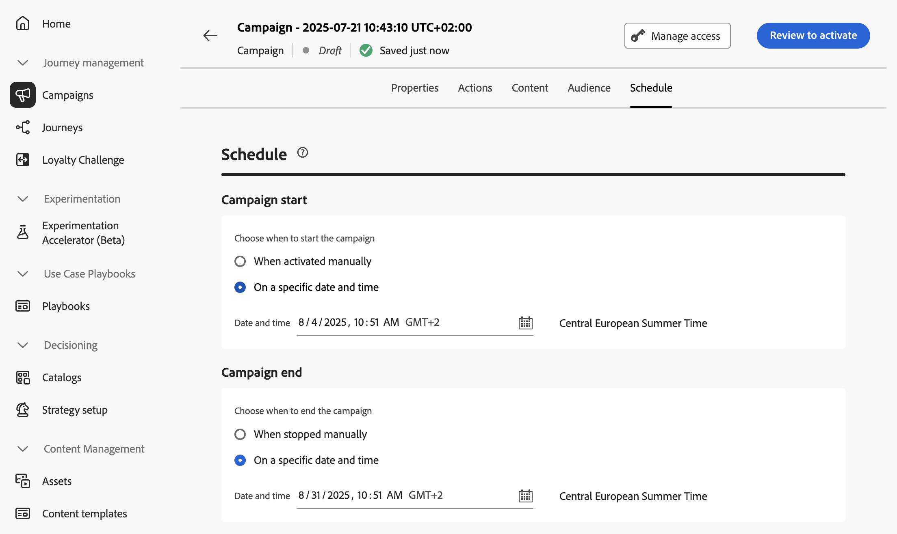
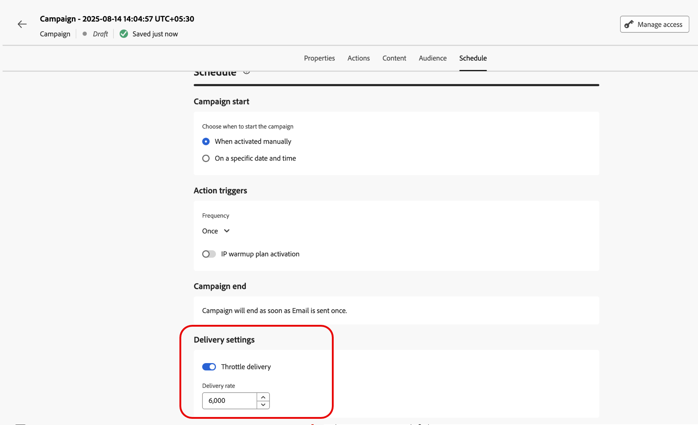

# 排程API觸發的行銷活動 {#api-schedule}

使用&#x200B;**[!UICONTROL 排程]**&#x200B;索引標籤來定義行銷活動排程。

## 設定開始和結束日期

根據預設，API觸發的行銷活動會在觸發後開始，並在訊息傳送後立即結束。 如果您不想在行銷活動觸發後立即執行，可以使用&#x200B;**[!UICONTROL 行銷活動開始]**&#x200B;選項指定傳送訊息的日期和時間。

**[!UICONTROL 行銷活動end]**&#x200B;選項可讓您指定行銷活動何時應停止執行。 在指定日期以外，將不會執行行銷活動。

>[!NOTE]
>
>在[!DNL Adobe Journey Optimizer]中排程行銷活動時，請確定您的開始日期/時間與所要的首次傳遞一致。

## 設定速率控制

[!DNL Journey Optimizer]可讓您啟用傳出動作（電子郵件、簡訊、推播通知）的速率控制。

此功能對於防止下游系統（例如登陸頁面或客戶服務平台）上的超載特別有用。 例如，您可以將速率限制設為每秒165則訊息，以確保穩定傳送，而不會對下游系統造成衝擊。

若要設定速率控制，請在&#x200B;**[!UICONTROL 傳遞設定]**&#x200B;區段中啟用&#x200B;**[!UICONTROL 節流傳遞]**&#x200B;選項，並指定所要的每秒&#x200B;**[!UICONTROL 傳遞速率]**。

* 支援的最低傳送率：每秒1個。
* 支援的最大傳遞率：啟用「節流傳遞」選項時為每秒2000。

>[!IMPORTANT]
>
>設定傳送率時，行銷活動對象可執行的時間範圍上限為12小時。 如果傳送率設為不允許在12小時時間範圍內傳送訊息的所有對象的值，則剩餘的設定檔將會從行銷活動中排除。 您可以在行銷活動報告中檢視這些排除的設定檔計數。

## 後續步驟 {#next}

行銷活動設定和內容準備就緒後，您就可以檢閱並啟用它。 [了解更多](../campaigns/review-activate-api-triggered-campaign.md)
