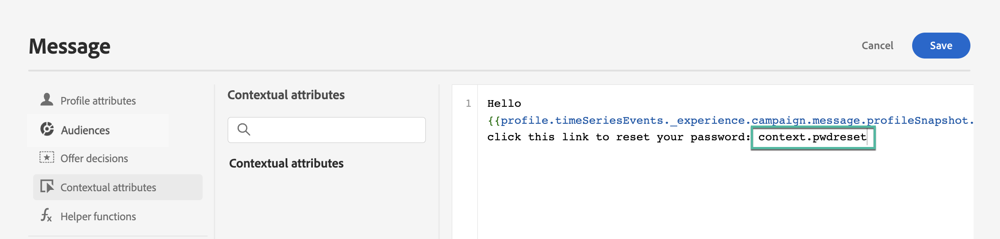

# 利用 API 觸發行銷活動 {#trigger-campaigns}

## 關於API觸發的行銷活動 {#about}

替換為 [!DNL Journey Optimizer]，您可以建立行銷活動，然後使用根據使用者觸發條件從外部系統叫用行銷活動。 [互動式訊息執行REST API](https://developer.adobe.com/journey-optimizer-apis/references/messaging/#tag/execution). 這允許您涵蓋各種操作和異動訊息需求，例如密碼重設、OTP 權杖等。

若要這麼做，您首先需要在Journey Optimizer中建立API觸發的行銷活動，然後透過API呼叫啟動其執行。

API觸發的行銷活動的可用管道包括電子郵件、簡訊和推播訊息。

## 建立API觸發的行銷活動 {#create}

### 設定並啟動行銷活動 {#create-activate}

建立API觸發的行銷活動的程式與排程的行銷活動相同，除了在API裝載中執行的對象選擇。 有關如何建立行銷活動的詳細資訊，請參閱 [本節](create-campaign.md).

若要建立API觸發的行銷活動，請遵循下列步驟：

1. 使用建立新的行銷活動 **[!UICONTROL API觸發]** 型別。

1. 選擇頻道和頻道介面以用來傳送您的訊息，然後按一下 **[!UICONTROL 建立]**.

   

1. 指定行銷活動的標題和說明，然後按一下 **[!UICONTROL 編輯內容]** 以設定要傳送的訊息。

   >[!NOTE]
   >
   >您可以將其他資料傳遞至API裝載中，以便運用這些資料來個人化您的訊息。 [了解更多](#contextual)
   >
   >在內容中使用大量或繁重的內容相關資料可能會影響效能。

1. 在 **[!UICONTROL 對象]** 區段，指定用來識別區段中的個人的名稱空間。

   此 **[!UICONTROL 建立新設定檔]** 選項可讓您自動建立資料庫中不存在的設定檔。 [進一步瞭解行銷活動執行時的設定檔建立](#profile-creation)

1. 設定行銷活動的開始和結束日期。

   如果您為行銷活動設定特定的開始和/或結束日期，則不會在這些日期之外執行，而且如果行銷活動由API觸發，API呼叫將會失敗。

1. 按一下 **[!UICONTROL 檢閱以啟動]** 檢查您的行銷活動是否已正確設定，然後啟用它。

您現在已準備好從API執行行銷活動。 [了解更多](#execute)

### 執行行銷活動 {#execute}

啟動行銷活動後，您需要擷取產生的範例cURL請求，並將其用於API中以建置您的裝載並觸發行銷活動。

1. 開啟行銷活動，然後從複製並貼上範例請求 **[!UICONTROL cURL要求]** 區段。

   

1. 將此cURL請求用於API以建置您的裝載並觸發行銷活動。 如需詳細資訊，請參閱 [互動式訊息執行API檔案](https://developer.adobe.com/journey-optimizer-apis/references/messaging/#tag/execution).

   >[!NOTE]
   >
   >如果您在建立行銷活動時已設定特定的開始和/或結束日期，則不會在這些日期以外執行，且API呼叫將會失敗。

## 在API觸發的行銷活動中使用內容屬性 {#contextual}

透過API觸發的行銷活動，您可以在API裝載中傳遞其他資料，並在行銷活動中使用這些資料來個人化您的訊息。

讓我們舉個例子，客戶想要重設密碼，而您想要傳送第三方工具產生的密碼重設URL給他們。 透過API觸發的行銷活動，您可以將此產生的URL傳遞至API裝載，並將其運用至行銷活動，以新增至訊息。

>[!NOTE]
>
>與設定檔啟用的事件不同，在REST API中傳遞的內容資料會用於一次性通訊，而不會針對設定檔儲存。 如果發現遺失設定檔，則會建立包含名稱空間詳細資訊的設定檔。

若要在行銷活動中使用這些資料，您需要將這些資料傳遞至API裝載，並使用運算式編輯器新增至您的訊息中。 若要這麼做，請使用 `{{context.<contextualAttribute>}}` 語法，其中 `<contextualAttribute>` 應符合包含您要傳遞之資料的API裝載中的變數名稱。

此 `{{context.<contextualAttribute>}}` 語法僅對應到String資料型別。

>[!IMPORTANT]
>
>傳入要求的內容屬性不能超過50kb。
>
>此 `context.system` 語法限製為僅供Adobe內部使用，且不得用於傳遞內容屬性。

請注意，目前左側邊欄功能表中沒有可用的內容屬性。 屬性必須直接在個人化運算式中輸入，不會由執行任何檢查 [!DNL Journey Optimizer].

## 行銷活動執行時建立設定檔 {#profile-creation}

在某些情況下，您可能需要將交易式訊息傳送至系統中不存在的設定檔。 例如，如果未知的使用者嘗試在您的網站上重設密碼。

當資料庫中不存在設定檔時，Journey Optimizer可讓您在執行行銷活動時自動建立該設定檔，以允許傳送訊息至此設定檔。

>[!IMPORTANT]
>
>此功能提供給 **建立非常小的體積設定檔** 在大量交易式傳送使用案例中，大量設定檔已存在於平台中。

若要在行銷活動執行時啟用設定檔建立，請切換 **[!UICONTROL 建立新設定檔]** 中的開啟選項 **[!UICONTROL 對象]** 區段。

>[!NOTE]
>
>在中建立未知的設定檔 **AJO互動式傳訊設定檔資料集** 資料集，分別位於每個傳出頻道（電子郵件、簡訊和推播）的三個預設名稱空間（電子郵件、電話和ECID）中。
