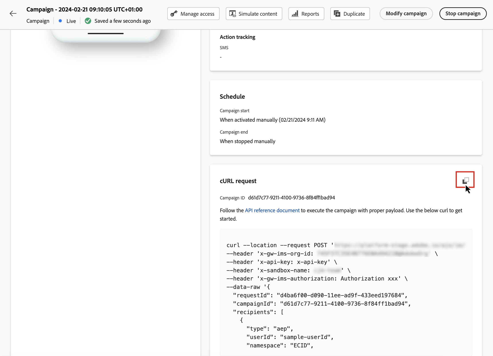

# 利用 API 觸發行銷活動 {#trigger-campaigns}

## 關於API觸發的促銷活動 {#about}

使用 [!DNL Journey Optimizer]，您可以建立促銷活動，然後使用從外部系統根據使用者觸發來叫用促銷活動 [互動式訊息執行REST API](https://developer.adobe.com/journey-optimizer-apis/references/messaging/#tag/execution). 這可讓您涵蓋各種操作和交易式訊息需求，例如密碼重設、OTP Token等。

若要這麼做，您必須先在Journey Optimizer中建立API觸發的促銷活動，然後透過API呼叫啟動其執行。

API觸發促銷活動的可用通道為電子郵件、簡訊及推送訊息。

## 建立API觸發的促銷活動 {#create}

建立API觸發促銷活動的程式與已排程的促銷活動相同，除了在API裝載中執行的對象選取。 有關如何建立促銷活動的詳細資訊，請參閱 [本節](create-campaign.md).

若要建立API觸發的促銷活動，請執行下列步驟：

1. 使用 **[!UICONTROL API觸發]** 類型。

1. 選擇要用來傳送訊息的通道和通道表面，然後按一下 **[!UICONTROL 建立]**.

   

1. 指定促銷活動的標題和說明，然後設定要傳送的訊息。

   

   >[!NOTE]
   >
   >您可以將其他資料傳遞至API裝載，以便運用這些資料來個人化您的訊息。 [了解更多](#contextual)
   >
   >在您的內容中使用大量或大量的內容資料可能會影響效能。

1. 在 **[!UICONTROL 對象]** 區段中指定要用來識別區段中個人的命名空間。

   此 **[!UICONTROL 建立新設定檔]** 選項可讓您自動建立資料庫中不存在的設定檔。 [進一步了解在行銷活動執行時建立設定檔](#profile-creation)

1. 設定促銷活動的開始和結束日期。

   如果您為促銷活動設定特定的開始和/或結束日期，則不會在這些日期以外執行，而如果API觸發促銷活動，API呼叫將會失敗。

1. 在 **[!UICONTROL cURL要求]** 部分，檢索 **[!UICONTROL 促銷活動ID]** 以用於API裝載。

   

1. 按一下 **[!UICONTROL 審核以激活]** 檢查促銷活動是否已正確設定，然後啟用它。

## 在API觸發的行銷活動中使用內容屬性 {#contextual}

透過API觸發的促銷活動，您可以在API裝載中傳遞其他資料，並在促銷活動內使用這些資料來個人化您的訊息。

讓我們舉一個範例，說明客戶想重設其密碼，而您想要傳送在協力廠商工具中產生的密碼重設URL。 透過API觸發的促銷活動，您可以將這個產生的URL傳遞至API裝載，並運用到促銷活動，將其新增至訊息。

>[!NOTE]
>
>與啟用設定檔的事件不同，在REST API中傳遞的內容資料會用於一次性通訊，不會儲存在設定檔中。 如果發現缺少命名空間詳細資訊，則最多會建立配置檔案。

若要在您的行銷活動中使用這些資料，您必須將其傳入API裝載，並使用運算式編輯器將其新增至訊息中。 若要這麼做，請使用 `{{context.<contextualAttribute>}}` 語法，其中 `<contextualAttribute>` 應符合您API裝載中，包含您要傳遞之資料的變數名稱。

此 `{{context.<contextualAttribute>}}` 語法僅映射到字串資料類型。

>[!IMPORTANT]
>
>此 `context.system` 語法僅限於Adobe內部使用，且不應用於傳遞內容屬性。
請注意，目前沒有內容屬性可供左側邊欄功能表使用。 屬性必須直接在個人化運算式中輸入，且不需執行任何檢查 [!DNL Journey Optimizer].

## 執行促銷活動 {#execute}

若要執行API觸發的促銷活動，您必須先擷取其ID，並將其傳遞至API裝載。 若要這麼做，請開啟促銷活動，然後從 **[!UICONTROL cURL要求]** 區段。

然後，您可以將此ID用於API裝載中，以觸發促銷活動。 請參閱 [互動式訊息執行API檔案](https://developer.adobe.com/journey-optimizer-apis/references/messaging/#tag/execution) 以取得更多資訊。

請注意，如果您在建立促銷活動時已設定特定的開始和/或結束日期，則不會在這些日期以外執行，而API呼叫將會失敗。

## 行銷活動執行時建立設定檔 {#profile-creation}

在某些情況下，您可能需要傳送交易式訊息至系統中不存在的設定檔。 例如，如果未知的使用者嘗試重設您網站上的密碼。

當資料庫中不存在設定檔時，Journey Optimizer可讓您在執行促銷活動時自動建立設定檔，以允許傳送訊息給此設定檔。

>[!IMPORTANT]
>
>此功能是為 **小量配置檔案建立** 在大量交易式傳送使用案例中，平台中已存在大量設定檔。

若要在行銷活動執行時啟動設定檔建立，請切換 **[!UCONTROL 建立新設定檔]** 在 **[!UICONTROL 對象]** 區段。

>[!NOTE]
>
>未知的設定檔會在 **AJO互動式訊息設定檔資料集** 資料集，分別以三個預設命名空間（電子郵件、電話和ECID）顯示，每個傳出頻道（電子郵件、簡訊和推播）。
