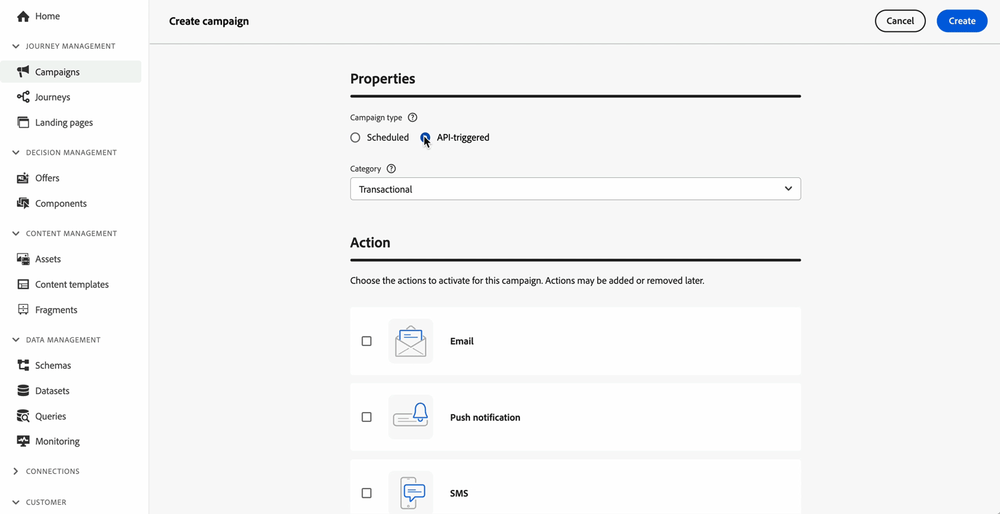

# 利用 API 觸發行銷活動 {#trigger-campaigns}

## 關於API觸發的行銷活動 {#about}

透過[!DNL Journey Optimizer]，您可以使用[互動式訊息執行REST API](https://developer.adobe.com/journey-optimizer-apis/references/messaging/#tag/execution)，根據使用者觸發從外部系統建立行銷活動，然後再執行它們。 這可讓您涵蓋各種行銷和異動訊息需求，例如密碼重設、OTP權杖等。

若要這麼做，您首先需要在Journey Optimizer中建立API觸發的行銷活動，然後透過API呼叫啟動其執行。

API觸發的行銷活動的可用管道包括電子郵件、簡訊和推播訊息。

>[!NOTE]
>
>截至目前，推播通知API觸發的行銷活動不支援快速傳送模式。

➡️ [在影片中探索此功能](#video)

## 建立API觸發的行銷活動 {#create}

### 設定並啟用行銷活動 {#create-activate}

若要建立API觸發的行銷活動，請遵循下列步驟。 有關如何建立行銷活動的詳細資訊，請參閱[本節](create-campaign.md)。

1. 使用&#x200B;**[!UICONTROL API觸發的]**&#x200B;型別建立新的行銷活動。

1. 根據您要傳送的通訊型別，選擇&#x200B;**[!UICONTROL 行銷]**&#x200B;或&#x200B;**[!UICONTROL 異動]**&#x200B;類別。

1. 選擇其中一個支援的頻道和相關聯的頻道設定來傳送您的訊息，然後按一下[建立]。****

   

1. 指定行銷活動的標題和說明，然後按一下&#x200B;**[!UICONTROL 編輯內容]**&#x200B;來設定要傳送的訊息。

   >[!NOTE]
   >
   >您可以將其他資料傳遞至API裝載，以便用於個人化您的訊息。 [了解更多](#contextual)
   >
   >在內容中使用大量或繁重的內容相關資料可能會影響效能。

1. 在&#x200B;**[!UICONTROL 對象]**&#x200B;區段中，指定要用來識別個人的名稱空間。

   * 如果您正在建立&#x200B;**交易**&#x200B;型別的行銷活動，則需要在API呼叫中定義目標設定檔。 **[!UICONTROL 建立新設定檔]**&#x200B;選項可讓您自動建立資料庫中不存在的設定檔。 [進一步瞭解行銷活動執行時的設定檔建立作業](#profile-creation)

     >[!NOTE]
     >
     >單一API呼叫支援最多20個不重複收件者。 每個收件者必須具有唯一的使用者ID，不允許重複的使用者ID。 進一步瞭解[互動式訊息執行API檔案](https://developer.adobe.com/journey-optimizer-apis/references/messaging/#tag/execution/operation/postIMUnitaryMessageExecution){target="_blank"}

   * 針對&#x200B;**行銷**&#x200B;型別的行銷活動，按一下&#x200B;**[!UICONTROL 對象]**&#x200B;按鈕以選擇要鎖定的對象。

1. 設定行銷活動的開始和結束日期。

   如果您設定行銷活動的特定開始和/或結束日期，則不會在這些日期以外執行，而如果行銷活動由API觸發，API呼叫將會失敗。

1. 按一下&#x200B;**[!UICONTROL 檢閱以啟用]**，檢查您的行銷活動是否已正確設定，然後啟用。

您現在已準備好從API執行行銷活動。 [了解更多](#execute)

### 執行行銷活動 {#execute}

啟動行銷活動後，您需要擷取產生的範例cURL請求，並將其用於API中以建置您的裝載並觸發行銷活動。

1. 開啟行銷活動，然後從&#x200B;**[!UICONTROL cURL請求]**&#x200B;區段複製並貼上裝載請求。 此裝載包含訊息中使用的所有個人化（設定檔和內容）變數。 行銷活動上線後，即可使用此功能。

   

1. 將此cURL請求用於API以建置您的裝載並觸發行銷活動。 如需詳細資訊，請參閱[互動式訊息執行API檔案](https://developer.adobe.com/journey-optimizer-apis/references/messaging/#tag/execution)。

   [此頁面](https://developer.adobe.com/journey-optimizer-apis/references/messaging-samples/)中也提供API呼叫範例。

   >[!NOTE]
   >
   >如果您在建立行銷活動時已設定特定的開始和/或結束日期，則不會在這些日期以外執行，並且API呼叫將會失敗。

## 在API觸發的行銷活動中使用內容屬性 {#contextual}

透過API觸發的行銷活動，您可以在API裝載中傳遞其他資料，並在行銷活動中使用這些資料，以個人化您的訊息。

讓我們舉個例子，客戶想要重設密碼，而您想要傳送第三方工具產生的密碼重設URL。 透過API觸發的行銷活動，您可以將此產生的URL傳遞至API裝載，並運用至行銷活動以將其新增至訊息。

>[!NOTE]
>
>與設定檔啟用的事件不同，在REST API中傳遞的內容資料用於一次性通訊，而不是針對設定檔儲存。 設定檔的建立次數上限為名稱空間詳細資訊（如果找不到的話）。

為了在您的行銷活動中使用這些資料，您需要將這些資料傳遞至API裝載，並使用個人化編輯器將其新增至您的訊息中。 若要這麼做，請使用`{{context.<contextualAttribute>}}`語法，其中`<contextualAttribute>`應符合包含您要傳遞之資料的API裝載中的變數名稱。

`{{context.<contextualAttribute>}}`語法只對應到String資料型別。

>[!IMPORTANT]
>
>傳入要求的內容屬性不能超過50kb，且一律視為字串型別。
>
>`context.system`語法限製為僅限Adobe內部使用，且不應用來傳遞內容屬性。

請注意，目前左側邊欄功能表中沒有可用的內容屬性。 屬性必須直接在個人化運算式中輸入，[!DNL Journey Optimizer]不會執行任何檢查。

## 在行銷活動執行時建立設定檔 {#profile-creation}

在某些情況下，您可能需要將交易式訊息傳送至系統中不存在的設定檔。 例如，如果未知的使用者嘗試重設您網站上的密碼。

當資料庫中不存在設定檔時，Journey Optimizer可讓您在執行行銷活動時自動建立該設定檔，以允許傳送訊息至此設定檔。

>[!IMPORTANT]
>
>若是交易式訊息，此功能是針對大型交易式傳送使用案例中的&#x200B;**極小容量設定檔建立**&#x200B;而提供的，且平台中已存在大量設定檔。

若要在行銷活動執行時啟用設定檔建立，請在&#x200B;**[!UICONTROL 對象]**&#x200B;區段中將&#x200B;**[!UICONTROL 建立新設定檔]**&#x200B;選項切換為開啟。 如果停用此選項，則會拒絕任何傳送的未知設定檔，且API呼叫將失敗。

>[!NOTE]
>
>在&#x200B;**AJO互動式訊息設定檔資料集**&#x200B;資料集中，針對每個傳出頻道（電子郵件、簡訊和推播）分別使用三個預設名稱空間（電子郵件、電話和ECID）建立未知的設定檔。 不過，如果您使用自訂名稱空間，則會使用相同的自訂名稱空間建立身分。

## 操作說明影片 {#video}

瞭解如何使用互動式訊息執行REST API，根據使用者互動從外部系統建立及觸發行銷活動。

>[!VIDEO](https://video.tv.adobe.com/v/3425358?quality=12)
