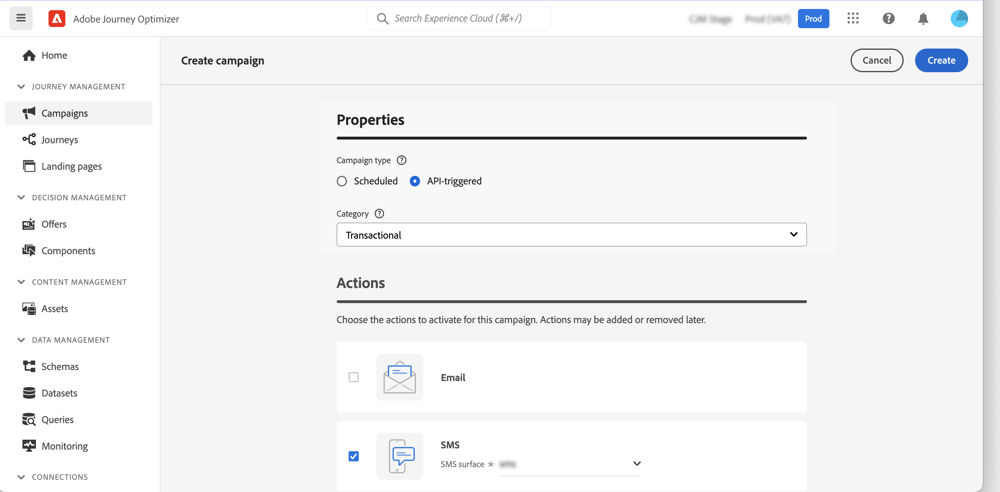

# 利用 API 觸發行銷活動 {#trigger-campaigns}

## 關於API觸發的市場活動 {#about}

>[!NOTE]
>
>互動式消息執行API當前處於測試版中，它可能需要頻繁更新，恕不另行通知。

與 [!DNL Journey Optimizer]，您可以建立市場活動，然後使用用戶觸發器從外部系統調用它們 [互動式消息執行REST API](https://developer.adobe.com/journey-optimizer-apis/references/messaging/#tag/execution)。 這允許您滿足各種操作和事務性消息傳遞需求，如密碼重置、OTP令牌等。

為此，您首先需要在Journey Optimizer建立API觸發的市場活動，然後通過API調用啟動其執行。

API觸發的市場活動的可用渠道是電子郵件、簡訊和推送消息。

## 建立API觸發的市場活動 {#create}

建立API觸發的市場活動的過程與計畫的市場活動保持相同，但在API負載中執行的受眾選擇除外。 有關如何建立市場活動的詳細資訊，請參閱 [此部分](create-campaign.md)。

要建立API觸發的市場活動，請執行以下步驟：

1. 使用 **[!UICONTROL API-triggered]** 的雙曲餘切值。

1. 選擇要用於發送消息的通道和通道曲面，然後按一下 **[!UICONTROL Create]**。

   

1. 指定市場活動的標題和說明，然後配置要發送的消息。

   

   >[!NOTE]
   >
   >您可以將其他資料傳遞到API負載中，以便對消息進行個性化設定。 [了解更多](#contextual)

1. 指定用於從段中標識個人的命名空間。

1. 配置市場活動的開始和結束日期。

   如果您為市場活動配置了特定的起始日期和/或終止日期，則不會在這些日期之外執行該日期，如果市場活動由API觸發，則API調用將失敗。

1. 在 **[!UICONTROL cURL request]** ，檢索 **[!UICONTROL Campaign ID]** 在API負載中使用。

   

1. 按一下 **[!UICONTROL Review to activate]** 檢查市場活動是否配置正確，然後將其激活。

## 在API觸發的市場活動中使用上下文屬性 {#contextual}

使用API觸發的市場活動，您可以在API負載中傳遞附加資料，並在市場活動中使用這些資料來個性化您的消息。

讓我們舉一個示例，客戶希望重置其密碼，而您希望向他們發送在第三方工具中生成的密碼重置URL。 使用API觸發的市場活動，您可以將此生成的URL傳遞到API負載中，並利用它到市場活動中將其添加到消息中。

>[!NOTE]
>
>與啟用配置檔案的事件不同，在REST API中傳遞的上下文資料用於一次性通信，而不是儲存在配置檔案中。 如果發現缺少配置檔案，則最多使用命名空間詳細資訊建立該配置檔案。

為了在市場活動中使用這些資料，您需要將它們傳遞到API負載中，並使用表達式編輯器將它們添加到消息中。 要執行此操作，請使用 `{{context.<contextualAttribute>}}` 語法，其中 `<contextualAttribute>` 應與包含要傳遞的資料的API負載中變數的名稱匹配。

的 `{{context.<contextualAttribute>}}` 語法僅映射到字串資料類型。

>[!IMPORTANT]
>
>的 `context.system` 語法僅限於Adobe內部用法，不應用於傳遞上下文屬性。
請注意，目前左滑軌菜單中沒有上下文屬性可用。 必須在個性化表達式中直接鍵入屬性，而不由 [!DNL Journey Optimizer]。

## 執行市場活動 {#execute}

要執行API觸發的市場活動，您首先需要檢索其ID並將其傳遞到API負載。 為此，請開啟市場活動，然後從 **[!UICONTROL cURL request]** 的子菜單。

然後，您可以將此ID用於API負載以觸發市場活動。 請參閱 [互動式消息執行API文檔](https://developer.adobe.com/journey-optimizer-apis/references/messaging/#tag/execution) 的子菜單。

請注意，如果在建立市場活動時配置了特定的起始日期和/或終止日期，則不會在這些日期之外執行該日期，API調用將失敗。

>[!NOTE]
>
>在某些情況下，您可能需要向系統中不存在的配置檔案發送事務性消息。 例如，如果未知用戶嘗試登錄您的網站。 在這種情況下，相應的配置檔案會自動建立到Adobe Experience Platform, **AJO交互消息配置檔案資料集** 資料集。

## 其他資源

* [開始使用行銷活動](get-started-with-campaigns.md)
* [建立行銷活動](create-campaign.md)
* [修改或停止行銷活動](modify-stop-campaign.md)
* [行銷活動即時報告](campaign-live-report.md)
* [行銷活動全域報告](campaign-global-report.md)
