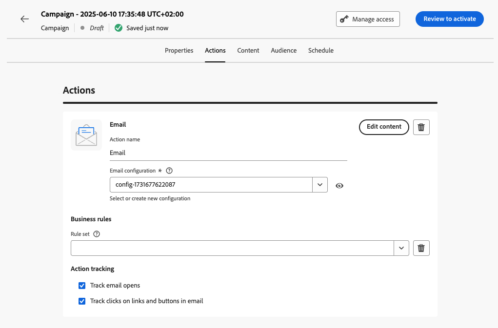
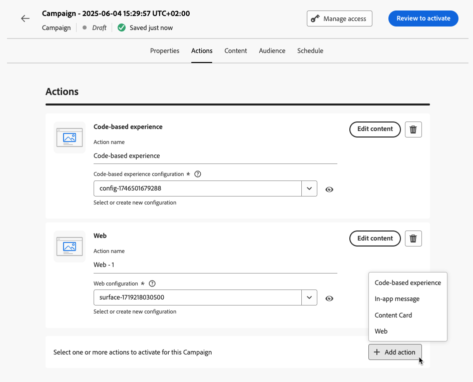

# 設定行銷活動動作 {#action-campaign-action}

使用&#x200B;**[!UICONTROL 動作]**&#x200B;索引標籤，選取訊息的頻道設定，再設定其他設定，例如追蹤、內容實驗或多語言內容。

1. **選擇頻道**

   導覽至&#x200B;**[!UICONTROL 動作]**&#x200B;標籤，按一下&#x200B;**[!UICONTROL 新增動作]**&#x200B;按鈕並選取通訊通道。

   

   >[!NOTE]
   >
   >如需支援管道的詳細資訊，請參閱本節中的表格：[歷程與行銷活動中的管道](../channels/gs-channels.md#channels)。
   >
   >可用的通道因您的授權模式及附加元件而異。

   如果您選取傳入頻道（程式碼型體驗、應用程式內訊息、內容卡片或網頁動作），則可新增更多傳入動作，即可在單一行銷活動中總計最多10個動作。 [了解作法](#multi-action)

1. **選取通道設定**

   會由[系統管理員](../start/path/administrator.md)定義設定。它包含所有用於傳送訊息的技術參數，如標頭參數、子網域、行動應用程式等等。[瞭解如何設定頻道設定](../configuration/channel-surfaces.md)

   

1. **善用最佳化**

   使用&#x200B;**[!UICONTROL 最佳化]**&#x200B;區段來執行內容實驗、運用鎖定目標規則，或使用實驗和鎖定目標的進階組合。 這些不同的選項和要遵循的步驟在[本節](../content-management/gs-message-optimization.md)中有詳細說明。
<!--
1. **Create a content experiment**

    Use the **[!UICONTROL Content experiment]** section to define multiple delivery treatments in order to measure which one performs best for your target audience. Click the **[!UICONTROL Create experiment]** button then follow the steps detailed in this section: [Create a content experiment](../content-management/content-experiment.md).-->

1. **新增多語言內容**

   使用&#x200B;**[!UICONTROL 語言]**&#x200B;區段，就能在行銷活動中，使用多語言建立內容。 若想這麼做，就請按一下 **[!UICONTROL [新增語言]]** 按鈕，然後選取指定 **[!UICONTROL [語言設定]]**。 有關如何設定及使用多語言功能的詳細資訊，請參閱[本節](../content-management/multilingual-gs.md)。

根據所選的通訊通道，有其他設定可供使用。 請展開下列各節以取得詳細資訊。

+++**套用上限規則** （電子郵件、直接郵件、推播、簡訊）

在&#x200B;**[!UICONTROL 商業規則]**&#x200B;下拉式清單中，選取要套用上限規則至行銷活動的規則集。 運用管道規則集，可讓您根據通訊型別設定頻率上限，以防止訊息相似的客戶超載。 [學習如何使用規則集](../conflict-prioritization/rule-sets.md)

+++

+++**追蹤參與** （電子郵件、簡訊）。

使用&#x200B;**[!UICONTROL 動作追蹤]**&#x200B;區段，追蹤收件者對電子郵件或簡訊傳遞的反應。 一旦執行行銷活動完畢，即可從行銷活動報告，存取追蹤結果。 [深入瞭解行銷活動報告](../reports/campaign-global-report-cja.md)

+++

+++**啟用快速傳遞模式** （推播）。

快速傳送模式是[!DNL Journey Optimizer]附加元件，可讓您透過行銷活動以非常快的速度大量傳送推播訊息。 當您想要在行動電話上，傳送緊急推播警報時，例如傳送重大新聞給已安裝新聞頻道應用程式的使用者參考，如果對企業來說，延後傳遞訊息很重要，就可能會使用快速傳遞功能。 瞭解如何在此頁面[啟用推播通知](../push/create-push.md#rapid-delivery)的快速傳遞模式。

如需使用快速傳遞模式時的效能詳細資訊，就請參閱 [Adobe Journey Optimizer 產品說明](https://helpx.adobe.com/tw/legal/product-descriptions/adobe-journey-optimizer.html){target="_blank"}。

+++

+++**指派優先順序分數** （網頁、應用程式內、程式碼型）

為行銷活動指派優先順序分數，可讓您在有強加的限制（例如頻率上限）時，為傳入行銷活動設定優先順序。 請輸入數值 (從 0 到 100)。請注意，數字越大，表示優先順序越高。[瞭解如何將優先順序分數指派給歷程與行銷活動](../conflict-prioritization/priority-scores.md)

+++

+++**設定其他傳遞規則** （內容卡）

對於內容卡行銷活動，您可以啟用其他傳送規則，以選擇觸發訊息的事件和條件。 [瞭解如何建立內容卡](../content-card/create-content-card.md)

+++

+++**定義觸發程式** （應用程式內）

針對應用程式內訊息，您可以使用&#x200B;**[!UICONTROL 編輯觸發器]**&#x200B;按鈕，選擇觸發訊息的事件和條件。 [瞭解如何建立應用程式內訊息](../in-app/create-in-app.md)

+++

## 新增多項入站動作 {#multi-action}

>[!CONTEXTUALHELP]
>id="ajo_multi_action"
>title="新增多項入站動作"
>abstract="您可以在單一行銷活動中選取多項入站動作。此功能可讓您同時對不同位置傳遞多個程式碼型體驗、應用程式內訊息、內容卡片或網頁動作，且每個動作都包含特定內容。"

為簡化行銷活動策劃，您可以在單一行銷活動內定義數個傳入動作，每個動作會包含特定內容。

>[!NOTE]
>
>此功能僅適用於傳入頻道。 目前不支援傳出頻道，例如電子郵件。

此功能可讓您同時將各種程式碼型體驗、應用程式內訊息、內容卡片或網頁動作傳送至不同位置，而不需要建立多個行銷活動。 這可讓行銷活動的部署更輕鬆，並允許更流暢的報表，將所有資料整合至單一行銷活動。

例如，您可以將程式碼型體驗傳送至內容稍有不同的多個端點。 若要這麼做，請在相同行銷活動中建立多個程式碼型動作，每個動作都具有不同的端點設定。

若要定義行銷活動中的數個傳入動作，請遵循下列步驟。

1. 從&#x200B;**動作**&#x200B;區段選取輸入動作（**程式碼型體驗**、**應用程式內訊息**、**內容卡**&#x200B;或&#x200B;**[!UICONTROL 網頁]**）。

1. 選取管道設定，並定義該動作的特定內容。

1. 使用&#x200B;**[!UICONTROL 新增動作]**&#x200B;按鈕，從下拉式清單中選取其他輸入動作。

   {width="80%"}

1. 以類似方式繼續以新增更多動作。 您最多可以在行銷活動中新增10個傳入動作。

一旦行銷活動為[即時](review-activate-campaign.md)，所有動作就會同時啟動。

## 後續步驟 {#next}

行銷活動動作準備就緒後，您就可以設計其內容。 [了解更多](campaign-content.md)
