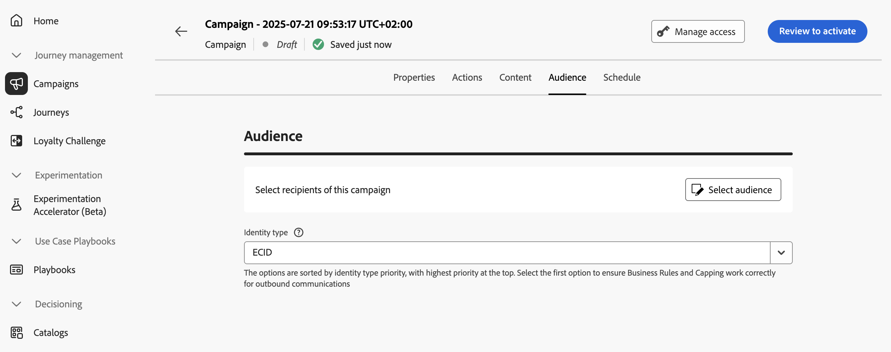

# 定義「動作」行銷活動對象 {#action-campaign-audience}

使用&#x200B;**[!UICONTROL 對象]**&#x200B;標籤來定義行銷活動對象。

1. **選取客群**

   針對行銷活動，按一下&#x200B;**[!UICONTROL 選取對象]**&#x200B;按鈕以顯示可用Adobe Experience Platform對象清單。 [進一步瞭解對象](../audience/about-audiences.md)。

   >[!IMPORTANT]
   >
   >[對象構成](../audience/get-started-audience-orchestration.md)的對象和屬性目前無法用於Healthcare Shield或Privacy and Security Shield。

1. **選取身分型別**

   在&#x200B;**[!UICONTROL 身分型別]**&#x200B;欄位中，選擇用來識別所選對象中個人的金鑰型別。 您可以使用現有的身分型別，或使用Adobe Experience Platform Identity Service建立新的身分型別。 標準身分名稱空間列於[此頁面](https://experienceleague.adobe.com/zh-hant/docs/experience-platform/identity/features/namespaces#standard){target="_blank"}。

   每個行銷活動只允許一個身分型別。 如果屬於區段的個人在不同身分中沒有選取的身分型別，則無法將該行銷活動設為目標。 在[Adobe Experience Platform檔案](https://experienceleague.adobe.com/docs/experience-platform/identity/home.html?lang=zh-Hant){target="_blank"}中進一步瞭解身分型別和名稱空間。

## 後續步驟 {#next}

一旦您的動作行銷活動的對象準備就緒後，您就可以排程行銷活動。 [了解更多](campaign-schedule.md)
