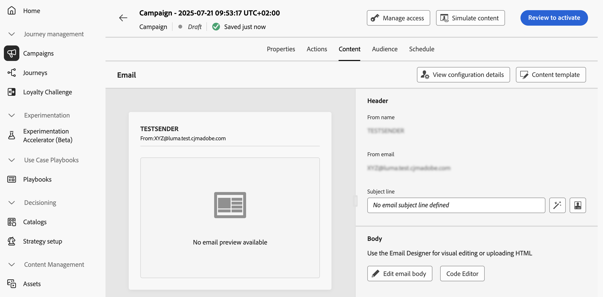

# 編輯動作行銷活動內容 {#action-campaign-content}

若要設定訊息內容，請瀏覽至&#x200B;**[!UICONTROL 內容]**&#x200B;索引標籤或按一下&#x200B;**[!UICONTROL 編輯內容]**&#x200B;按鈕。

## 設計內容

內容建立程式取決於您選取的管道。 在以下頁面瞭解建立訊息內容的詳細步驟：

<table style="table-layout:fixed"><tr style="border: 0;">
<td>

<a href="../email/create-email.md"><strong>電子郵件</strong></a>
</td>
<td>

<a href="../sms/create-sms.md"><strong>簡訊</strong></a>
</td>
<td>

<a href="../push/create-push.md"><strong>推播通知</strong></a>
</td>
<td>

<a href="../direct-mail/create-direct-mail.md"><strong>直接郵件</strong></a>
</td>
</tr></table>

<table style="table-layout:fixed"><tr style="border: 0;">
<td>

<a href="../in-app/create-in-app.md"><strong>應用程式內</strong></a>
</td>
<td>

<a href="../web/create-web.md"><strong>網頁</strong></a>
</td>
<td>

<a href="../code-based/create-code-based.md"><strong>程式碼型體驗</strong></a>
</td>
<td>

<a href="../content-card/create-content-card.md"><strong>內容卡</strong></a>
</td>
</tr></table>

## 測試並檢查您的內容

定義內容後，請使用&#x200B;**[!UICONTROL 模擬內容]**&#x200B;按鈕，以測試設定檔或從CSV / JSON檔案上傳的範例輸入資料來預覽和測試您的內容，或手動新增。 [瞭解如何預覽和測試內容](../content-management/preview-test.md)

若要瀏覽回到行銷活動建立畫面，請按一下向左箭頭。

## 後續步驟 {#next}

準備好動作行銷活動的內容後，您就可以定義行銷活動對象。 [了解更多](campaign-audience.md)
