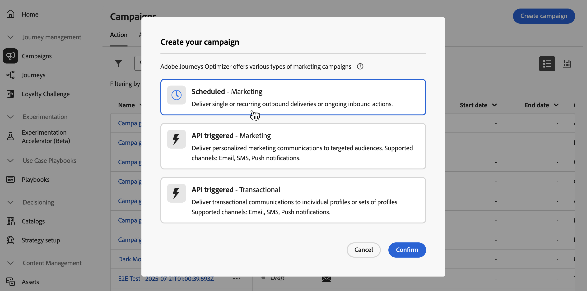
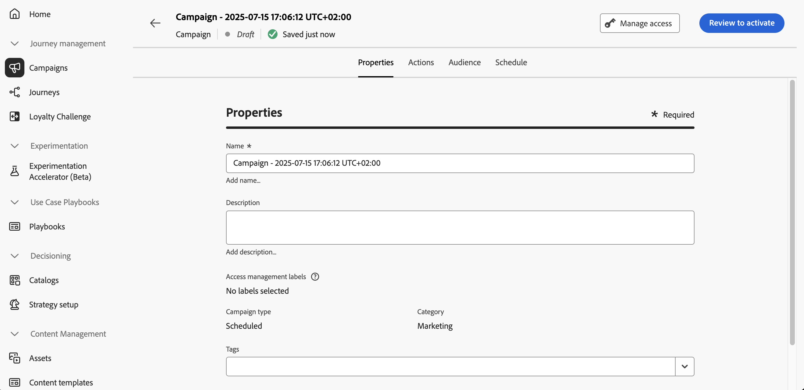

# 定義「動作」行銷活動屬性 {#action-campaign-properties}

若要建立「動作」行銷活動並定義其屬性，請遵循下列步驟：

1. 瀏覽至&#x200B;**[!UICONTROL 行銷活動]**&#x200B;功能表並選取&#x200B;**[!UICONTROL 動作]**&#x200B;標籤。

1. 按一下&#x200B;**[!UICONTROL 建立行銷活動]**&#x200B;按鈕，然後選取&#x200B;**[!UICONTROL 排程 — 行銷]**&#x200B;行銷活動型別。

   

1. 在&#x200B;**[!UICONTROL 屬性]**&#x200B;索引標籤中，輸入行銷活動的名稱和說明。

   

1. 使用&#x200B;**標籤**&#x200B;欄位將Adobe Experience Platform統一標籤指派給您的行銷活動。 這可讓您輕鬆分類，並改進行銷活動清單的搜尋。 [了解如何使用標籤](../start/search-filter-categorize.md#tags)

1. 您可以根據存取標籤限制對此行銷活動的存取。若要新增存取限制，請瀏覽至此頁面最上方的「**[!UICONTROL 管理存取]**」按鈕。請確定只選取您具有許可權的標籤。 [進一步瞭解物件層級存取控制](../administration/object-based-access.md)。

## 後續步驟 {#next}

建立及設定動作行銷活動後，您就可以設定其動作。 [了解更多](campaign-action.md)
