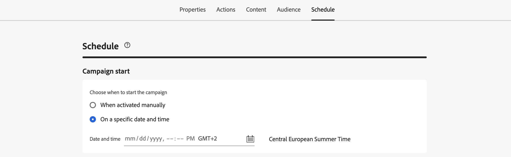
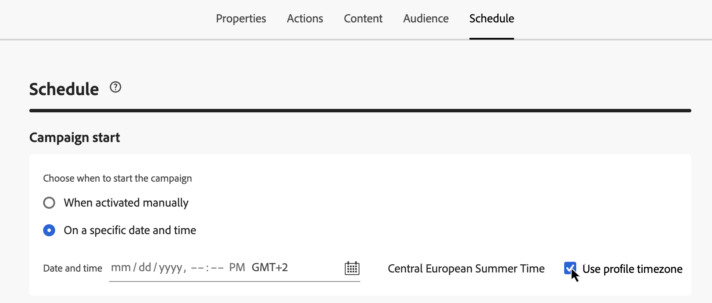
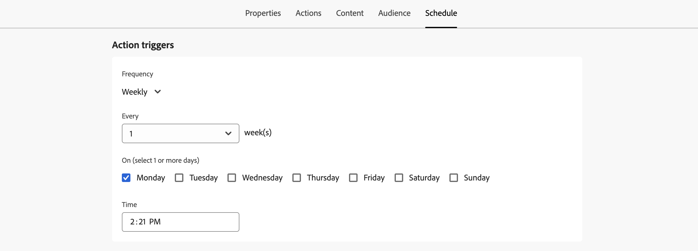
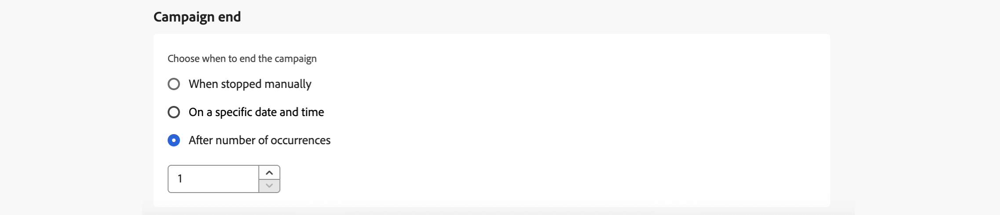

# 排程動作行銷活動 {#action-campaign-schedule}

使用&#x200B;**[!UICONTROL 排程]**&#x200B;索引標籤來定義行銷活動排程。

## 設定行銷活動開始日期

依預設，動作行銷活動在手動啟動後開始，並在訊息傳送後立即結束。 如果您不想在行銷活動啟動後立即執行，您可以在&#x200B;**[!UICONTROL 行銷活動開始]**&#x200B;區段中指定傳送訊息的日期和時間。

在 [!DNL Adobe Journey Optimizer] 中排程行銷活動時，請確定您的開始日期/時間與所要的首次傳遞一致。對於定期行銷活動，如果初始排程時間已過，行銷活動將根據其週期規則滾動至下一個可用時段。

## 在收件者的當地時間傳送 {#profile-timezone}

>[!CONTEXTUALHELP]
>id="ajo_campaigns_schedule_profile_timezone"
>title="使用設定檔時區"
>abstract="根據每位收件者的設定檔時區傳送訊息。 所有收件者都會於當地時間收到訊息，無論其地理位置為何。 系統會使用Adobe Experience Platform設定檔中的「時區」欄位，將行銷活動建立者的時區設為遞補。"

為特定日期和時間排程行銷活動時，您可以選擇根據每個收件者的設定檔時區傳送訊息。 這可確保所有收件者（不論其地理位置為何）都能在當地時間收到訊息。

例如，如果您排程促銷活動使用設定檔時區在早上9點傳送，紐約州(ET)的收件者會在早上9點收到訊息，洛杉磯州(PT)的收件者則會在早上9點收到訊息。

>[!AVAILABILITY]
>
>使用設定檔時區排程僅適用於以下傳出頻道：電子郵件、推播、簡訊、WhatsApp和LINE。

若要啟用設定檔時區排程：

1. 在&#x200B;**[!UICONTROL 行銷活動開始]**&#x200B;區段中，指定傳送訊息的日期和時間。

1. 啟用&#x200B;**[!UICONTROL 使用設定檔時區]**&#x200B;選項。

   

**運作方式：**

系統會使用每個收件者Adobe Experience Platform設定檔的`profile.timeZone`欄位來決定其當地時區。 如果設定檔沒有時區值，則系統會使用行銷活動建立時的時區作為遞補。

跨所有時區傳遞訊息時，行銷活動仍維持在&#x200B;**即時**&#x200B;狀態。 處理完所有時區後，行銷活動狀態會變更為&#x200B;**已完成**。

**支援的時區識別碼：**

`profile.timeZone`格式可以是IANA命名或定義為UTC位移。 IANA命名是慣用的格式，因為它會自動針對日光節約規則進行調整。

對於IANA命名，識別碼區分大小寫，且必須符合官方IANA命名。 由於日光節約規則和歷史更新，位移可能會隨著時間變更。 如需識別碼的正式清單，請參閱[IANA時區資料庫](https://www.iana.org/time-zones){_blank}。

## 設定執行頻率

對於&#x200B;**電子郵件**、**簡訊**&#x200B;及&#x200B;**推播通知**&#x200B;動作，您可以定義行銷活動訊息的傳送頻率。 若要這麼做，請使用行銷活動建立畫面中的&#x200B;**[!UICONTROL 動作觸發器]**&#x200B;選項，指定行銷活動應該每日、每週或每月執行。

>[!NOTE]
>
>對於&#x200B;**電子郵件**&#x200B;動作，您可以建立特定的IP熱身計畫啟用行銷活動。 行銷活動排程將由與其相關聯的IP熱身計畫驅動，這表示行銷活動本身不再定義排程。 [瞭解如何建立IP熱身行銷活動](../configuration/ip-warmup-campaign.md)。

## 設定結束日期

**[!UICONTROL 行銷活動end]**&#x200B;區段可讓您指定行銷活動何時應停止執行。 在指定日期以外，將不會執行行銷活動。

## 設定速率控制

[!DNL Journey Optimizer]可讓您啟用傳出動作（電子郵件、簡訊、推播通知）的速率控制。

此功能對於防止下游系統（例如登陸頁面或客戶服務平台）上的超載特別有用。 例如，您可以將速率限制設為每秒165則訊息，以確保穩定傳送，而不會對下游系統造成衝擊。

若要設定速率控制，請在&#x200B;**[!UICONTROL 傳遞設定]**&#x200B;區段中啟用&#x200B;**[!UICONTROL 節流傳遞]**&#x200B;選項，並指定所要的每秒&#x200B;**[!UICONTROL 傳遞速率]**。

* 支援的最低傳送率：每秒1個。
* 支援的最大傳遞率：啟用「節流傳遞」選項時為每秒2000。

>[!IMPORTANT]
>
>設定傳送率時，行銷活動對象可執行的時間範圍上限為12小時。 如果傳送率設為不允許在12小時時間範圍內傳送訊息的所有對象的值，則剩餘的設定檔將會從行銷活動中排除。 您可以在行銷活動報告中檢視這些排除的設定檔計數。

## 使用波段傳送

若要隨著時間分批傳送行銷活動訊息，而非一次傳送所有訊息，您可以使用波動傳送。 這有助於平衡負載、支援傳遞能力，並避免壓倒性的下游系統（例如呼叫中心或登陸頁面）。 您可以定義波次的數目、其大小（以百分比或絕對數表示），以及每個波次的排程。

[瞭解如何使用波段傳送](send-using-waves.md)。

## 後續步驟 {#next}

行銷活動排程準備就緒後，您就可以檢閱並啟動行銷活動。 [了解更多](review-activate-campaign.md)
