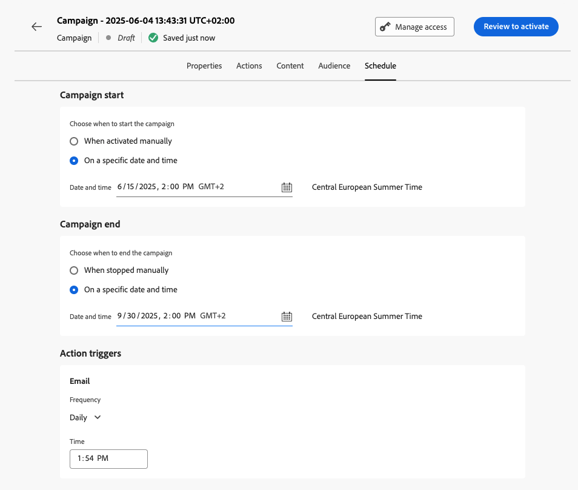
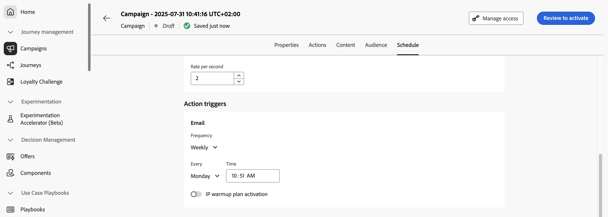

# 排程動作行銷活動 {#action-campaign-schedule}

使用&#x200B;**[!UICONTROL 排程]**&#x200B;索引標籤來定義行銷活動排程。

## 設定開始和結束日期

依預設，動作行銷活動在手動啟動後開始，並在訊息傳送後立即結束。 如果您不想在行銷活動啟動後立即執行，可以使用&#x200B;**[!UICONTROL 行銷活動開始]**&#x200B;選項指定傳送訊息的日期和時間。

**[!UICONTROL 行銷活動end]**&#x200B;選項可讓您指定行銷活動何時應停止執行。 在指定日期以外，將不會執行行銷活動。

>[!NOTE]
>
>在 [!DNL Adobe Journey Optimizer] 中排程行銷活動時，請確定您的開始日期/時間與所要的首次傳遞一致。對於定期行銷活動，如果初始排程時間已過，行銷活動將根據其週期規則滾動至下一個可用時段。

## 設定速率控制

[!DNL Journey Optimizer]可讓您啟用傳出動作（電子郵件、簡訊、推播通知）的速率控制。

此功能對於防止下游系統（例如登陸頁面或客戶服務平台）上的超載特別有用。 例如，您可以將速率限制設為每秒165則訊息，以確保穩定傳送，而不會對下游系統造成衝擊。

若要設定速率控制，請在&#x200B;**[!UICONTROL 傳遞設定]**&#x200B;區段中啟用&#x200B;**[!UICONTROL 節流傳遞]**&#x200B;選項，並指定所要的每秒&#x200B;**[!UICONTROL 傳遞速率]**。

## 設定執行頻率

對於電子郵件、簡訊和推播通知動作，您可以定義行銷活動訊息的傳送頻率。 若要這麼做，請使用行銷活動建立畫面中的&#x200B;**[!UICONTROL 動作觸發器]**&#x200B;選項，指定行銷活動應該每日、每週或每月執行。

## 設定IP熱身計畫

對於電子郵件動作，您可以建立特定的IP熱身計畫啟用行銷活動。 行銷活動排程將由與其相關聯的IP熱身計畫驅動，這表示行銷活動本身不再定義排程。 [瞭解如何建立IP熱身行銷活動](../configuration/ip-warmup-campaign.md)。

## 後續步驟 {#next}

行銷活動排程準備就緒後，您就可以檢閱並啟動行銷活動。 [了解更多](review-activate-campaign.md)
