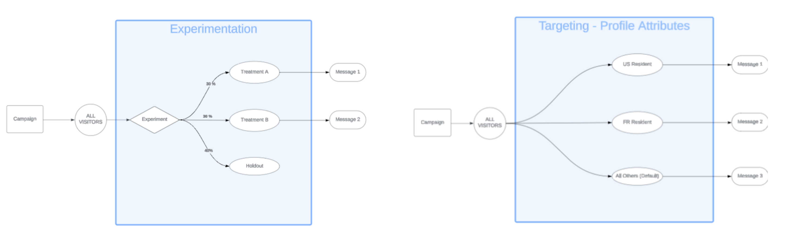
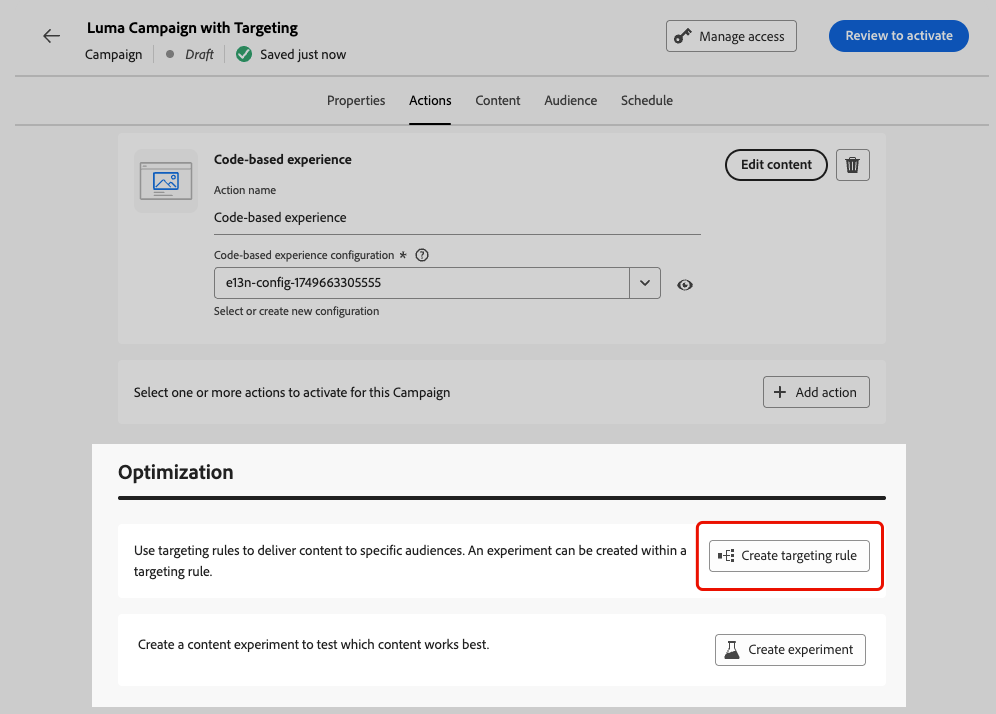
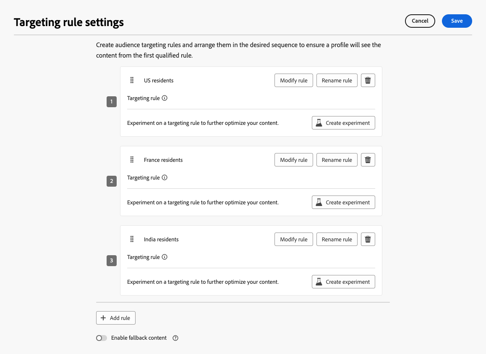
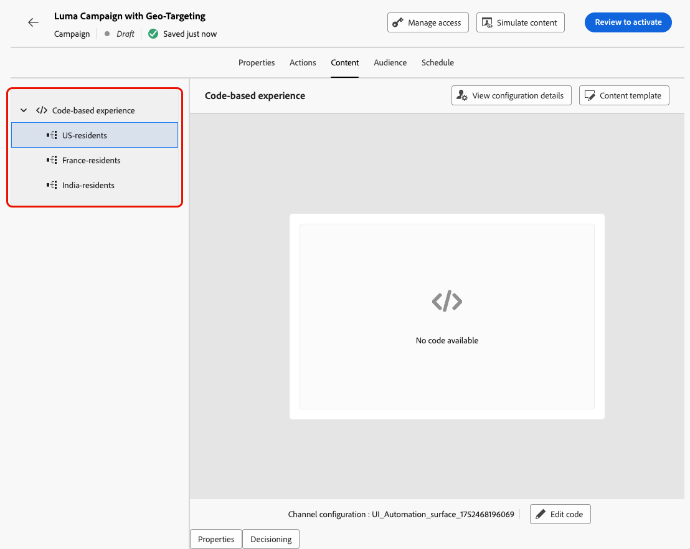
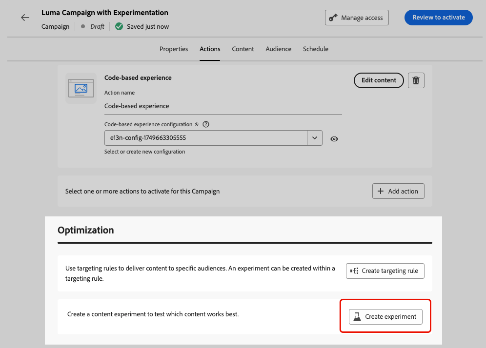
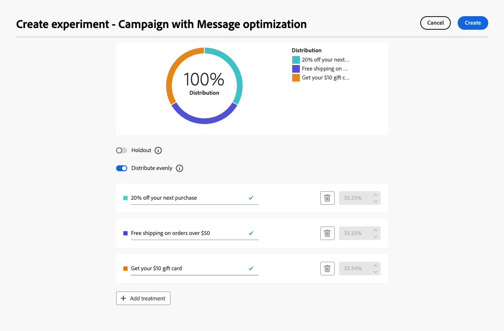
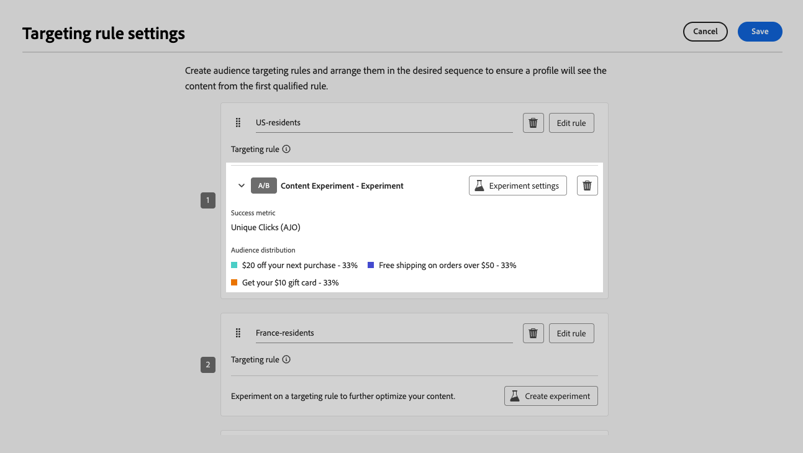
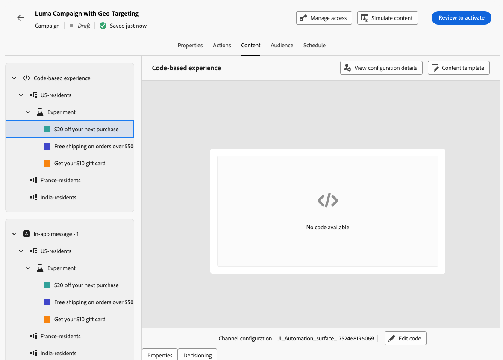

# 行銷活動和歷程的最佳化 {#message-optimization}

最佳化可讓您擁有工具，為對象提供個人化和最佳化的內容，<!--based on marketer-defined advanced decision configurations. This ensures that the right message reaches the right audience at the right time in order to maximize the effectiveness of your campaigns. (Removed for now as Decisioning is not yet supported)-->確保最大限度的參與和成功，以建立高度<!--customized and -->有效的歷程和行銷活動。

使用最佳化時，您可以：

* 運用[目標定位](#targeting)規則
* 執行[內容實驗](#experimentation)
* 在單一行銷活動中使用[進階組合](#combination)的實驗和目標定位

歷程或行銷活動上線後，會根據定義的條件評估設定檔，並根據比對條件，從歷程/行銷活動傳送包含適當體驗或內容的設定檔。

實驗與目標鎖定之間的差異概述如下：

* 實驗包括根據流量分配隨機分割提供內容&#x200B;。
* 鎖定目標會使用確定性技術，根據使用者設定檔、對象成員資格或內容型規則來傳送內容。

{width="110%" zoomable="yes"}

➡️ [在此影片中進一步瞭解行銷活動的最佳化](#video)

## 善用目標選擇 {#targeting}

>[!CONTEXTUALHELP]
>id="ajo_content_targeting_fallback"
>title="什麼是後備內容？"
>abstract="沒有符合目標選擇規則時，後備內容可讓您的客群收到預設內容。 如果您不選取此選項，任何不符合上述目標選擇規則的客群都不會收到內容。"

目標定位會根據使用者設定檔屬性或內容屬性，將個人化內容提供給特定對象區段。

實驗是隨機指派訊息內容，而目標定位則是將內容提供給正確受眾的確定性方式，與此不同。

透過鎖定目標，可根據下列專案定義特定規則：

* **使用者設定檔屬性**，例如位置(例如 地理定位)、年齡或偏好設定。 例如，美國的使用者會看到「Golden Gate」促銷活動，而法國的使用者會看到「Eiffel Tower」促銷活動。

* **內容資料**，例如裝置型別(例如 裝置定位)、一天中的時間或工作階段詳細資訊。 例如，案頭使用者會收到案頭最佳化內容，而行動使用者則會收到行動最佳化內容。

* **對象**，可用來包含或排除具有特定對象成員資格的設定檔。

若要設定鎖定目標，請遵循下列步驟。

1. 建立[歷程](../building-journeys/journey-gs.md#jo-build)或[行銷活動](../campaigns/create-campaign.md)。

   >[!NOTE]
   >
   >如果您在歷程中，請新增&#x200B;**[!UICONTROL 動作]**&#x200B;活動、選擇頻道活動並選取&#x200B;**[!UICONTROL 設定動作]**。 [了解更多](../building-journeys/journey-action.md#add-action)

1. 從&#x200B;**[!UICONTROL 動作]**&#x200B;索引標籤中，選取至少一個動作。

1. 在&#x200B;**[!UICONTROL 最佳化]**&#x200B;區段中，選取&#x200B;**[!UICONTROL 建立目標規則]**。

   {width=85%}

1. 使用規則產生器來定義條件。 例如，定義美國居民的規則、法國居民的規則以及印度居民的規則。

   {width=85%}

1. 視需要選取&#x200B;**[!UICONTROL 啟用遞補內容]**&#x200B;選項。 沒有符合目標選擇規則時，後備內容可讓您的客群收到預設內容。

   >[!NOTE]
   >
   >如果您未選取此選項，則不符合上述定位規則的任何對象都不會收到內容。

1. 儲存您的目標規則設定。

1. 返回&#x200B;**[!UICONTROL 動作]**&#x200B;索引標籤，選取&#x200B;**[!UICONTROL 編輯內容]**。

1. 為您目標規則設定所定義的每個群組設計適當的內容。

   {width=85%}

   在此範例中，請為美國居民設計特定內容、為法國居民設計不同內容，並為印度居民設計其他內容。

1. [啟動](review-activate-campaign.md)您的歷程或行銷活動。

一旦歷程/行銷活動上線，就會傳送為每個目標量身打造的內容，好讓美國居民收到特定訊息、法國居民收到不同訊息等。

<!--Default content:

* If no targeting rules match, default content can be delivered.

* If default content is not enabled, passthrough behavior ensures lower-priority campaigns are evaluated.-->

## 使用實驗 {#experimentation}

實驗可讓您測試多個內容版本，以根據預先定義的成功量度判斷哪些版本的執行效果最佳。

若要設定實驗，請遵循下列步驟。

假設您想在行銷活動中測試下列促銷訊息：

* **處理A**：「下次購買可享受20%的優惠」
* **處理B**：「超過$50美元訂單的免運費」
* **處理C**：「取得您的$10禮品卡」

若要設定實驗並確定哪些訊息促成了最多購買，請遵循以下步驟。

1. 建立[歷程](../building-journeys/journey-gs.md#jo-build)或[行銷活動](../campaigns/create-campaign.md)。

   >[!NOTE]
   >
   >如果您在歷程中，請新增&#x200B;**[!UICONTROL 動作]**&#x200B;活動、選擇頻道活動並選取&#x200B;**[!UICONTROL 設定動作]**。 [了解更多](../building-journeys/journey-action.md#add-action)

1. 從&#x200B;**[!UICONTROL 動作]**&#x200B;索引標籤中，選取兩個輸入動作，例如[程式碼型體驗](../code-based/get-started-code-based.md)和[應用程式內](../../rp_landing_pages/in-app-landing-page.md)。

1. 在&#x200B;**[!UICONTROL 最佳化]**&#x200B;區段中，選取&#x200B;**[!UICONTROL 建立實驗]**。

   {width=85%}

1. 視需要設計和設定您的內容實驗。 [了解作法](../content-management/content-experiment.md)

   {width=85%}

   定義實驗後，實驗將套用至在該行銷活動中或透過歷程&#x200B;**[!UICONTROL 動作]**&#x200B;活動插入的所有動作，這表示相同的客戶會在所有介面上看到相同的選件。

   >[!NOTE]
   >
   >您可以選取其他動作：實驗會套用至新增至行銷活動或歷程動作的所有動作。

1. [啟動](review-activate-campaign.md)您的歷程或行銷活動。

歷程/行銷活動上線後，使用者會被隨機指派不同的內容變數。 [!DNL Journey Optimizer]會追蹤哪些變數可推動更多購買，並提供可操作的深入分析。

使用[歷程](../reports/journey-global-report-cja.md)和[行銷活動](../reports/campaign-global-report-cja-experimentation.md)報告追蹤行銷活動是否成功。<!--Link to Experimentation journey reportis missing-->

## 結合目標定位與實驗 {#combination}

Journey Optimizer也可讓您在單一歷程或行銷活動中結合目標定位和實驗，以建立更複雜的策略。

事實上，您可以使用鎖定目標建立數個變體，並針對每個變體使用實驗進一步最佳化每個內容。 這可確保實驗特定於每個定位規則，且不會跨越變體。

例如，您可以針對美國客戶測試「促銷活動50%折扣」與「50美元禮品卡」，並針對歐洲客戶執行其他測試，例如「超過50歐元訂單的免運費」與「下次購買折扣20%」。

若要在歷程或行銷活動中同時結合目標定位和實驗，請遵循下列步驟。

1. 建立您定義數個鎖定目標規則的歷程或行銷活動。 [了解作法](#targeting)

   {width=85%}

1. 為第一個鎖定目標規則建立實驗。

1. 視需要設計和設定您的內容實驗。 [了解作法](../content-management/content-experiment.md)

   {width=85%}

   定義實驗後，該實驗將僅適用於第一個目標規則。

1. 返回&#x200B;**[!UICONTROL 動作]**&#x200B;索引標籤，選取&#x200B;**[!UICONTROL 編輯內容]**。

1. 對於您第一個鎖定目標規則所定義的群組，您可以為實驗的每個變體定義特定的內容。

   如果您將多個入站動作新增至歷程或行銷活動，則定位和實驗會套用至每個動作。 不過，您需要為每個動作的每個變體定義特定內容。

   {width=85%}

1. 以類似方式處理其他鎖定目標規則，並為每個變體設計對應的內容。

1. 儲存您的變更並[啟用](review-activate-campaign.md)您的歷程或行銷活動。

歷程/行銷活動上線後，每個目標群組的使用者會被隨機指派為其所屬群組定義的不同內容變數。

<!--
## Reporting on Message optimization

E.g. explaining how a marketer can look at the report to determine which treatment (e.g. which message content) is performing the best for the targeting audience
-->

## 作法影片{#video}

了解如何在動作中或 API 觸發的行銷活動中運用訊息最佳化。您將深入了解如何鎖定子對象目標、建立以位置為依據的訊息變化、啟用遞補內容，以及在單一行銷活動中執行多個實驗。本教學課程也涵蓋如何管理多頻道行銷活動，同時維持訊息的一致性。

>[!VIDEO](https://video.tv.adobe.com/v/3470368?quality=12)