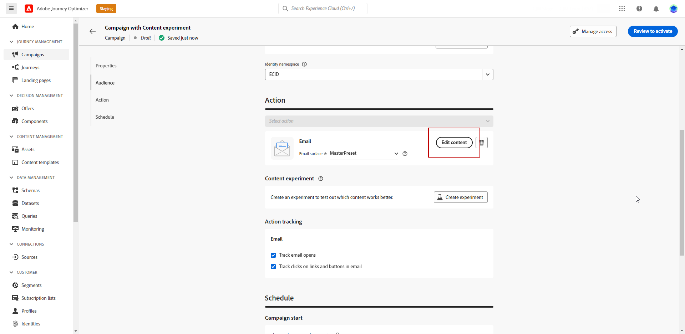

# 建立內容實驗 {#content-experiment}

>[!CONTEXTUALHELP]
>id="ajo_campaigns_content_experiment"
>title="內容實驗"
>abstract="您可以選擇改變訊息內容、主題或寄件者，以便定義多種處理方式並確定最適合您的對象的組合。"

>[!NOTE]
>
>開始內容實驗之前，請確定您的報告設定已針對自訂資料集設定。 請參閱[此章節](reporting-configuration.md)深入瞭解。

Journey Optimizer內容實驗可讓您定義多種傳送處理方式，以衡量哪種方式最適合您的目標對象。 您可以選擇變更傳遞內容、主旨或寄件者。 感興趣的對象會隨機分配給每個處理，以決定哪個處理在指定量度方面效果最佳。

在下列範例中，傳遞目標已分割為兩個群組，分別代表目標人口的45%，以及不會收到傳遞的保留群組10%。

目標對象中的每個人都會收到一個版本的電子郵件，主旨列是以下兩個版本之一：

* 直接促銷新系列和影像的10%優惠方案。
* 另一個則只會宣傳特殊優惠方案，未指定任何影像的10%優惠。

此處的目標是檢視收件者是否會根據收到的實驗與電子郵件互動。 因此，我們將選擇 **[!UICONTROL 電子郵件開啟次數]** 作為此內容實驗中的主要目標量度。

## 建立您的行銷活動 {#campaign-experiment}

1. 從 **[!UICONTROL 行銷活動]** 頁面，按一下 **[!UICONTROL 建立行銷活動]**.

   

<!--
1. In the **[!UICONTROL Properties]** section, choose your **[!UICONTROL Campaign type]**:

    * **[!UICONTROL Scheduled]**: designed to send marketing messages and can be executed immediately or at a specified date.

    * **[!UICONTROL API-Triggered]**: designed to send transactional messages, such as password reset notifications or cart abandonment reminders. 
    
        To execute an API-triggered campaign, you will need to make an API call. [Learn more](api-triggered-campaigns.md)
-->
1. 選取您的頻道，然後 **[!UICONTROL 表面]** 您要用於此傳遞，然後按一下 **[!UICONTROL 建立]**. 有關詳細資訊，請參閱 [管道表面](../configuration/channel-surfaces.md) 頁面。

   在此範例中，我們選取使用電子郵件傳送行銷活動。

   

1. 設定 **[!UICONTROL 屬性]** 您的傳遞內容：
   * **[!UICONTROL 名稱]**
   * **[!UICONTROL 說明]**

1. 定義要定位的對象。 若要這麼做，請按一下 **[!UICONTROL 選取對象]** 按鈕來顯示可用Adobe Experience Platform對象清單。 [深入瞭解對象](../audience/about-audiences.md)

   在 **[!UICONTROL 身分名稱空間]** 欄位，選擇要使用的名稱空間，以識別所選對象中的個人。 [了解更多](get-started-experiment.md#content-experiment-work)

   

1. 在 **[!UICONTROL 動作追蹤]** 部分，指定是否要追蹤收件者對傳送的反應：您可以追蹤點選和/或開啟。

   一旦執行行銷活動，即可從行銷活動報表存取追蹤結果。

1. 若要在特定日期或循環頻率執行行銷活動，請設定 **[!UICONTROL 排程]** 區段。 [了解更多](create-campaign.md)

1. 按一下 **[!UICONTROL 編輯內容]** 以開始個人化您的傳遞。

   

1. 從 **[!UICONTROL 編輯內容]** 視窗，開始個人化處理A。

   針對此處理方式，我們將直接在主旨行中指定特殊優惠方案，並新增個人化。

   

## 設定您的內容實驗 {#configure-experiment}

>[!CONTEXTUALHELP]
>id="ajo_campaigns_content_experiment_dimension"
>title="維度"
>abstract="選擇用於追蹤實驗的特定維度，例如特定頁面的特定點擊數或瀏覽數。"

>[!CONTEXTUALHELP]
>id="ajo_campaigns_content_experiment_success_metric"
>title="成功量度"
>abstract="成功量度用於追蹤和評估實驗中表現最佳的處理。在使用之前，請務必針對特定量度設定資料集。"

1. 當您的訊息已個人化時，從行銷活動摘要頁面，按一下 **[!UICONTROL 建立實驗]** 以開始設定您的內容實驗。

   

1. 選取 **[!UICONTROL 成功量度]** 您想要為實驗設定。

   在此範例中，選取 **[!UICONTROL 電子郵件開啟]** 以測試設定檔是否會開啟其電子郵件（如果促銷代碼在主題行中）。

   

1. 使用應用程式內或網頁通道設定實驗，然後選擇 **[!UICONTROL 傳入點按次數]**， **[!UICONTROL 不重複傳入點按次數]** ， **[!UICONTROL 頁面檢視]** ，或 **[!UICONTROL 不重複頁面檢視量度]** ，則 **[!UICONTROL 點按動作]**  下拉式清單可讓您精確追蹤和監控特定頁面上的點按次數和檢視次數。

   

1. 按一下 **[!UICONTROL 新增處理方式]** 以建立所需數量的新處理。

   

1. 變更 **[!UICONTROL 標題]** 以更能區分您的治療方式。

1. 選擇以新增 **[!UICONTROL 保留樣本]** 群組至您的傳遞。 此群組將不會收到來自此行銷活動的任何內容。

   切換列會自動取得母體的10%，您可以視需要調整此百分比。

   

1. 然後，您可以選擇將精確百分比分配給每個 **[!UICONTROL 處理]** 或直接開啟 **[!UICONTROL 平均分配]** 切換列。

   

1. 按一下 **[!UICONTROL 建立]** 設定您的設定時。

## 設計您的處理方式 {#treatment-experiment}

1. 從 **[!UICONTROL 編輯內容]** 視窗中，選取您的處理B以變更內容。

   在此，我們選擇不指定 **[!UICONTROL 主旨列]**.

   

1. 按一下 **[!UICONTROL 編輯電子郵件內文]** 以進一步個人化您的處理方式B。

   

1. 設計處理方式後，按一下 **[!UICONTROL 更多動作]** 若要存取與處理相關的選項： **[!UICONTROL 重新命名]**， **[!UICONTROL 複製]** 和 **[!UICONTROL 刪除]**.

   

1. 如有需要，請存取 **[!UICONTROL 實驗設定]** 功能表以變更您的處理設定。

   

1. 定義訊息內容後，按一下 **[!UICONTROL 模擬內容]** 按鈕來控制傳遞的呈現，並使用測試設定檔檢查個人化設定。 [了解更多](../email/preview.md)

1. 當您的內容實驗準備就緒時，您可以從您的行銷活動摘要頁面按一下 **[!UICONTROL 檢閱以啟動]** 以顯示行銷活動的摘要。 如果有任何引數不正確或遺失，則會顯示警報。

   

1. 檢查您的行銷活動是否已正確設定，然後按一下 **[!UICONTROL 啟動]** 以啟動它。

   

設定好實驗與行銷活動後，您可以使用行銷活動報告追蹤傳送成功。 [了解更多](../reports/campaign-global-report.md#experimentation-report)
