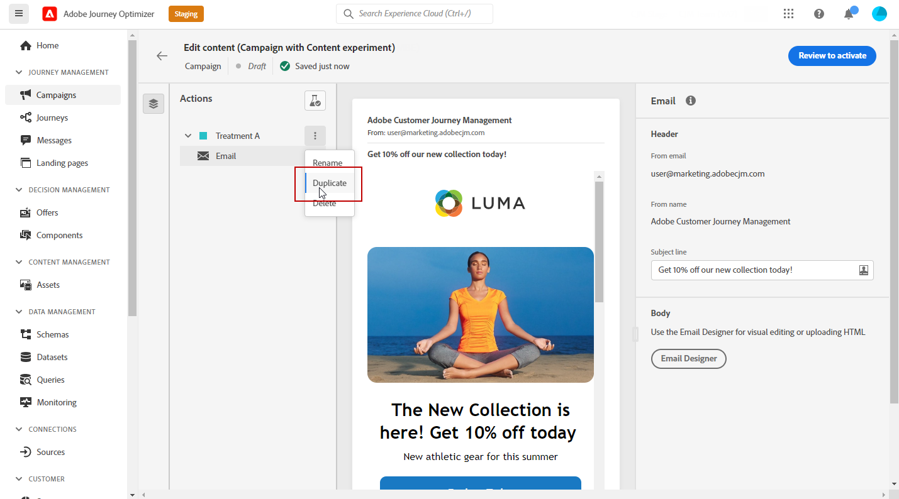

# 建立內容實驗 {#content-experiment}

>[!AVAILABILITY]
>
>此 **內容實驗** 功能目前僅適用於一組組織（有限可用性）。 如需詳細資訊，請聯絡您的 Adobe 代表。

使用Journey Optimizer內容實驗來定義多種傳送處理。 將興趣對象隨機分配給每個治療，以確定哪個治療對興趣度量表現最佳。 您可以選擇變更電子郵件的內容、主旨或寄件者。

>[!NOTE]
>
>開始進行內容實驗之前，請確定已為自訂資料集設定報表設定。 請參閱[此章節](reporting-configuration.md)深入瞭解。

在以下範例中，傳送目標已分割為兩個群組，每個群組分別代表目標母體的45%，而拒絕組為10%，不會接收傳送。

目標對象中的每個人都會收到一個版本的電子郵件，主旨行是下列兩個版本之一：

* 直接宣傳新系列和影像的10%優惠。
* 另一個只廣告特惠，沒有指定10%的優惠，沒有任何影像。

此處的目標是根據收到的實驗，查看收件者是否會與電子郵件互動。 因此，我們將選擇 **[!UICONTROL Email Opens]** 作為此內容實驗中的主要目標量度。

## 建立您的行銷活動 {#campaign-experiment}

1. 從 **[!UICONTROL Campaigns]** 頁面，按一下 **[!UICONTROL Create campaign]**.

   

1. 選擇 **[!UICONTROL Email]** 然後 **[!UICONTROL Surface]** 您想要用於此傳送。 有關詳細資訊，請參閱 [通道曲面](../configuration/channel-surfaces.md) 頁面。

   

1. 按一下「**[!UICONTROL Create]**」。

1. 設定 **[!UICONTROL Properties]** 傳送時：
   * **[!UICONTROL Title]**
   * **[!UICONTROL Description]**
   * **[!UICONTROL Category]**: **[!UICONTROL Marketing]** / **[!UICONTROL Transactional]**

1. 若要開始內容實驗，請切換 **[!UICONTROL Content experiment]** 選項。 此 **[!UICONTROL Content experiment]** 中。

   

1. 設定 **[!UICONTROL Audience]** 和 **[!UICONTROL Schedule]** 參數。 [了解更多](create-campaign.md)

1. 按一下 **[!UICONTROL Edit content]** 開始個人化您的不同 **[!UICONTROL Treatments]**.

   

## 建立您的治療方法 {#treatment-experiment}

1. 從 **[!UICONTROL Edit content]** 窗口，添加 **[!UICONTROL Subject line]** A電子郵件，然後按一下 **[!UICONTROL Save]**.

   針對此方式，我們會直接在主旨行中指定優惠方案。

   

1. 按一下 **[!UICONTROL Email designer]** 開始個人化傳遞。

   

1. 設計電子郵件後，按一下 **[!UICONTROL Save]** 回到 **[!UICONTROL Edit content]** 窗口建立處理B。

1. 從 **[!UICONTROL More actions]** 按一下 **[!UICONTROL Duplicate]**.

   您也可以選擇從頭開始新治療，按一下 **[!UICONTROL Content experiment]** 按鈕，然後訪問高級選項 **[!UICONTROL Add treatment]**.

   

1. 變更 **[!UICONTROL Title]** 以便更好地區化。

   

1. 選取連結至您新建立之電子郵件的傳送 **[!UICONTROL Treatment]**.

1. 新增 **[!UICONTROL Subject line]** 供您傳送。

   針對此方式，我們選擇不在 **[!UICONTROL Subject line]**.

   

1. 按一下 **[!UICONTROL Email designer]** 以視需要進一步個人化處理B傳送。

將處理方式個人化後，您就可以開始設定內容實驗。

## 設定內容實驗 {#configure-experiment}

1. 兩個傳送均個人化時，從 **[!UICONTROL Edit content]** 窗口，選擇 **[!UICONTROL Configure content experiment]**.

   

1. 選取您要為實驗設定的目標。

   針對我們的實驗，我們選取 **[!UICONTROL Email open]** 以測試收件者是否會在促銷代碼位於主旨行中時開啟其電子郵件。

   

1. 選擇以新增 **[!UICONTROL Holdout]** 群組至您的傳送。 此群組將不會接收來自此促銷活動的任何內容。

   開啟切換列會自動取用您10%的母體，您可以視需要調整此百分比。

   

1. 然後，您可以選擇將精確百分比分配給每個 **[!UICONTROL Treatment]** 或直接開啟 **[!UICONTROL Distribute evenly]** 切換欄。

   

1. 按一下 **[!UICONTROL Save]** 設定時。

1. 內容實驗準備就緒時，您可以按一下 **[!UICONTROL Review to activate]** 顯示促銷活動摘要。 如果有任何參數不正確或遺失，則會顯示警報。

   

1. 檢查促銷活動是否已正確設定，然後按一下 **[!UICONTROL Activate]** 啟動它。

   

在設定您的實驗和行銷活動後，您可以透過行銷活動報表追蹤傳送的成功。

## 目標報告 {#objectives-global}

>[!AVAILABILITY]
>
>內容實驗功能目前僅適用於一組組織（有限可用性）。 如需詳細資訊，請聯絡您的 Adobe 代表。

此 **[!UICONTROL Objectives]** 「促銷活動」報表的標籤，可讓您透過鎖定一個特定量度來更精確地調整傳送的報表。

此 **[!UICONTROL Objectives]** 清單連結至 **[!UICONTROL Datasets]** 定義與系統的連接以檢索附加資訊。 內建的清單 **[!UICONTROL Objectives]** 可用，但您可以透過新增 **[!UICONTROL Dataset]**. 有關詳細的過程，請參閱 [節](reporting-configuration.md).

選取您要鎖定的目標後，這兩個 **[!UICONTROL Performance overview]** 和 **[!UICONTROL Campaign objective]** 介面工具集將提供傳送效能的詳細摘要。

使用 **[!UICONTROL Campaign objective]** 介面工具集，您也可以選擇將主要目標與其他量度進行比較。

請注意，可視需要對每個介面工具集調整大小並刪除。 有關詳細資訊，請參閱 [節](../reports/global-report.md#modify-dashboard).

## 實驗報告 {#experimentation-global}

>[!AVAILABILITY]
>
>內容實驗功能目前僅適用於一組組織（有限可用性）。 如需詳細資訊，請聯絡您的 Adobe 代表。

從您的行銷活動 **[!UICONTROL Global report]**, **[!UICONTROL Experimentation]** 索引標籤會詳細說明與每個變體的執行方式以及是否有最佳執行者相關的主要資訊。

請注意，定義最佳執行者可能需要一些時間，它將用此表徵圖表示 .

此 **[!UICONTROL Experiment result]** 介面工具集會詳細說明每個變體的效能。 您可以選取以下其中一個處理方式，以變更基線： **[!UICONTROL Baseline]** 下拉式清單。 最佳待遇會以星形圖示表示。

表格顯示下列量度：

* **[!UICONTROL Profiles]**:針對此處理的設定檔數。

* **[!UICONTROL Unique outbound clicks]**:所有對外管道的點按總數。

* **[!UICONTROL Count per profile]**:實驗目標量度的總值除以設定檔數。

* **[!UICONTROL Confidence interval]**:基線與效能最佳處理之間的效能差異百分比。 [了解更多](../campaigns/experiment-calculations.md#confidence-intervals)。

* **[!UICONTROL Average lift]**:給定治療的轉換率在基線上的百分比提高。 [了解更多](../campaigns/experiment-calculations.md#understand-lift)

* **[!UICONTROL Confidence]**:有證據表明給予的治療與基線治療相同。 [了解更多](../campaigns/experiment-calculations.md#understand-confidence)

如需深入了解這些結果以及如何解讀，請參閱 [本頁](../campaigns/get-started-experiment.md#interpret-results).
