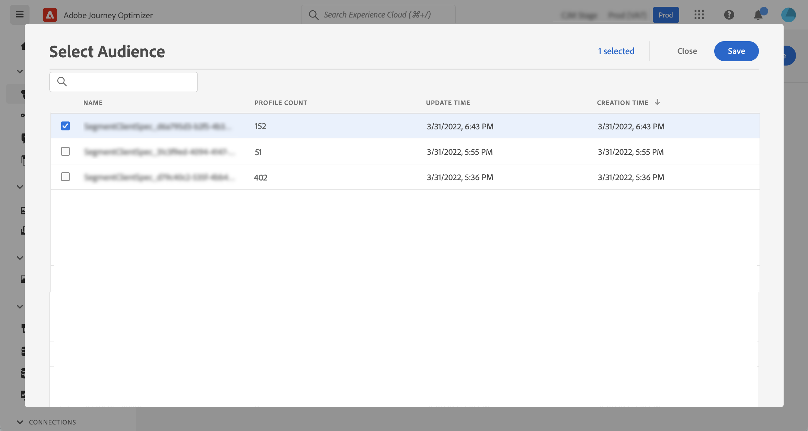
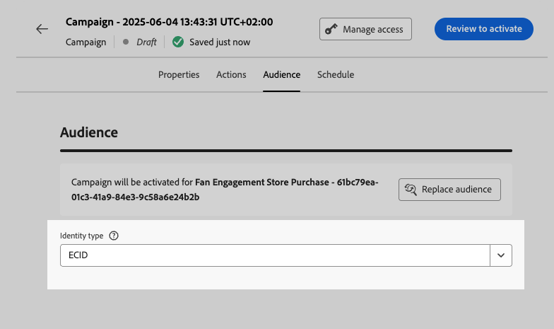
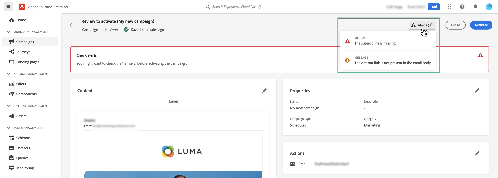

# 建立促銷活動 {#create-campaign}

>[!NOTE]
>
>在建立新市場活動之前，請確保您已預置了消息，並且已準備好使用Adobe Experience Platform段。 在以下各節中瞭解更多資訊：
>
>* [建立訊息預設集](../configuration/message-presets.md)
>* [開始使用區段](../segment/about-segments.md)

## 配置市場活動 {#configure}

建立市場活動的步驟如下：

1. 訪問 **[!UICONTROL Campaigns]** 菜單，然後按一下 **[!UICONTROL Create campaign]**。

   

<!--1. In the **[!UICONTROL Properties]** section, specify when you want to execute the campaign:

    * **[!UICONTROL Scheduled]**: execute the campaign immediately or on a specified date,
    * **[!UICONTROL API-triggered]**: execute the campaign using an API call. In this case, profiles to be targeted and triggers for actions need to be set via the API call.-->

1. 在 **[!UICONTROL Actions]** 部分，選擇用於發送消息的通道和消息表面（即消息預設）。

   

1. 指定市場活動的標題和說明。

   <!--To test the content of your message, toggle the **[!UICONTROL Content experiment]** option on. This allows you to test multiple variables of a delivery on populations samples, in order to define which treatment has the biggest impact on the targeted population.[Learn more about content experiment](../campaigns/content-experiment.md).-->

   

1. 在 **[!UICONTROL Actions]** 部分，配置要隨市場活動一起發送的消息：

   1. 按一下 **[!UICONTROL Edit content]** 按鈕，然後配置和設計消息。 [瞭解如何配置消息](../messages/get-started-content.md)。

      內容準備好後，按一下箭頭返回市場活動建立螢幕。

      

   1. 在 **[!UICONTROL Actions tracking]** 部分，指定是否要跟蹤收件人對交貨的反應。

      市場活動一旦執行，便可以從市場活動報告訪問跟蹤結果。 [瞭解有關市場活動報告的更多資訊](campaign-global-report.md)

      

1. 定義目標受眾。 要執行此操作，請按一下 **[!UICONTROL Select audience]** 按鈕來顯示可用的Adobe Experience Platform段清單。 [瞭解有關網段的更多資訊](../segment/about-segments.md)

   

   <!--By default, the targeted audience for in-app messages includes all the users of the selected mobile application.-->

   在 **[!UICONTROL Identity namespace]** 欄位中，選擇要用於標識選定段中的個體的命名空間。 [瞭解有關命名空間的詳細資訊](../event/about-creating.md#select-the-namespace)

   

   >[!NOTE]
   >
   >該活動不會針對屬於在其不同身份中沒有選定身份（命名空間）的段的個人。 <!--info vue dans section journeys, read segment-->

   <!--If you are creating a campaign to send an in-app message, you can choose how and when the message will be shown to the audience using existing mobile app triggers.-->
   <!-- where are triggers configured?-->

1. 配置市場活動的開始和結束日期。

   預設情況下，市場活動配置為在手動激活市場活動後啟動，並在消息已發送一次時以暫停結束。

1. 此外，您還可以配置執行市場活動中配置的操作的頻率。

   

市場活動準備好後，您可以查看並發佈它(請參閱 [複查並激活市場活動](#review-activate))。

## 複查並激活市場活動 {#review-activate}

配置市場活動後，您需要先查看其參數和內容，然後再激活它。 要執行此操作，請依照下列步驟執行：

1. 在市場活動配置螢幕中，按一下 **[!UICONTROL Review to activate]** 顯示市場活動的摘要。

   匯總允許您在必要時修改市場活動，並檢查是否有任何參數不正確或缺失。

   >[!IMPORTANT]
   >
   >如果出現錯誤，您將無法激活市場活動。 在繼續之前解決錯誤。

   

1. 檢查市場活動配置是否正確，然後按一下 **[!UICONTROL Activate]**。

   

1. 該活動現已啟動，並 **[!UICONTROL Live]** 狀態(或 **[!UICONTROL Scheduled]**  )的正平方根。 [瞭解有關市場活動狀態的詳細資訊](get-started-with-campaigns.md#statuses)

   市場活動中配置的消息將立即或在指定日期執行。

   >[!NOTE]
   >
   >一旦激活了市場活動，即使在消息執行後，它仍將保持「即時」狀態。 要更改其狀態，需要手動停止它。 [瞭解如何停止活動](modify-stop-campaign.md)

1. 激活市場活動後，您可以隨時通過開啟市場活動資訊來檢查其資訊。 該摘要允許您獲取有關目標配置檔案數量以及交付和失敗操作的統計資訊。

   您還可以通過按一下 **[!UICONTROL Reports]** 按鈕 [了解更多](campaign-global-report.md)

   

   >[!IMPORTANT]
   >
   >在市場活動中建立的消息特定於 [!DNL Journey Optimizer] 市場活動能力。 建立後，將只能從市場活動訪問它們，並且不會顯示在 **[!UICONTROL Messages]** 的子菜單。