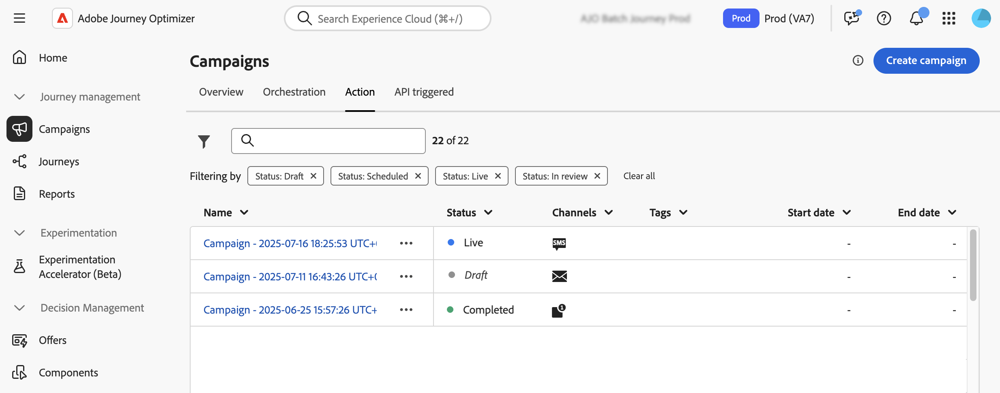
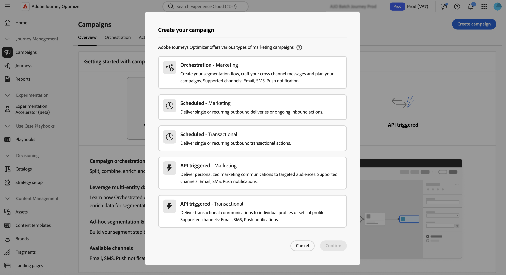

# 開始使用行銷活動 {#get-started-campaigns}

>[!CONTEXTUALHELP]
>id="ajo_campaigns_schedule"
>title="行銷活動排程"
>abstract="預設情況下，行銷活動經由手動啟用後開始執行，並在訊息傳送一次後立即結束。您可以彈性設定發送訊息的具體日期和時間。此外，您可以對定期執行的動作行銷活動指定結束日期。在動作觸發程序中，你亦可根據自己的偏好設定訊息傳送頻率。"

>[!CONTEXTUALHELP]
>id="ajo_campaigns_schedule_start"
>title="行銷活動開始"
>abstract="指定傳送訊息的日期和時間。"

>[!CONTEXTUALHELP]
>id="ajo_campaigns_schedule_end"
>title="行銷活動結束"
>abstract="指定應停止執行週期性行銷活動的時間。"

>[!CONTEXTUALHELP]
>id="ajo_campaigns_schedule_triggers"
>title="行銷活動動作觸發程序"
>abstract="定義應傳送行銷活動訊息的頻率。"

>[!CONTEXTUALHELP]
>id="ajo_campaigns_throttling"
>title="速率控制"
>abstract="指定想要的速率限制，以設定行銷活動的速率控制。此功能對於防止下游系統 (例如登陸頁面或客戶服務平台) 上的超載特別有用。"

>[!CONTEXTUALHELP]
>id="ajo_homepage_card3"
>title="建立行銷活動"
>abstract="使用 **Adobe Journey Optimizer**，透過各種管道將一次性內容傳遞至特定對象。當使用歷程時，動作會依序執行。 透過行銷活動，可同時執行動作 (立即執行或根據指定的排程執行)。"

>[!CONTEXTUALHELP]
>id="campaigns_list"
>title="行銷活動"
>abstract="建立行銷活動以跨不同管道向特定客群提供一次性內容。建立行銷活動之前，請確保您準備好可供使用的管道設定與 Adobe Experience Platform 客群。"

>[!CONTEXTUALHELP]
>id="ajo_campaigns_campaign_type"
>title="行銷活動類型"
>abstract="選取行銷活動類型。可用管道根據所選類型而有所不同。 **已排程行銷活動** (動作行銷活動) – 非常適合簡單的一次性批次通訊，您可以安排在特定時間執行。 **API 觸發的行銷活動** – 透過 API 呼叫啟動，啟用直接從外部系統傳送以事件為基礎的自動化訊息功能。 **協調式行銷活動** – 提供視覺化的拖放式版面，以便設計和自動化複雜的多步驟行銷工作流程，從客群細分到跨管道傳送個人化訊息皆包含在內。"

>[!CONTEXTUALHELP]
>id="ajo_campaigns_create_orchestration"
>title="行銷活動"
>abstract="建立您的細分流程、精心製作跨管道訊息，並規劃您的行銷活動。支援的管道：電子郵件、簡訊、推播通知。"

>[!CONTEXTUALHELP]
>id="ajo_campaigns_create_scheduled_marketing"
>title="行銷活動"
>abstract="傳遞單次或定期的傳出傳遞或持續的傳入動作。"

>[!CONTEXTUALHELP]
>id="ajo_campaigns_create_scheduled_transactional"
>title="行銷活動"
>abstract="提供單一或定期的傳出交易型動作。"

>[!CONTEXTUALHELP]
>id="ajo_campaigns_create_api_marketing"
>title="行銷活動"
>abstract="向目標客群傳遞個人化行銷通訊內容。支援的管道：電子郵件、簡訊、推播通知。"

>[!CONTEXTUALHELP]
>id="ajo_campaigns_create_api_transactional"
>title="行銷活動"
>abstract="向個別輪廓或輪廓集傳遞交易型通訊內容。支援的管道：電子郵件、簡訊、推播通知。"

Adobe Journey Optimizer可讓您跨多個管道，將具針對性的一次性內容傳送給特定對象。 使用行銷活動，您可以同時執行協調的行銷動作，在正確的時間以正確的訊息觸及對象。

本指南提供清楚的藍圖，可協助您瞭解行銷活動基本面、為您的使用案例選擇正確的行銷活動型別，並自信地設計提供具影響力客戶體驗的行銷活動。

## 什麼是行銷活動？

**行銷活動**&#x200B;是協調的行銷動作，可跨一或多個管道將內容傳送給特定對象。 與動作依序執行的歷程不同，行銷活動會同時執行動作 — 立即執行或依定義的排程執行。

使用[!DNL Journey Optimizer]行銷活動：

* 將&#x200B;**單次或循環內容**&#x200B;傳遞至目標對象區段
* 在電子郵件、推播、簡訊、應用程式內、網頁等之間執行&#x200B;**協調式多頻道通訊**
* 透過API呼叫觸發即時事件導向傳訊的&#x200B;**自動回應**
* 使用視覺化協調工具設計&#x200B;**複雜的行銷工作流程**

➡️ **準備好開始建置嗎？** [在幾分鐘內建立您的第一個行銷活動](create-campaign.md)。

## 選擇您的行銷活動型別 {#campaign-types}

**在您開始建立**&#x200B;之前，請務必瞭解哪種型別的行銷活動適合您的使用案例。 Adobe Journey Optimizer支援三種行銷活動型別，分別針對不同情境和啟用機制而設計：

>[!BEGINTABS]

>[!TAB 協調的行銷活動]

**何時使用：**&#x200B;複雜的多步驟行銷工作流程

**協調的行銷活動**&#x200B;提供視覺化的拖放畫布，以設計和自動化複雜的行銷工作流程。 從受眾細分到跨頻道個人化訊息傳送，所有事情都發生在專為快速和控制而建立的直覺式環境中。

**最適合：**&#x200B;多步驟客戶參與計畫、複雜的分段和目標定位策略、跨頻道行銷活動策劃、大規模品牌啟動行銷，以及具有多個決策點的進階工作流程自動化。

➡️ [瞭解協調的行銷活動](../orchestrated/gs-orchestrated-campaigns.md)

>[!TAB 動作行銷活動（已排程）]

**何時使用：**&#x200B;簡單、排程的批次通訊

**動作行銷活動** （也稱為排程行銷活動）適用於在特定時間執行的直接、一次性或循環批次通訊。

**兩個類別：**

* **行銷** — 促銷優惠、參與行銷活動、公告、法律通知或原則更新。 需要收件者選擇加入。
* **異動** — 中斷、緊急狀況、取消。 不需要選擇加入。

**最適合：**&#x200B;客戶區段的每月電子報、時效性促銷宣告、季節性行銷活動、產品上市通訊及服務中斷通知。

➡️ [瞭解動作行銷活動](create-campaign.md)

>[!TAB 由 API 觸發的行銷活動]

**何時使用：**&#x200B;外部系統即時事件導向的傳訊

**API觸發的行銷活動**&#x200B;會透過API呼叫啟用，啟用直接從外部系統自動傳訊。 這些行銷活動支援使用個人檔案屬性和API裝載的即時內容資料進行個人化。

**兩個類別：**

* **行銷** — 與目標對象進行個人化的行銷通訊
* **異動** — 個別動作（密碼重設、購物車購買等）後的訊息

**最適合：**&#x200B;密碼重設確認、購物車放棄復原、訂單確認和送貨更新、帳戶活動通知，以及即時個人化建議。

➡️ [瞭解API觸發的行銷活動](api-triggered-campaigns.md)

>[!ENDTABS]

>[!NOTE]
>
>不確定要選擇哪種型別？ 針對排程批次通訊從&#x200B;**動作行銷活動**&#x200B;開始，或針對即時傳訊從&#x200B;**API觸發的行銷活動**&#x200B;開始 — 這些涵蓋最常見的使用案例。

## 先決條件 {#prerequisites}

在使用行銷活動之前，請確定您已具備下列專案：

* **對象** — 對象必須可在Adobe Experience Platform中使用，才能建立行銷活動。 [開始使用對象→](../audience/about-audiences.md)

* **頻道設定** — 頻道設定（預設集）必須已建立，並且可供您想要使用的頻道使用。 [設定頻道設定→](../configuration/channel-surfaces.md)

* **許可權** — 您需要根據行銷活動型別的適當許可權。 如果您無法存取Campaign功能，請聯絡管理員。 [瞭解內建角色→](../administration/ootb-product-profiles.md)

  +++行銷活動許可權清單

  | 行銷活動類型 | 權限 |
  |-------------|---------------|
  | **動作行銷活動**&#x200B;和&#x200B;**API觸發的行銷活動** | 行銷活動管理員 行銷活動核准者 行銷活動經理 行銷活動檢視者 |
  | **協調的行銷活動** | 協調的行銷活動管理員 協調的行銷活動核准者 協調的行銷活動經理 協調的行銷活動檢視者 |

  +++

  +++如何指派行銷活動許可權

   1. 導覽至&#x200B;**[!UICONTROL 產品中的]**&#x200B;角色[!DNL Permissions]索引標籤，並選取其中一個內建行銷活動相關&#x200B;**[!UICONTROL 角色]**。

   1. 在&#x200B;**[!UICONTROL 使用者]**&#x200B;標籤中，按一下&#x200B;**[!UICONTROL 新增使用者]**。

   1. 輸入您的使用者名稱或電子郵件地址，或從清單中選擇使用者，然後按一下&#x200B;**[!UICONTROL 儲存]**。

  如果之前未建立使用者，請參閱[新增使用者文件](https://experienceleague.adobe.com/zh-hant/docs/experience-platform/access-control/ui/users){target="_blank"}。

  接著，使用者應會收到一封電子郵件，並重新導向至您的執行個體。

  +++

## 您的行銷活動建立工作流程 {#workflow}

建立成功的行銷活動會遵循清晰、可重複的流程。 以下是您的逐步工作流程：

+++1.規劃您的行銷活動

開始之前，請釐清您的目標：

* **目標是什麼？** （例如，推動轉換、提高參與度、通知客戶）
* **對象是誰？** (例如，建置或從Adobe Experience Platform中選取)
* **適合哪個行銷活動型別？** （請參閱上述[行銷活動型別](#campaign-types)）
* **您將使用哪些管道？** （電子郵件、推播、簡訊、應用程式內、網頁等） → [檢視依行銷活動型別支援的管道](../channels/gs-channels.md#channels)
* **何時應該執行？** （立即、排程或API觸發）

+++

+++2.設定行銷活動屬性

設定行銷活動的基礎：

1. **為行銷活動命名並描述**，以方便識別
2. **選取行銷活動型別** （動作、API觸發或協調）
3. **選擇您的對象**
4. 如果使用衝突管理，**設定優先順序**
5. **設定排程** （針對動作行銷活動）或API詳細資料（針對API觸發）

**特定型別的指南：** [動作行銷活動屬性](campaign-properties.md) | [API觸發的行銷活動屬性](api-triggered-campaign-properties.md) | [協調的行銷活動設定](../orchestrated/create-orchestrated-campaign.md)

+++

+++3.設計您的內容

為受眾建立吸引人的訊息：

* 針對豐富的電子郵件體驗使用&#x200B;**電子郵件Designer**
* 使用影像和深層連結設定&#x200B;**推播通知**
* 設計&#x200B;**簡訊/多媒體簡訊服務**&#x200B;與個人化
* 建立&#x200B;**應用程式內**&#x200B;和&#x200B;**網頁**&#x200B;體驗
* 使用設定檔屬性和內容資料新增&#x200B;**個人化**

**特定型別的指南：** [動作行銷活動內容](campaign-content.md) | [API觸發的行銷活動內容](api-triggered-campaign-content.md) | [協調的行銷活動內容](../orchestrated/create-orchestrated-campaign.md)

+++

+++4.檢閱及測試

一律在啟用前檢閱您的行銷活動：

* 使用測試設定檔&#x200B;**預覽內容**
* **檢查目標定位**，以確保適當的對象
* **驗證排程**&#x200B;和啟用設定
* 如果使用核准工作流程，**要求核准**
* 使用種子清單&#x200B;**測試傳遞能力**

**特定型別的指南：** [檢閱動作行銷活動](review-activate-campaign.md) | [檢閱API觸發的行銷活動](review-activate-api-triggered-campaign.md) | [檢閱協調的行銷活動](../orchestrated/create-orchestrated-campaign.md)

+++

+++5.啟用您的行銷活動

檢閱完成後，請啟動您的行銷活動：

* **手動啟動** — 立即啟動或在排程時間啟動
* **API啟用** — 針對API觸發的行銷活動，請使用啟用端點
* **核准流程** — 如有需要，請等待利害關係人的核准

注意：無法編輯作用中的行銷活動（您必須複製才能進行變更）

**特定型別的指南：** [啟動動作行銷活動](review-activate-campaign.md) | [啟用API觸發的行銷活動](review-activate-api-triggered-campaign.md) | [啟用協調的行銷活動](../orchestrated/create-orchestrated-campaign.md)

+++

+++6.監控和分析

追蹤行銷活動的執行方式：

* 檢視行銷活動報表和分析
* 監視傳遞率和參與量度
* 追蹤錯誤和退信
* 分析轉換率和ROI
* 使用見解進行最佳化

**特定型別的指南：** [動作行銷活動報告](../reports/campaign-global-report-cja.md) | [API觸發的行銷活動監視](api-triggered-campaigns.md#monitor) | [協調的行銷活動分析](../orchestrated/create-orchestrated-campaign.md)

+++

## 讓我們深入探討 {#get-started-types}

現在您已瞭解[!DNL Journey Optimizer]中的行銷活動，請選擇您的行銷活動型別以開始：

<table style="table-layout:fixed"><tr style="border: 0; text-align: center;">
<td> <a href="create-campaign.md">動作行銷活動</a></td>
<td> <a href="api-triggered-campaigns.md">由 API 觸發的行銷活動</a></td>
<td><a href="../orchestrated/gs-orchestrated-campaigns.md">協調的行銷活動</a></td>
</tr></table>

當您更熟悉行銷活動時，請探索這些強大的功能：

:::: landing-cards-container

:::

**排程與時間**

針對特定日期/時間排程行銷活動、設定循環傳送，以及最佳化傳送時間以獲得最大影響。 （動作和API觸發的行銷活動）

[瞭解排程](campaign-schedule.md)
:::

:::

**速率控制項**

限制訊息輸送量，以防止登入頁面或客戶服務平台等下游系統過載。 （動作和API觸發的行銷活動）

[控制速率限制](create-campaign.md)
:::

:::

**對象目標定位**

精準鎖定特定Adobe Experience Platform對象，並動態管理對象資格。

[選取行銷活動對象](campaign-audience.md)
:::

:::

**核准工作流程**

在行銷活動上線之前實施稽核和核准程式，確保品質和合規性。 （動作和API觸發的行銷活動）

[檢閱並啟動](review-activate-campaign.md)
:::

:::

**無訊息時數**

避免在指定的時間範圍內傳送訊息，以尊重客戶偏好設定。 （動作和API觸發的行銷活動）

[設定無訊息時數](quiet-hours.md)
:::

:::

**最佳化**

使用鎖定目標規則和內容實驗提供個人化內容並最大化參與度。

[最佳化行銷活動](campaigns-message-optimization.md)
:::

::::
