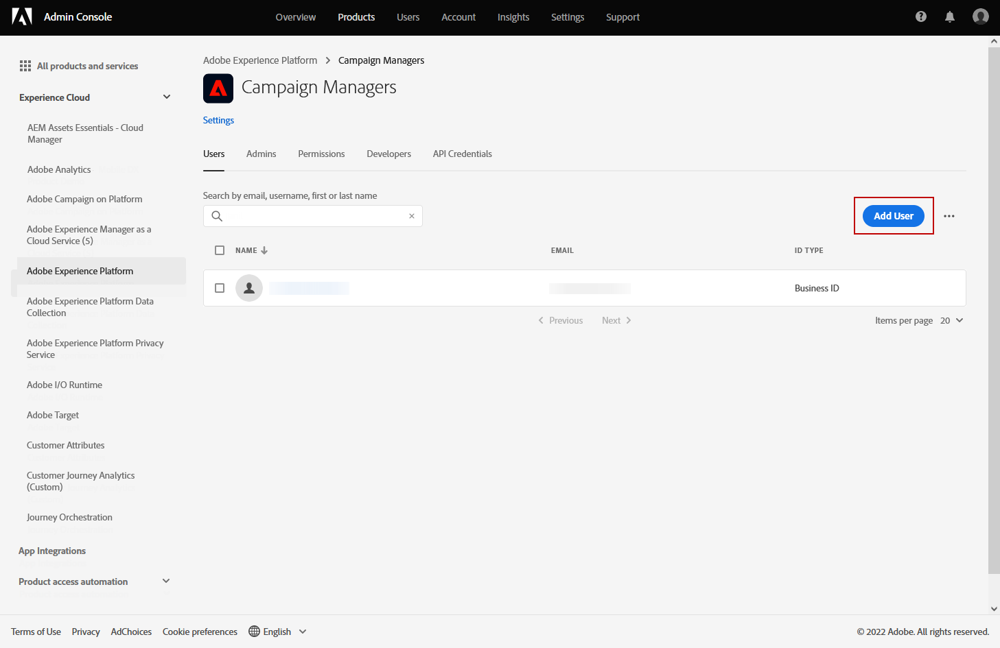

# 開始使用行銷活動 {#get-started-campaigns}

>[!CONTEXTUALHELP]
>id="campaigns_list"
>title="Campaigns"
>abstract="建立行銷活動，跨不同管道將一次性內容傳送至特定區段。 建立促銷活動之前，請確定您有通道表面（即訊息預設集）和Adobe Experience Platform區段可供使用。"

使用 Journey Optimizer 行銷活動，透過各種管道將一次性內容傳遞至特定區段。 使用歷程時，動作會依序執行。 透過行銷活動，可同時執行動作 (立即執行或根據指定的排程執行)。

您可以建立兩種類型的促銷活動：

* **已排程的行銷活動** 允許針對促銷優惠方案、參與促銷活動、公告、法律通知或政策更新等行銷使用案例進行簡單的臨機批次通訊。
* **API觸發的促銷活動** 允許使用REST API（密碼重設、卡放棄等）執行簡單的交易/操作訊息，其中需要可能涉及使用設定檔屬性和裝載的內容資料進行個人化。

建立促銷活動的主要步驟如下：

➡️ [在影片中探索此功能](#video)

## 開始之前 {#campaign-prerequisites}

開始在Journey Optimizer中建立第一個促銷活動之前，請先檢查下列必要條件：

1. **您需要適當的權限**. 促銷活動僅適用於可存取與促銷活動相關之促銷活動的使用者 **[!UICONTROL 產品設定檔]** 例如促銷活動管理員、促銷活動核准者、促銷活動管理員和/或促銷活動檢視器。

   如果您無法存取行銷活動，則必須延長您的權限。 如果您有權存取 [Adobe Admin Console](https://adminconsole.adobe.com/){target=&quot;_blank&quot;}，請遵循下列步驟。 否則請聯絡您的Journey Optimizer管理員。

   +++了解如何指派campaign權限

   若要指派對應的 **[!UICONTROL 產品設定檔]** 對您的使用者：

   1. 從 [Adobe Admin Console](https://adminconsole.adobe.com/){target=&quot;_blank&quot;}，請選取 [!DNL Adobe Experience Platform] 產品。

   1. 瀏覽至 **[!UICONTROL 產品設定檔]** 索引標籤，選取其中一個內建促銷活動相關項目 **[!UICONTROL 產品設定檔]**:促銷活動管理員、促銷活動核准者、促銷活動管理員或促銷活動檢視器。

      如需Journey Optimizer促銷活動的詳細資訊 **[!UICONTROL 產品設定檔]** 和 **[!UICONTROL 權限]**, [請參閱本頁面](../administration/ootb-product-profiles.md).

      

   1. 按一下 **[!UICONTROL 新增使用者]** 指派給您所選取的使用者 **[!UICONTROL 產品設定檔]**.

      

   1. 輸入您的使用者名稱、群組或電子郵件地址，然後按一下 **[!UICONTROL 儲存]**.
   您的使用者現在可以存取 **[!UICONTROL 行銷活動]**.

+++

1. **您需要對象**. 建立行銷活動之前必須有可用的受眾區段。 深入了解受眾建立 [在本頁](../segment/about-segments.md).
1. **需要通道表面**. 要能夠選取通道，必須建立並可用相應的通道曲面（即預設）。 進一步了解通道曲面 [在本頁](../configuration/channel-surfaces.md).

## 存取行銷活動 {#access}

您可從 **[!UICONTROL 行銷活動]** 功能表。

依預設，清單會以 **[!UICONTROL 草稿]**, **[!UICONTROL 已排程]**，和 **[!UICONTROL 即時]** 狀態。 若要顯示已停止、已完成和已封存的促銷活動，您必須清除篩選器。

## 促銷活動狀態 {#statuses}

促銷活動可以有多種狀態：

* **[!UICONTROL 草稿]**:正在編輯促銷活動，尚未啟動。
* **[!UICONTROL 啟用]**:促銷活動正在啟動。
* **[!UICONTROL 即時]**:促銷活動已啟動。
* **[!UICONTROL 已排程]**:促銷活動設定為在特定開始日期啟動。
* **[!UICONTROL 已停止]**:已手動停止促銷活動。 您無法再啟動或重複使用它。 [了解更多](modify-stop-campaign.md#stop)
* **[!UICONTROL 已完成]**:促銷活動已完成。 此狀態會在促銷活動啟動後3天自動指派，或是在促銷活動結束日期（如果有循環執行）自動指派。
* **[!UICONTROL 已封存]**:已封存促銷活動。

>[!NOTE]
>
>旁邊的「開啟草稿版本」圖示 **[!UICONTROL 即時]** 或 **[!UICONTROL 已排程]** 狀態表示已建立新版本的促銷活動，但尚未啟動。 [了解更多](modify-stop-campaign.md#modify)。

## 作法影片 {#video}

了解如何建立您的第一個行銷活動。

>[!VIDEO](https://video.tv.adobe.com/v/346680?quality=12)
