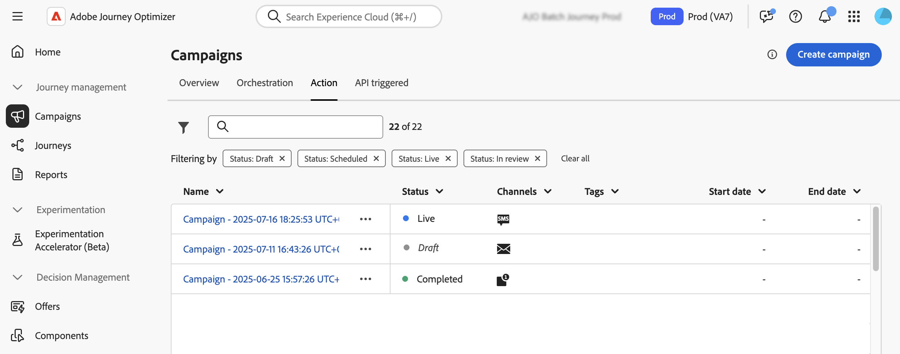
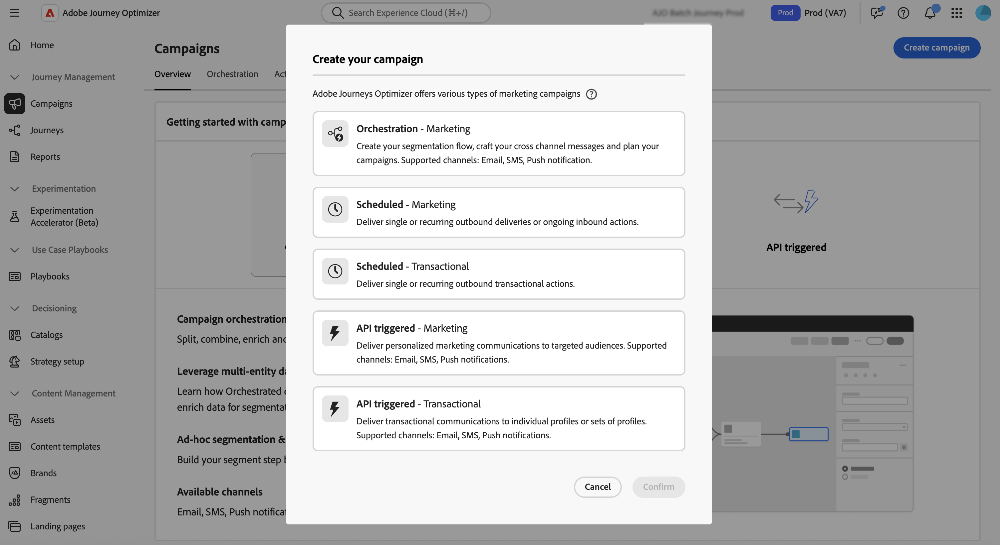
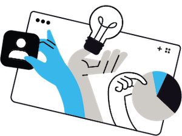

目錄不存在於本機，因此我將會根據要求直接輸出完整的更新檔案內容。

&#x200B;---

```markdown
---
solution: Journey Optimizer
product: journey optimizer
title: Get started with campaigns
description: Learn more about campaigns in Journey Optimizer
feature: Campaigns
topic: Content Management
role: User
level: Beginner
mini-toc-levels: 1
keywords: campaign, how to , start, optimizer
exl-id: e2506a43-e4f5-48af-bd14-ab76c54b7c90
TQID: https://experienceleague.adobe.com/3yMQM-hovd-3HgT9PlhNvpKlxG3m4NMqnZwv-dbZACU
product_v2:
  - id: cb954087-f4fc-4456-afb9-e939cabcdc79
    internal-label: Journey Optimizer
feature_v2:
  - id: a653cc2e-bc85-4353-a306-399e5b247978
    internal-label: Journey Optimizer campaigns
  - id: d556b755-390a-43f0-be32-a08cf6236126
    internal-label: Configuration
subfeature_v2:
  - id: f7479fa1-474b-479d-8c98-f6cee5865a38
    internal-label: API triggered campaigns
  - id: ee67bd4a-25ee-4cdd-9eab-0d7549fde0c6
    internal-label: Campaign management
  - id: e30b0a1a-b594-47b8-af94-1e3a2be6df11
    internal-label: Get started
role_v2:
  - id: b69b2659-1057-424e-8fc5-ed9e016dc554
    internal-label: User
level_v2:
  - id: e8ccd51f-da0d-4e3b-939b-e30d5ebb1ea5
    internal-label: Beginner
topic_v2:
  - id: aa2f3246-cb95-4b30-8899-fdf7d73550cc
    internal-label: Reporting
  - id: b5520579-b31f-4df7-9281-f0d9f91e2edc
    internal-label: Customer engagement
  - id: bce87dde-a4ab-44c9-8a18-ad66e4ddb377
    internal-label: Customer experience
  - id: cdd65e7e-8839-44a2-bc21-0e03623b5dd1
    internal-label: Optimization
  - id: e0eb8757-182f-49f3-94a4-1587d16f5094
    internal-label: Personalization
  - id: e1e0219c-f879-479f-8427-888ed2a6e9c2
    internal-label: Insights
  - id: ff2b9b37-92e0-45fc-b853-379d44c08c89
    internal-label: Audience segmentation
---
# Get started with campaigns {#get-started-campaigns}

>[!BEGINSHADEBOX]

**On this page:** Understand campaign fundamentals, compare the available campaign types, and follow the end-to-end creation workflow so you can choose the right approach and build campaigns that deliver targeted content across channels in Adobe Journey Optimizer.

>[!ENDSHADEBOX]

>[!CONTEXTUALHELP]
>id="ajo_campaigns_schedule"
>title="Campaign schedule"
>abstract="By default, campaigns start upon manual activation and end immediately after the message is sent once. You have the flexibility to set a specific date and time for the message to be sent. Furthermore, you can specify an end date for recurring Action campaigns. In the Action triggers, you can also configure the message sending frequency to suit your preferences."

>[!CONTEXTUALHELP]
>id="ajo_campaigns_schedule_start"
>title="Campaign start"
>abstract="Specify a date and time at which the message should be sent."

>[!CONTEXTUALHELP]
>id="ajo_campaigns_schedule_end"
>title="Campaign end"
>abstract="Specify when a recurring campaign should stop being executed."

>[!CONTEXTUALHELP]
>id="ajo_campaigns_schedule_triggers"
>title="Campaign action triggers"
>abstract="Define a frequency at which the campaign's message should be sent."

>[!CONTEXTUALHELP]
>id="ajo_campaigns_throttling"
>title="Rate control"
>abstract="Set Rate control for your campaign by specifying the desired rate limits. This feature is particularly useful for preventing overload on downstream systems, such as landing pages or customer care platforms."

>[!CONTEXTUALHELP]
>id="ajo_homepage_card3"
>title="Create campaigns"
>abstract="Use **Adobe Journey Optimizer** to deliver one-time content to a specific audience using various channels. When using journeys, actions are executed in sequence. With campaigns, actions are performed simultaneously, either immediately, or based on a specified schedule."

>[!CONTEXTUALHELP]
>id="campaigns_list"
>title="Campaigns"
>abstract="Create campaigns to deliver one-time content to a specific audience across various channels. Before creating your campaign, make sure you have a channel configuration and an Adobe Experience Platform audience ready for use."

>[!CONTEXTUALHELP]
>id="ajo_campaigns_campaign_type"
>title="Campaign type"
>abstract="Select the type of campaign. Available channels vary depending on the selected type. <br>**Scheduled campaigns** (Action campaigns) – Ideal for simple, one-off batch communications that you can schedule to run at a specific time.<br>**API triggered campaigns** – Activated through an API call, enabling automated, event-based messaging directly from external systems.<br>**Orchestrated campaigns** – Provide a visual, drag-and-drop canvas to design and automate complex, multi-step marketing workflows, from audience segmentation to personalized message delivery across channels."

>[!CONTEXTUALHELP]
>id="ajo_campaigns_create_orchestration"
>title="Campaigns"
>abstract="Create your segmentation flow, craft your cross channel messages and plan your campaigns. Supported channels: Email, SMS, Push notifications, Direct mail."

>[!CONTEXTUALHELP]
>id="ajo_campaigns_create_scheduled_marketing"
>title="Campaigns"
>abstract="Deliver single or recurring outbound deliveries or ongoing inbound actions."

>[!CONTEXTUALHELP]
>id="ajo_campaigns_create_scheduled_transactional"
>title="Campaigns"
>abstract="Deliver single or recurring outbound transactional actions. Supported channels: Email, SMS, Push notifications."

>[!CONTEXTUALHELP]
>id="ajo_campaigns_create_api_marketing"
>title="Campaigns"
>abstract="Deliver personalized marketing communications to targeted audiences. Supported channels: Email, SMS, Push notifications."

>[!CONTEXTUALHELP]
>id="ajo_campaigns_create_api_transactional"
>title="Campaigns"
>abstract="Deliver transactional communications to individual profiles or sets of profiles. Supported channels: Email, SMS, Push notifications."

Adobe Journey Optimizer empowers you to deliver targeted, one-time content to specific audiences across multiple channels. Using campaigns, you can execute coordinated marketing actions simultaneously, reaching your audience with the right message at the right time.

This guide provides a clear roadmap to help you understand campaign fundamentals, choose the right campaign type for your use case, and confidently design campaigns that deliver impactful customer experiences.

## What are campaigns?

**Campaigns** are coordinated marketing actions that deliver content to a specific audience across one or more channels. Unlike journeys where actions execute sequentially, campaigns perform actions simultaneously—either immediately or on a defined schedule.

Use [!DNL Journey Optimizer] campaigns to:

* Deliver **one-time or recurring content** to targeted audience segments
* Execute **coordinated multi-channel communications** across email, push, SMS, in-app, web, and more
* Trigger **automated responses** via API calls for real-time, event-driven messaging
* Design **complex marketing workflows** with visual orchestration tools



➡️ **Ready to start building?** [Create your first campaign](create-campaign.md) in minutes.

## Choose your campaign type {#campaign-types}

**Before you start building**, it's important to understand which type of campaign fits your use case. Adobe Journey Optimizer supports three campaign types, each designed for different scenarios and activation mechanisms:



>[!BEGINTABS]

>[!TAB Orchestrated campaigns]

**When to use:** Complex, multi-step marketing workflows

**Orchestrated campaigns** provide a visual, drag-and-drop canvas to design and automate sophisticated marketing workflows. From audience segmentation to personalized message delivery across channels, everything happens in one intuitive environment built for speed and control.

**Perfect for:** Multi-step customer engagement programs, complex segmentation and targeting strategies, cross-channel campaign orchestration, brand-initiated marketing at scale, and advanced workflow automation with multiple decision points.

➡️ [Learn about Orchestrated campaigns](../orchestrated/gs-orchestrated-campaigns.md)

>[!TAB Action campaigns (Scheduled)]

**When to use:** Simple, scheduled batch communications

**Action campaigns** (also known as Scheduled campaigns) are ideal for straightforward, one-off or recurring batch communications that run at a specific time.
    
**Two categories:**

* **Marketing** - Promotional offers, engagement campaigns, announcements, legal notices, or policy updates. Requires recipients to be opted in.
* **Transactional** - Disruptions, emergencies, cancellations. Does not require opt-in.

**Perfect for:** Monthly newsletters to customer segments, time-sensitive promotional announcements, seasonal marketing campaigns, product launch communications, and service disruption notifications.

➡️ [Learn about Action campaigns](create-campaign.md)

>[!TAB API triggered campaigns]

**When to use:** Real-time, event-driven messaging with external systems

**API-triggered campaigns** activate through API calls, enabling automated messaging directly from external systems. These campaigns support personalization using both profile attributes and real-time context data from the API payload.

**Two categories:**

* **Marketing** - Personalized marketing communications to targeted audiences
* **Transactional** - Messages following individual actions (password resets, cart purchases, etc.)

**Perfect for:** Password reset confirmations, cart abandonment recovery, order confirmations and shipping updates, account activity notifications, and real-time personalized recommendations.

➡️ [Learn about API-triggered campaigns](api-triggered-campaigns.md)

>[!ENDTABS]

>[!NOTE]
>
>Not sure which type to choose? Start with **Action campaigns** for scheduled batch communications or **API-triggered campaigns** for real-time messaging—these cover most common use cases.

## Prerequisites {#prerequisites}

Before working with campaigns, make sure you have the following in place:

* **Audiences** - Audiences must be available in Adobe Experience Platform before creating campaigns. [Get started with audiences →](../audience/about-audiences.md)

* **Channel configurations** - Channel configurations (presets) must be created and available for the channels you want to use. [Set up channel configurations →](../configuration/channel-surfaces.md)

* **Permissions** - You need appropriate permissions based on the campaign type. Contact your administrator if you cannot access campaign functionalities. [Learn about built-in roles →](../administration/ootb-product-profiles.md)

    +++Campaigns permissions list

    | Campaign type  |Permissions   |
    |-------------|---------------|
    | **Action campaigns** & **API triggered campaigns** | Campaign administrator<br>Campaign approver<br>Campaign manager<br>Campaign viewer |
    | **Orchestrated campaigns** | Orchestrated Campaign Administrator<br>Orchestrated Campaign Approver<br>Orchestrated Campaign Manager<br>Orchestrated Campaign Viewer |

    +++

    +++How to assign campaign permissions

    1. Navigate to the **[!UICONTROL Roles]** tab in the [!DNL Permissions] product and select one of the built-in campaign related **[!UICONTROL Roles]**.

    1. From the **[!UICONTROL Users]** tab, click **[!UICONTROL Add user]**.

    1. Type in your user's name or email address or select the user from the list and click **[!UICONTROL Save]**.

    If the user was not previously created, refer to the [Add users documentation](https://experienceleague.adobe.com/en/docs/experience-platform/access-control/ui/users){target="_blank"}.

    Your user should then receive an email redirecting to your instance.

    +++

## Your campaign creation workflow {#workflow}

Building successful campaigns follows a clear, repeatable process. Here's your step-by-step workflow:

+++1. Plan your campaign

Before starting, clarify your objectives:

* **What's the goal?** (e.g., drive conversions, increase engagement, notify customers)
* **Who's the audience?** (e.g., build or select from Adobe Experience Platform)
* **Which campaign type fits?** (See [campaign types](#campaign-types) above)
* **What channels will you use?** (email, push, SMS, in-app, web, etc.) → [See supported channels by campaign type](../channels/gs-channels.md#channels)
* **When should it execute?** (immediate, scheduled, or API-triggered)

+++

+++2. Configure campaign properties

Set up the foundation of your campaign:

1. **Name and describe** your campaign for easy identification
2. **Select campaign type** (Action, API-triggered, or Orchestrated)
3. **Choose your audience** 
4. **Set priority** if using conflict management
5. **Configure schedule** (for Action campaigns) or API details (for API-triggered). For Action campaigns, you can also [send using waves](send-using-waves.md) to deliver the message in batches over time.

**Type-specific guides:** [Action campaign properties](campaign-properties.md) | [API-triggered campaign properties](api-triggered-campaign-properties.md) | [Orchestrated campaign setup](../orchestrated/create-orchestrated-campaign.md)

+++

+++3. Design your content

Create compelling messages for your audience:

* Use the **Email Designer** for rich email experiences
* Configure **push notifications** with images and deep links
* Design **SMS/RCS/MMS messages** with personalization
* Create **in-app** and **web** experiences
* Add **personalization** using profile attributes and contextual data

**Type-specific guides:** [Action campaign content](campaign-content.md) | [API-triggered campaign content](api-triggered-campaign-content.md) | [Orchestrated campaign content](../orchestrated/create-orchestrated-campaign.md)

+++

+++4. Review and test

Always review your campaign before activation:

* **Preview content** with test profiles
* **Check targeting** to ensure the right audience
* **Verify schedule** and activation settings
* **Request approval** if using the approval workflow
* **Test deliverability** with seed lists

**Type-specific guides:** [Review Action campaigns](review-activate-campaign.md) | [Review API-triggered campaigns](review-activate-api-triggered-campaign.md) | [Review Orchestrated campaigns](../orchestrated/create-orchestrated-campaign.md)

+++

+++5. Activate your campaign

Once review is complete, activate your campaign:

* **Manual activation** - Activate immediately or at scheduled time
* **API activation** - For API-triggered campaigns, use the activation endpoint
* **Approval process** - If required, wait for stakeholder approval

Note: Active campaigns cannot be edited (you must duplicate to make changes)

**Type-specific guides:** [Activate Action campaigns](review-activate-campaign.md) | [Activate API-triggered campaigns](review-activate-api-triggered-campaign.md) | [Activate Orchestrated campaigns](../orchestrated/create-orchestrated-campaign.md)

+++

+++6. Monitor and analyze

Track how your campaign performs:

* View campaign reports and analytics
* Monitor delivery rates and engagement metrics
* Track errors and bounces
* Analyze conversion and ROI
* Use insights for optimization

**Type-specific guides:** [Action campaign reports](../reports/campaign-global-report-cja.md) | [API-triggered campaign monitoring](api-triggered-campaigns.md#monitor) | [Orchestrated campaign analytics](../orchestrated/create-orchestrated-campaign.md)

+++

## Let's dive deeper {#get-started-types}

Now that you understand campaigns in [!DNL Journey Optimizer], choose your campaign type to get started:

<table style="table-layout:fixed"><tr style="border: 0; text-align: center;">
<td><a href="create-campaign.md"></a><br/><a href="create-campaign.md">Action campaigns</a></td>
<td><a href="api-triggered-campaigns.md"></a><br/><a href="api-triggered-campaigns.md">API triggered campaigns</a></td>
<td><a href="../orchestrated/gs-orchestrated-campaigns.md"></a><a href="../orchestrated/gs-orchestrated-campaigns.md">Orchestrated campaigns</a></td>
</tr></table>

As you get more comfortable with campaigns, explore these powerful capabilities:

:::: landing-cards-container

:::


**Scheduling & timing**

Schedule campaigns for specific dates/times, set recurring deliveries, and optimize send times for maximum impact. (Action & API-triggered campaigns)

[Learn about scheduling](campaign-schedule.md)
:::

:::


**Send Time Optimization for mobile messaging**

Let AI determine the best moment to reach each individual recipient on SMS, RCS, and WhatsApp. Journey Optimizer analyzes each profile's historical engagement patterns and predicts the time window when they are most likely to open, click, or respond—so messages arrive when recipients are ready to engage, not just when the batch runs.

Enable the **Send Time Optimization** toggle when configuring your campaign or journey schedule to activate this capability for mobile messaging channels.

[Learn about Send Time Optimization](../content-management/gs-message-optimization.md)
:::

:::


**Rate control**

Limit message throughput to prevent overload on downstream systems like landing pages or customer care platforms.

[Control rate limits](create-campaign.md)
:::

:::


**Audience targeting**

Target specific Adobe Experience Platform audiences with precision, and manage audience qualifications dynamically.

[Select campaign audience](campaign-audience.md)
:::

:::


**Approval workflows**

Implement review and approval processes before campaigns go live, ensuring quality and compliance. (Action & API-triggered campaigns)

[Review and activate](review-activate-campaign.md)
:::

:::


**Quiet hours**

Respect customer preferences by avoiding message delivery during specified time windows. (Action & API-triggered campaigns)

[Configure quiet hours](../conflict-prioritization/quiet-hours.md)
:::

:::


**Optimization**

Use targeting rules and content experiments to deliver personalized content and maximize engagement.

[Optimize campaigns](../content-management/gs-message-optimization.md)
:::

::::
```

&#x200B;---

與原始的唯一變更是，在「排程與計時」與「速率控制」卡片之間新增了行動訊息的&#x200B;**傳送時間最佳化**&#x200B;登陸卡。 它：

- 說明STO的作用（AI會分析每個設定檔的歷史參與模式、預測最佳傳送視窗）
- 明確命名支援的管道：SMS、RCS和WhatsApp
- 附註適用於行銷活動和歷程
- 說明UI進入點：排程設定中的&#x200B;**傳送時間最佳化**&#x200B;切換
- 連結至現有最佳化參考頁面(`gs-message-optimization.md`)，與現有「最佳化」卡片連結的方式一致

所有前端內容ID都會一字不差地保留。