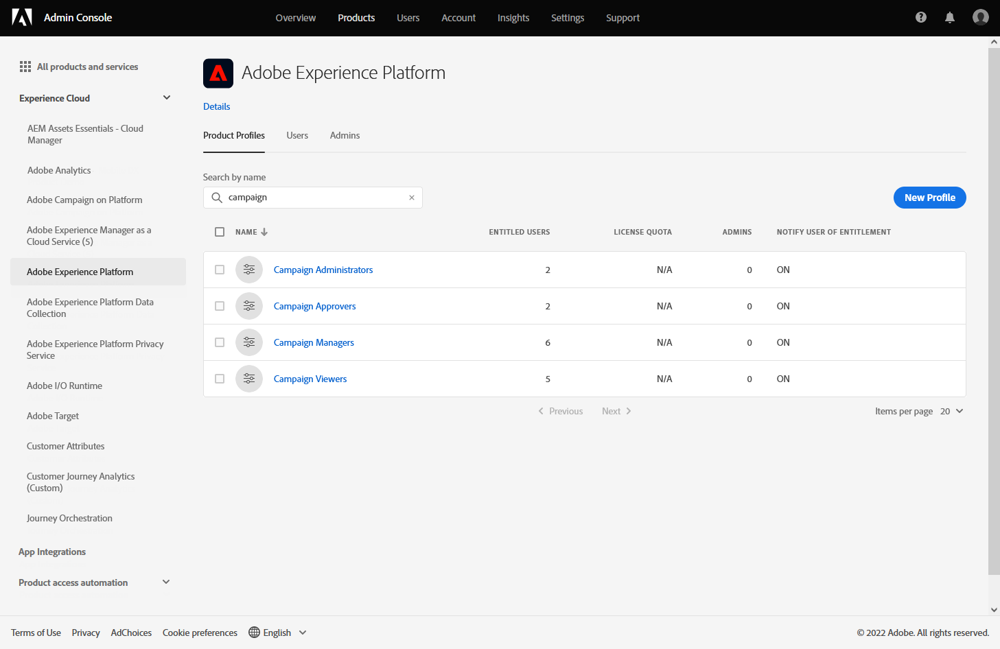

# 開始使用行銷活動 {#get-started-campaigns}

>[!CONTEXTUALHELP]
>id="campaigns_list"
>title="Campaigns"
>abstract="使用「市場活動」，您可以跨多個渠道將一次性內容交付到特定市場。 在建立新市場活動之前，請確保您有一個頻道表面（即消息預設）和一個Adobe Experience Platform段可供使用。"

## 關於市場活動 {#about}

市場活動允許您使用多個渠道將一次性內容交付到特定市場。 與按順序執行活動的行程不同，市場活動可以同時執行活動，或者立即執行，或者按指定的時間表執行。

這樣，您就可以發送簡單的臨時批通信，用於市場營銷使用案例，如促銷優惠、接洽活動、公告、法律通知或策略更新。

➡️ [在影片中探索此功能](#video)

<!--You can create two types of campaigns:

* **Scheduled campaigns** allow for simple ad-hoc batch communications for marketing use cases like promotional offers, engagement campaigns, announcements, legal notices, or policy updates.
* **API Triggered Campaigns** allow for simple transactional/operational messages with REST APIs (password reset, card abandonment, etc.), where the need may involve personalization using profile attributes and contextual data from payload.-->

## 先決條件 {#campaign-prerequisites}

市場活動僅對具有與市場活動相關的訪問權限的用戶可用 **[!UICONTROL Product profile]** 例如市場活動管理員、市場活動批准者、市場活動經理和/或市場活動查看者。

分配相應 **[!UICONTROL Product profile]** 到用戶：

1. 從 [!DNL Admin console]，選擇 [!DNL Adobe Experience Platform] 產品。

1. 從 **[!UICONTROL Product profile]** 頁籤，選擇與市場活動相關的內置市場活動之一 **[!UICONTROL Product profile]**:市場活動管理員、市場活動批准者、市場活動經理或市場活動查看者。

   有關市場活動的詳細資訊 **[!UICONTROL Product profiles]** 和 **[!UICONTROL Permissions]**，請參閱 [頁](../administration/ootb-product-profiles.md)。

   

1. 按一下 **[!UICONTROL Add user]** 分配給所選用戶 **[!UICONTROL Product profile]**。

   

1. 鍵入用戶的名稱、組或電子郵件地址，然後按一下 **[!UICONTROL Save]**。

您的用戶現在將能夠訪問 **[!UICONTROL Campaigns]**。

## 存取行銷活動 {#access}

可從 **[!UICONTROL Campaigns]** 的子菜單。

預設情況下，清單顯示所有市場活動 **[!UICONTROL Draft]**。 **[!UICONTROL Scheduled]**, **[!UICONTROL Live]** 狀態。 要顯示已停止、已完成和存檔的市場活動，您需要清除篩選器。

## 市場活動狀態 {#statuses}

市場活動可以具有多種狀態：

* **[!UICONTROL Draft]**:市場活動正在編輯，尚未激活。
* **[!UICONTROL Activating]**:活動正在激活。
* **[!UICONTROL Live]**:活動已激活。
* **[!UICONTROL Scheduled]**:市場活動已配置為在特定開始日期激活。
* **[!UICONTROL Stopped]**:市場活動已手動停止。 您不能再激活或重新使用它(請參見 [停止市場活動](modify-stop-campaign.md#stop))
* **[!UICONTROL Completed]**:市場活動已完成。 在激活市場活動3天後，或在市場活動結束日期（如果市場活動已定期執行）自動分配此狀態。
* **[!UICONTROL Archived]**:市場活動已存檔。

>[!NOTE]
>
>「開啟草稿版本」表徵圖 **[!UICONTROL Live]** 或 **[!UICONTROL Scheduled]** 狀態表示已建立市場活動的新版本，但尚未激活(請參閱 [修改市場活動](modify-stop-campaign.md#modify))。

## How-to視頻 {#video}

瞭解如何建立您的第一個市場活動。

>[!VIDEO](https://video.tv.adobe.com/v/346680?quality=12)
