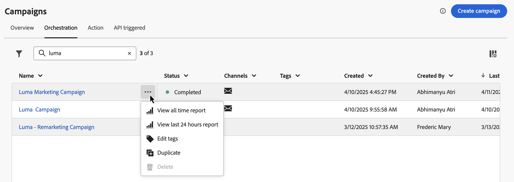

# 存取和管理行銷活動 {#modify-stop-campaign}

## 存取行銷活動 {#access}

>[!CONTEXTUALHELP]
>id="ajo_campaigns_view"
>title="行銷活動清單和行事曆視圖"
>abstract="除了行銷活動清單之外，[!DNL Journey Optimizer] 還提供行銷活動的行事曆視圖，以清晰的視覺化方式呈現排程。您可以使用這些按鈕隨時在清單和行事曆視圖之間切換。"

>[!CONTEXTUALHELP]
>id="ajo_targeting_workflow_list"
>title="協調式行銷活動詳細目錄"
>abstract="在此畫面中，您可以存取協調式行銷活動的完整清單、檢查其目前狀態、上次/下次執行日期，以及建立新的協調式行銷活動。"

>[!CONTEXTUALHELP]
>id="ajo_orchestration_campaign_action"
>title="動作"
>abstract="本節列出在協調式行銷活動中使用的所有動作。"

可從&#x200B;**[!UICONTROL 行銷活動]**&#x200B;功能表存取行銷活動。

>[!BEGINTABS]

>[!TAB 動作行銷活動]

選取&#x200B;**[!UICONTROL 動作]**&#x200B;索引標籤以存取動作行銷活動清單。

依預設，清單會顯示所有狀態為&#x200B;**[!UICONTROL 草稿]**、**[!UICONTROL 已排程]**&#x200B;和&#x200B;**[!UICONTROL 即時]**&#x200B;的行銷活動。 若要顯示已停止、已完成和已封存的行銷活動，您必須清除篩選器。

>[!TAB 由 API 觸發的行銷活動]

選取&#x200B;**[!UICONTROL API觸發]**&#x200B;索引標籤以存取API觸發的行銷活動清單。

依預設，清單會顯示所有狀態為&#x200B;**[!UICONTROL 草稿]**、**[!UICONTROL 已排程]**&#x200B;和&#x200B;**[!UICONTROL 即時]**&#x200B;的行銷活動。 若要顯示已停止、已完成和已封存的行銷活動，您必須清除篩選器。

>[!TAB 協調的行銷活動]

選取&#x200B;**[!UICONTROL 協調流程]**&#x200B;索引標籤以存取協調流程行銷活動清單。

{zoomable="yes"}{zoomable="yes"}

清單中每個已協調的行銷活動都會顯示資訊，例如行銷活動的目前[狀態](#status)、相關頻道和標籤，或上次修改行銷活動的時間。 您可以按一下「」按鈕來自訂顯示的欄。

>[!ENDTABS]

此外，還可使用搜尋列和篩選器，以便在清單中輕鬆搜尋。例如，您可以篩選行銷活動，以僅顯示與指定頻道或標籤相關聯的行銷活動，或顯示在特定日期範圍內建立的行銷活動。

行銷活動詳細目錄中的「」按鈕，可讓您執行各種作業，詳情如下。

顯示行銷活動詳細目錄的

* **[!UICONTROL 檢視所有時間報表]** / **[!UICONTROL 檢視過去24小時的報表]** — 存取報表以測量並視覺化行銷活動的影響和效能。
* **[!UICONTROL 編輯標籤]** — 編輯與行銷活動相關聯的標籤。
* **[!UICONTROL 複製]** — 在某些情況下，您可能需要複製行銷活動，例如執行已停止的協調行銷活動。
* **[!UICONTROL 刪除]** — 刪除行銷活動。此動作僅適用於&#x200B;**[!UICONTROL 草稿]**&#x200B;行銷活動。
* **[!UICONTROL 封存]** — 封存行銷活動。所有已封存的行銷活動都會在其上次修改日期後的 30 天內，以滾動重新排程方式刪除。此動作適用於除&#x200B;**[!UICONTROL 草稿]**&#x200B;行銷活動以外的所有行銷活動。

針對「動作」和API觸發的行銷活動，可使用下列其他動作：

* **[!UICONTROL 新增至封裝]** — 將行銷活動新增至封裝，以便將其匯出至另一個沙箱。 [將物件匯出至另一個沙箱](../configuration/copy-objects-to-sandbox.md)
* **[!UICONTROL 開啟草稿版本]** — 如果已建立新版本的行銷活動且尚未啟動，您可以使用此動作存取其草稿版本。

## 行銷活動狀態和警示 {#statuses}

行銷活動可以有多個狀態：

>[!BEGINTABS]

>[!TAB 動作行銷活動]

* **[!UICONTROL 草稿]**：行銷活動正在編輯中，尚未啟動。
* **[!UICONTROL 已排程]**：行銷活動已設定為在特定的開始日期啟動。
* **[!UICONTROL 即時]**：行銷活動已啟用。
* **[!UICONTROL 稽核中]**：行銷活動已提交核准以便發佈。 [瞭解如何使用核准](../test-approve/gs-approval.md)
* **[!UICONTROL 已停止]**：行銷活動已手動停止。 您無法再啟用或重複使用它。 [瞭解如何停止行銷活動](modify-stop-campaign.md#stop)
* **[!UICONTROL 已完成]**：行銷活動已完成。 此狀態會在行銷活動啟動3天後自動指派，如果行銷活動有週期性執行，則會在行銷活動的結束日期指派。
* **[!UICONTROL 失敗]**：行銷活動執行失敗。 檢查記錄以識別問題。
* **[!UICONTROL 已封存]**：行銷活動已封存。 [瞭解如何封存行銷活動](modify-stop-campaign.md#archive)

>[!NOTE]
>
>**[!UICONTROL 即時]**&#x200B;或&#x200B;**[!UICONTROL 已排程]**&#x200B;狀態旁的「開啟草稿版本」圖示表示已建立新版本的動作或API觸發的行銷活動，但尚未啟動。

>[!TAB 由 API 觸發的行銷活動]

* **[!UICONTROL 草稿]**：行銷活動正在編輯中，尚未啟動。
* **[!UICONTROL 已排程]**：行銷活動已設定為在特定的開始日期啟動。
* **[!UICONTROL 即時]**：行銷活動已啟用。
* **[!UICONTROL 稽核中]**：行銷活動已提交核准以便發佈。 [瞭解如何使用核准](../test-approve/gs-approval.md)
* **[!UICONTROL 已停止]**：行銷活動已手動停止。 您無法再啟用或重複使用它。 [瞭解如何停止行銷活動](modify-stop-campaign.md#stop)
* **[!UICONTROL 已完成]**：行銷活動已完成。 此狀態會在行銷活動啟動3天後自動指派，如果行銷活動有週期性執行，則會在行銷活動的結束日期指派。
* **[!UICONTROL 失敗]**：行銷活動執行失敗。 檢查記錄以識別問題。
* **[!UICONTROL 已封存]**：行銷活動已封存。 [瞭解如何封存行銷活動](modify-stop-campaign.md#archive)

>[!NOTE]
>
>**[!UICONTROL 即時]**&#x200B;或&#x200B;**[!UICONTROL 已排程]**&#x200B;狀態旁的「開啟草稿版本」圖示表示已建立新版本的動作或API觸發的行銷活動，但尚未啟動。

>[!TAB 協調的行銷活動]

* **[!UICONTROL 草稿]**：已建立協調的行銷活動。 行銷活動尚未發佈。
* **[!UICONTROL 發佈]**：正在發佈協調的行銷活動。
* **[!UICONTROL 即時]**：已發佈且正在執行協調的行銷活動。
* **[!UICONTROL 已排程]**：已排程協調的行銷活動執行。
* **[!UICONTROL 已完成]**：協調的行銷活動執行已完成。 行銷活動完成傳送訊息且沒有出錯後，系統最多在 3 天內自動指派「已完成」狀態。
* **[!UICONTROL 已關閉]**：當週期性行銷活動已關閉時，會顯示此狀態。行銷活動會繼續執行直到其所有活動完成，但無法再有設定檔進入行銷活動。
* **[!UICONTROL 已封存]**：已封存協調的行銷活動。 所有已封存的行銷活動都會在上次修改日期後的 30 天內，以滾動重新排程方式刪除。您可以複製已封存的行銷活動 (如有必要)，以繼續處理。
* **[!UICONTROL 已停止]**：已停止協調的行銷活動執行。 若要再次啟動行銷活動，您必須複製它。

>[!ENDTABS]

當您的其中一個行銷活動發生錯誤時，警告圖示會出現在行銷活動的狀態旁。 按一下該按鈕，以顯示有關警示的資訊。 這些警報可能會發生在各種情況下，例如行銷活動訊息尚未發佈或如果選擇的設定不正確。

## 行銷活動行事曆 {#calendar}

除了行銷活動清單，[!DNL Journey Optimizer]還提供行銷活動的行事曆檢視，提供其排程的清晰視覺化呈現。

行銷活動的呈現方式：

* 依預設，行事曆格線會顯示所選周的所有即時和已排程行銷活動。 其他篩選器選項可顯示已完成、已停止和已完成的特定型別或管道的啟動或啟動。
* 不顯示草稿行銷活動。
* 橫跨多天的行銷活動會顯示在行事曆格線的頂端。
* 如果未指定開始時間，則會使用最接近的手動啟動時間，將其放置在行事曆中。
* 行銷活動會顯示為1小時時間跨度，但這並不反映實際的傳送或完成時間。

若要在您的「促銷活動」行事曆中導覽：

1. 按一下圖示以存取您的行銷活動行事曆。

1. 使用箭頭按鈕或行事曆上方的日期選擇器，在周之間移動。

   行事曆顯示本週排程的所有行銷活動。

   

1. 按一下圖示，以切換橫跨數天或數週之專案的顯示。

   

1. 按一下圖示以管理和新增最多三個外部行事曆。

   顯示外部行事曆的

1. 拖放包含事件名稱、開始日期和結束日期的CSV檔案。

   上傳的事件會針對您組織中的所有使用者顯示，並顯示在歷程和行銷活動行事曆上。

   +++CSV格式應如下所示：

   | Column1 | Column2 | Column3 |
   |-|-|-|
   | 事件名稱 | 開始日期（mm/dd/yy格式） | 結束日期（mm/dd/yy格式） |

   +++

1. 如有需要，您可以隱藏、取消隱藏或移除新增的外部行事曆。

   顯示外部行事曆的

1. 如需促銷活動的詳細資訊，請按一下其視覺區塊以開啟詳細資訊。 資訊窗格會隨即開啟，內含促銷活動的各種資訊，例如，其型別、報表存取權或已指派的標籤。

   

## 修改和停止週期性動作行銷活動 {#modify}

### 修改動作行銷活動

若要修改和建立循環動作行銷活動的新版本，請遵循下列步驟：

1. 開啟動作行銷活動，然後按一下&#x200B;**[!UICONTROL 修改行銷活動]**&#x200B;按鈕。

1. 會建立新版本的行銷活動。 您可以按一下&#x200B;**[!UICONTROL 開啟即時版本]**&#x200B;來檢查即時版本。

   

   在行銷活動清單中，正在進行草稿版本的已啟動行銷活動在&#x200B;**[!UICONTROL 狀態]**&#x200B;欄中顯示特定圖示。 按一下此圖示以開啟行銷活動的草稿版本。

   

1. 一旦您的變更準備就緒後，您就可以啟用新版本的行銷活動（請參閱[檢閱並啟用行銷活動](create-campaign.md#review-activate)）。

   >[!IMPORTANT]
   >
   >啟用草稿將會取代行銷活動的即時版本。

### 停止動作行銷活動 {#stop}

若要停止週期性行銷活動，請開啟行銷活動，然後按一下&#x200B;**[!UICONTROL 停止行銷活動]**&#x200B;按鈕。

>[!IMPORTANT]
>
>停止行銷活動不會停止進行中的傳送，但會停止排程的傳送，或如果傳送已在進行中，則會停止下一次發生。

## 封存行銷活動 {#archive}

隨著時間過去，行銷活動清單會持續成長，最終使瀏覽已完成和已停止的行銷活動變得更困難。

為避免此問題，您可以封存不再需要之已完成和停止的行銷活動。 若要這麼做，請按一下省略符號按鈕，然後選取&#x200B;**[!UICONTROL 封存]**。

接著，您可以使用清單中的專用篩選器來擷取已封存的行銷活動。
