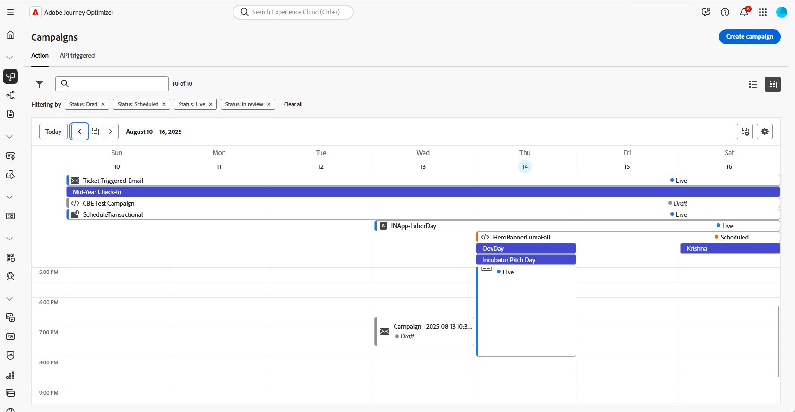

# 管理行銷活動 {#modify-stop-campaign}

行銷活動一旦啟動後，您就可以隨時修改或停止。 這些操作僅適用於具有週期性執行的行銷活動。

此外，您可以複製即時行銷活動（執行一次或循環執行）以建立新行銷活動，並封存已完成或停止的行銷活動。

## 存取行銷活動 {#access}

>[!CONTEXTUALHELP]
>id="ajo_campaigns_view"
>title="行銷活動清單和行事曆檢視"
>abstract="除了行銷活動清單，[!DNL Journey Optimizer]還提供行銷活動的行事曆檢視，提供其排程的清晰視覺化呈現。 您可以隨時使用這些按鈕在清單和行事曆檢視之間切換。"

可從&#x200B;**[!UICONTROL 行銷活動]**&#x200B;功能表存取行銷活動。

依預設，清單會顯示所有狀態為&#x200B;**[!UICONTROL 草稿]**、**[!UICONTROL 已排程]**&#x200B;和&#x200B;**[!UICONTROL 即時]**&#x200B;的行銷活動。 若要顯示已停止、已完成和已封存的行銷活動，您必須清除篩選器。

您也可以根據行銷活動型別和頻道，或是在建立行銷活動時指派給行銷活動的標籤來篩選清單。 [瞭解如何將標籤指派給行銷活動](create-campaign.md#create)

## 行銷活動行事曆 {#calendar}

除了行銷活動清單，[!DNL Journey Optimizer]還提供行銷活動的行事曆檢視，提供其排程的清晰視覺化呈現。

>[!AVAILABILITY]
>
>行事曆檢視目前僅可用於一組組織（可用性限制）。 若要要求存取權，請使用[此表單](https://forms.cloud.microsoft/r/FC49afuJVi){target=”_blank”}。
>
>此功能正在開發中。 我們歡迎您使用上方功能表中的&#x200B;**[!UICONTROL Beta意見回饋]**&#x200B;按鈕來輸入和請求。

行事曆顯示本週排程的所有行銷活動。 使用行事曆上方的箭頭按鈕，在周之間導覽。

行銷活動的呈現方式：

* 依預設，行事曆格線會顯示所選周的所有即時和已排程行銷活動。 其他篩選器選項可顯示已完成、已停止和已完成的特定型別或管道的啟動或啟動。
* 不顯示草稿行銷活動。
* 橫跨多天的行銷活動會顯示在行事曆格線的頂端。
* 如果未指定開始時間，則會使用最接近的手動啟動時間，將其放置在行事曆中。
* 行銷活動會顯示為1小時時間跨度，但這並不反映實際的傳送或完成時間。

如需促銷活動的詳細資訊，請按一下其視覺區塊以開啟詳細資訊。

若要檢視特定行銷活動的詳細資料，請從清單中選取它。 資訊窗格會隨即開啟，內含促銷活動的各種資訊，例如，其型別、報表存取權或已指派的標籤。

## 行銷活動狀態和警示 {#statuses}

行銷活動可以有多個狀態：

* **[!UICONTROL 草稿]**：行銷活動正在編輯中，尚未啟動。
* **[!UICONTROL 正在啟動]**：正在啟動行銷活動。
* **[!UICONTROL 正在處理]** *（僅限電子郵件行銷活動）*：對象匯出已完成，正在發佈行銷活動。
* **[!UICONTROL 即時]**：行銷活動已啟用。
* **[!UICONTROL 已排程]**：行銷活動已設定為在特定的開始日期啟動。
* **[!UICONTROL 已停止]**：行銷活動已手動停止。 您無法再啟用或重複使用它。 [瞭解如何停止行銷活動](modify-stop-campaign.md#stop)
* **[!UICONTROL 已完成]**：行銷活動已完成。 此狀態會在行銷活動啟動3天後自動指派，如果行銷活動有週期性執行，則會在行銷活動的結束日期指派。
* **[!UICONTROL 已封存]**：行銷活動已封存。 [瞭解如何封存行銷活動](modify-stop-campaign.md#archive)

>[!NOTE]
>
>**[!UICONTROL 即時]**&#x200B;或&#x200B;**[!UICONTROL 已排程]**&#x200B;狀態旁的「開啟草稿版本」圖示表示已建立新版本的行銷活動，但尚未啟用。 [了解更多](modify-stop-campaign.md#modify)。

當您的其中一個行銷活動發生錯誤時，警告圖示會出現在行銷活動的狀態旁。 按一下該按鈕，以顯示有關警示的資訊。 這些警報可能會發生在各種情況下，例如行銷活動訊息尚未發佈或如果選擇的設定不正確。

## 修改週期性行銷活動 {#modify}

若要修改和建立循環行銷活動的新版本，請遵循下列步驟：

1. 開啟行銷活動，然後按一下&#x200B;**[!UICONTROL 修改行銷活動]**&#x200B;按鈕。

1. 會建立新版本的行銷活動。 您可以按一下&#x200B;**[!UICONTROL 開啟即時版本]**&#x200B;來檢查即時版本。

   

   在行銷活動清單中，正在進行草稿版本的已啟動行銷活動在&#x200B;**[!UICONTROL 狀態]**&#x200B;欄中顯示特定圖示。 按一下此圖示以開啟行銷活動的草稿版本。

   

1. 一旦您的變更準備就緒後，您就可以啟用新版本的行銷活動（請參閱[檢閱並啟用行銷活動](create-campaign.md#review-activate)）。

   >[!IMPORTANT]
   >
   >啟用草稿將會取代行銷活動的即時版本。

## 停止週期性行銷活動 {#stop}

若要停止週期性行銷活動，請開啟行銷活動，然後按一下&#x200B;**[!UICONTROL 停止行銷活動]**&#x200B;按鈕。

>[!IMPORTANT]
>
>停止行銷活動不會停止進行中的傳送，但會停止排程的傳送，或如果傳送已在進行中，則會停止下一次發生。

<!-- inbound campaign (inapp): can stop and resume -->

## 複製行銷活動 {#duplicate}

您可以複製即時行銷活動以建立新行銷活動。 若要這麼做，請開啟行銷活動，然後按一下[複製]。**&#x200B;**

## 封存行銷活動 {#archive}

隨著時間過去，行銷活動清單會持續成長，最終使瀏覽已完成和已停止的行銷活動變得更困難。

為避免此問題，您可以封存不再需要之已完成和停止的行銷活動。 若要這麼做，請按一下省略符號按鈕，然後選取&#x200B;**[!UICONTROL 封存]**。

接著，您可以使用清單中的專用篩選器來擷取已封存的行銷活動。 [瞭解如何存取行銷活動](get-started-with-campaigns.md#access)
