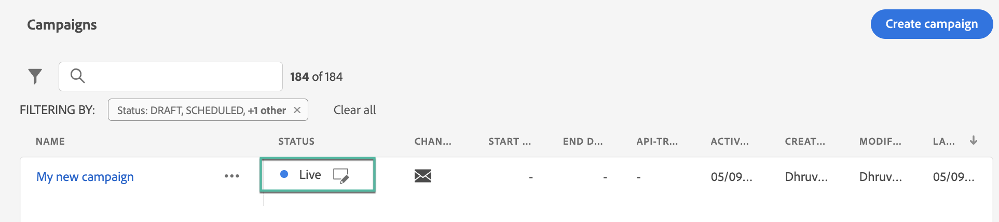

# 管理行銷活動 {#modify-stop-campaign}

促銷活動啟動後，您可以隨時修改或停止。 這些操作僅適用於具有循環執行的促銷活動。

此外，您可以複製已上線的促銷活動（執行一次或執行循環）以建立新的促銷活動，並封存已完成或已停止的促銷活動。

## 存取行銷活動 {#access}

您可從 **[!UICONTROL Campaigns]** 功能表。

依預設，清單會以 **[!UICONTROL Draft]**, **[!UICONTROL Scheduled]**，和 **[!UICONTROL Live]** 狀態。

若要顯示已停止、已完成和已封存的促銷活動，您必須清除篩選器。

## 促銷活動狀態 {#statuses}

促銷活動可以有多種狀態：

* **[!UICONTROL Draft]**:正在編輯促銷活動，尚未啟動。
* **[!UICONTROL Activating]**:促銷活動正在啟動。
* **[!UICONTROL Live]**:促銷活動已啟動。
* **[!UICONTROL Scheduled]**:促銷活動設定為在特定開始日期啟動。
* **[!UICONTROL Stopped]**:已手動停止促銷活動。 您無法再啟動或重複使用它。 [了解如何停止行銷活動](modify-stop-campaign.md#stop)
* **[!UICONTROL Completed]**:促銷活動已完成。 此狀態會在促銷活動啟動後3天自動指派，或是在促銷活動結束日期（如果有循環執行）自動指派。
* **[!UICONTROL Archived]**:已封存促銷活動。 [了解如何封存行銷活動](modify-stop-campaign.md#archive)

>[!NOTE]
>
>旁邊的「開啟草稿版本」圖示 **[!UICONTROL Live]** 或 **[!UICONTROL Scheduled]** 狀態表示已建立新版本的促銷活動，但尚未啟動。 [深入了解](modify-stop-campaign.md#modify).

## 修改循環促銷活動 {#modify}

若要修改並建立循環促銷活動的新版本，請遵循下列步驟：

1. 開啟促銷活動，然後按一下 **[!UICONTROL Modify campaign]** 按鈕。

1. 促銷活動的新版本隨即建立。 您可以按一下「 」，以檢查即時版本 **[!UICONTROL Open live version]**.

   

   在促銷活動清單中，進行中草稿版本的已啟動促銷活動會在 **[!UICONTROL Status]** 欄。 按一下此圖示以開啟促銷活動的草稿版本。

   

1. 一旦您的變更準備就緒，您就可以啟動新版本的促銷活動(請參閱 [檢閱及啟動行銷活動](create-campaign.md#review-activate))。

   >[!IMPORTANT]
   >
   >啟動草稿將取代行銷活動的即時版本。

## 停止循環促銷活動 {#stop}

若要停止循環促銷活動，請開啟它，然後按一下 **[!UICONTROL Stop campaign]** 按鈕。

>[!IMPORTANT]
>
>停止促銷活動不會停止持續傳送，但會停止已排程的傳送，或如果傳送已進行，則會停止下一個例項。

<!-- inbound campaign (inapp): can stop and resume -->

## 複製促銷活動 {#duplicate}

您可以複製已上線的促銷活動以建立新促銷活動。 若要這麼做，請開啟促銷活動，然後按一下 **[!UICONTROL Duplicate]**.

## 封存行銷活動 {#archive}

隨著時間推移，促銷活動清單會持續增長，最終會讓瀏覽已完成和已停止的促銷活動變得更困難。

為避免此情況，您可以封存已完成和已停止您不再需要的促銷活動。 要執行此操作，請按一下橢圓按鈕，然後選取 **[!UICONTROL Archive]**.

然後，您就可以使用清單中的專用篩選器來擷取已封存的促銷活動。 [了解如何存取行銷活動](get-started-with-campaigns.md#access)
